--

This is a document pertaining to software things that must be polished and be fixed in our system.

Note: Do not forgot to use our rules in this codespace: `codingRules.instructions.md`, `ENGINEERING_STANDARDS_FRAMES.md.instructions.md`, `FRAMES_DEPLOYMENT_CONSTRAINTS.instructions.md`, `FRAMES_OBSERVABILITY_RULES.instructions.md`, `FRAMES_SECURITY_RULES.instructions.md`, `FRAMES_TESTING_RULES.instructions.md`

Note: Changes in the database must be migrated or have files for migration that can be run in the SQL editor.

1. Ensure that our data `FRAMES_Data_Dictionary.md` is aligned with our database models. JUst like in database, they don't have the column device.api_key, but in the models it has, resulting in error last time. After updating our dictionary, make it as our reference and we will be using it later to alter or preserve some data. Let us practice data minimization where just gather data that is needed for our system.

2. The `FRAMES_Data_Dictionary.md` has tables and columns or entities that store no data. Identify where can we generate those data. For example, to populate the devices table in database, in department head module inside "Department Mgmt" section, the department head must have assign camera in action. She will register the camera in there. For example, we have a one available raspi camera for testing or deployment, he can insert it in this section and will be taken with the necessary info to store in the database. insert here:

 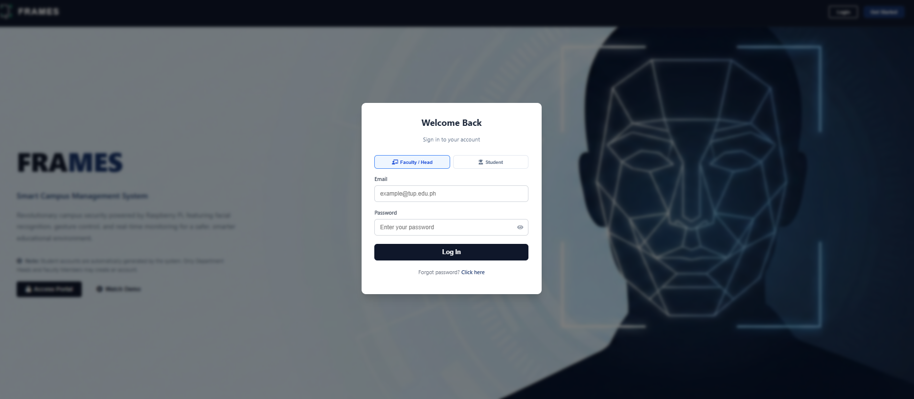

3. Also, the database seems to be lagging or slow, espscially when all there is a poor network connection. Can it be fixed?

4. I also noticed that there when I clean the database, the facial recognition can still be run. However, it recognizes old data. It means, do we always need to run `export_embeddings.py`?

--

LANDING PAGE

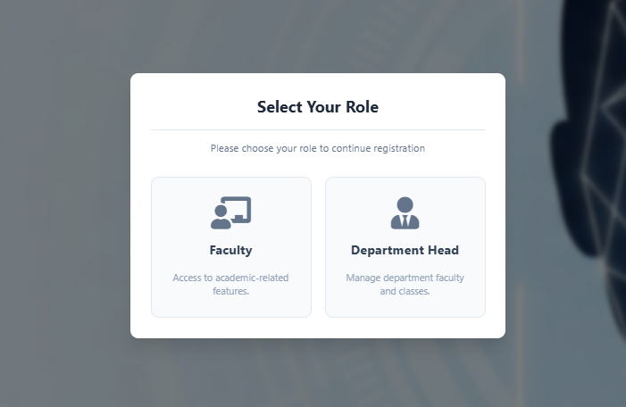

5. In landing page, I am not sure yet what to do. I need to consult my adviser first. in signing up for a faculty account, once sign up, the department head must verify first before the registration. once verified, an automated mail will be generated for the faculty member to sign in lor log in. but our professor says, it is hassle. remove the verification becuase we want to lessen the burden of the department head. however, it is for security. like if there is no like that, all accessors of that sign up page can sign up ofr those roles. what can be alternative that is mo simple yet secure? we plan to remove the sign up page in the landing page then give the link only? through automated emails or what. also, what if the use of codes? one time use of codes? wait it is so unclear to me. can ou suggest and how can we implement it? All I want for this section is opinion NOT implementation thru coding.

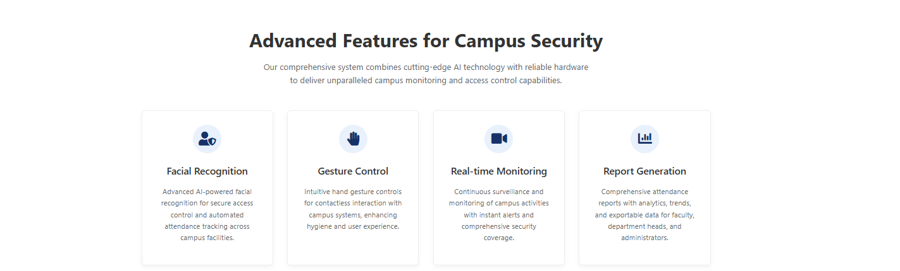
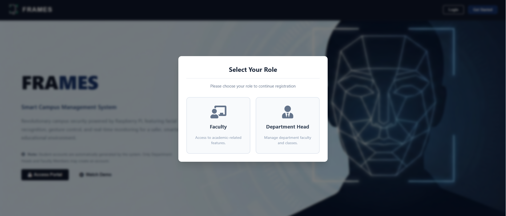

6. there should be a selection where a user can log in. For the faculty (Faculty head and Faculty member), stick to the email and password. For the students, instead of email, the credentials should be `TUP-M ID` and `password`. Also, for both sign ins, instead of `Don't have an account? Sign Up` replace it with `forgot password? click here.`. it must be redirect to section with forgot password but considering that the user has already registered or saved their email.

7. Watch demo - we don't have contents here yet. Can you suggest how can we make a demo video using AI?

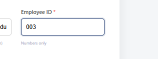

8. what is the emergency alerts? I think emergency alterts is not fully supported yet. How about others like, report generation? or what is the better term for it. 

9. Insert link in the socials so that when user clicks it, they will be redirected to that socials. facebook = link, twitter (change with the X symbol, since it is now X) = link, `instagram = https://www.instagram.com/_moneann/`, `contact number = 09669837650`, `email = framessys01@gmail.com`, address = link, `linked in =https://www.linkedin.com/in/angelica-terana-524297258`

--

SIGN-UP

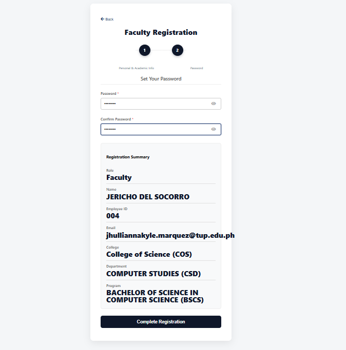

10. In academic credentials before department field, add a new field `College` which has values enclosed to College of Science (COS). I believe this is a new data field, so we need to migrate sql for this to save and update other affected codes or features. 

11. department head has no TUP-M ID. They only have employee ID and they are only numbers. The only restriction for this is that they are only numbers.

12. Ensure that their emails are valid for TUP email which has a domain of @tup.edu.ph.

13. Middle Name shall not be optional. If there is no Middle Name, just prompt the user to put a dash `-`

14. All user inputs, except email and password, shall be stricted to uppercase only. If the user types it in lowercase, it will automatically transform in upper case like the department field.    

15. there shall be a section where the department head will initialize or add the programs under their department. This is formatted like department field where in their side there is a genertion of automatic code for example 'Bachelor of Science in Information Technology' code is BSIT. They can add more or just set up at least 1 program. They can still configure it later in their module. 

16. Make use of the data dictionary and update the needed updates in our code to store and fetch the required data.

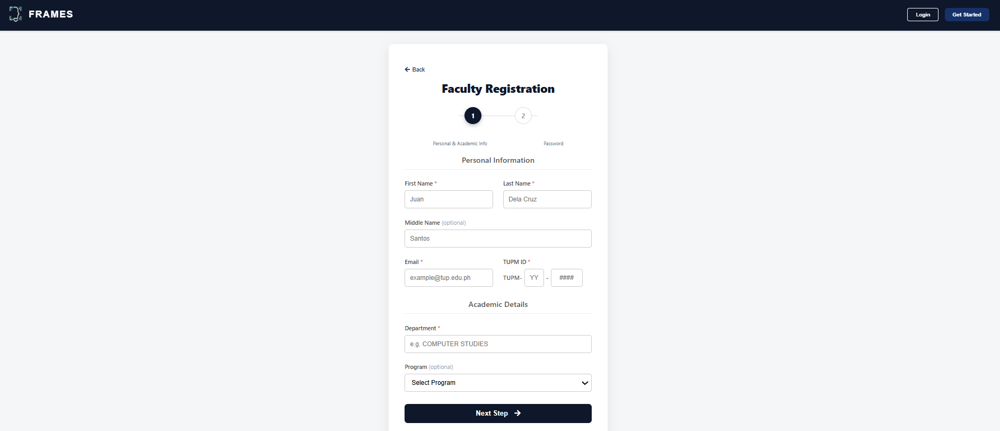

17. In academic credentials before department field, add a new field `College` which is a drop down or selection menu where the choices are fetched fro, what is inside the database, for example COllege of Science. Then, if the college of science is picked, then the departments under that college will only be the selection or choices of drop down in the department field, not a user input for faculty member. Then if they pick a certain department of that college, the available programs will be showcased in the program field for that dept. for example, Information Technology (remove the `Bachelor of Science`). Program must also be required. 

18. faculty member has no TUP-M ID. They only have employee ID and they are only numbers. The only restriction for this is that they are only numbers.

19. Ensure that their emails are valid for TUP email which has a domain of @tup.edu.ph.

20. Middle Name shall not be optional. If there is no Middle Name, just prompt the user to put a dash `-`

21. All user inputs, except email and password, shall be stricted to uppercase only. If the user types it in lowercase, it will automatically transform in upper case like the department field.    

22. Make use of the data dictionary and update the needed updates in our code to store and fetch the required data.

--

SIGN-IN

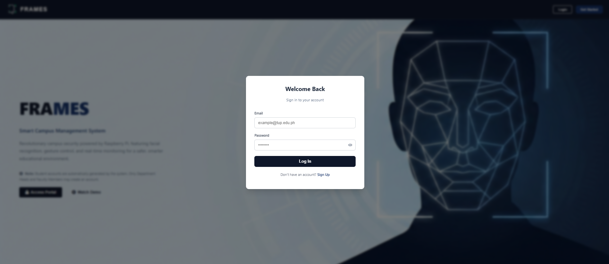

23. Just like in task 6, in logging in, the student (tup-m id and password) must have a different credentials from the faculty member and department head (both tup-m mail and password). Forgot password shall also be created and send in their email. Once the faculty member and department head clicks forgot password, they will be prompted on what email they use or saved in the system then you will send a link there in the email where they can change their password. Once they change their password, they can now sign in again. I think there is no implementation and UI for this yet.

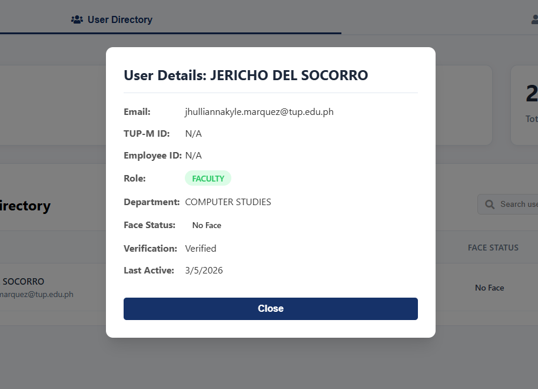

24. General Sign in applicable to all users (faculty member, department head, student). When the user enroll their face, the enrollment quality shall be at least 80%. if this does not meet, let the user to retake. Also, say the problem to the user why did their face data is not enrolled if declined, tell the enrollment quality and etc. 

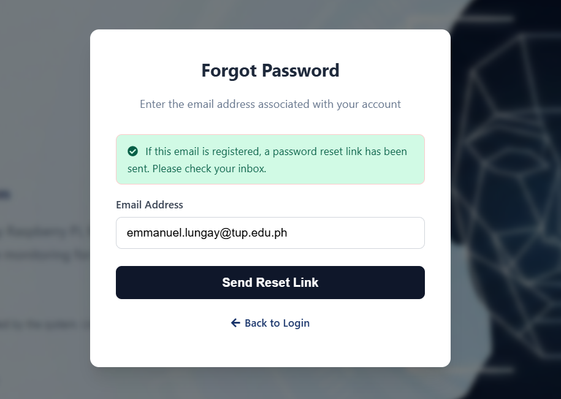

25. when enrolling the face and when you see the loading screen, remove the emojis and make it formal. if possible, instead of loading and reflecting words to know if the progress of enrolling face and saving it to database, why not add percentage beside it? like 0% to 100%. If successfully enroll, it should be redirected to their dashboard.

--

DEPARTMENT HEAD MODULE

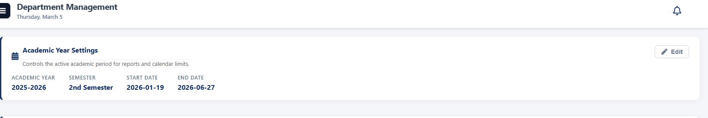

26. there should be a profile tab? because the department cant explicitly know where is the profile tab where they can edit their information. 

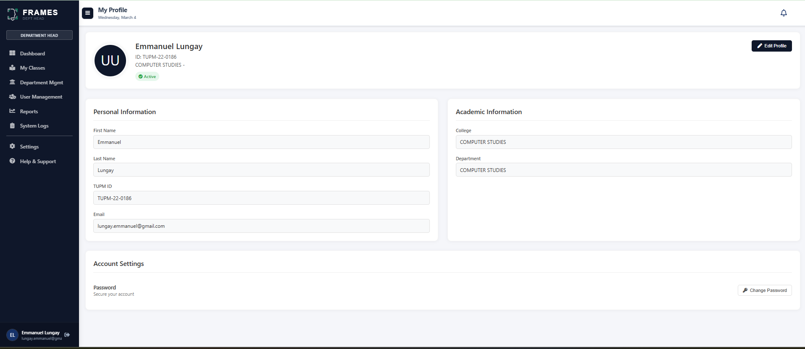

27. in profile section, replace the tup-m id with employee id. also in academic information,  include the college of science, and programs available in their department. edit profile button must be located at the end side of personal information text because the only needed to edit in there is the personal information. 

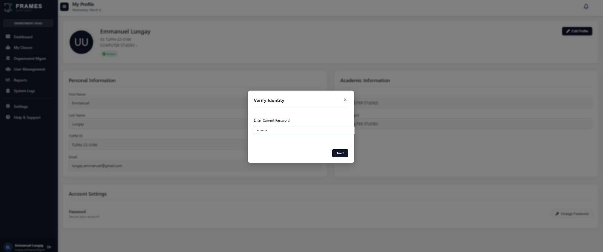

28. change password UI must be fixed since the field space overlaps or exceeds the window. When clicking next and the password is incorrect or no input, the system shall bot be automatically logged out, it shall only be reflected as incorrect and and still allow to retry but with rate limiting

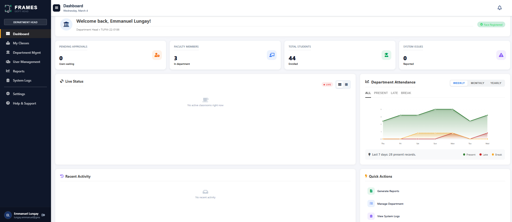

29. Notification shall be working. Like personal notifications sytem wide (own logs and etc), faculty notifications (notify when the faculty enter, breaks, and exits and also change their exception type like online or face-to-face or what) any necessarry general notifications. students that they teach, when this user enters, breaks and exits. notification also where the faculty member has not taught face-to-face set up in an assigned room with recognition device for 3 consecutive days.

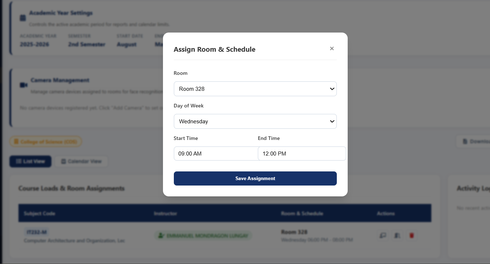

30. pending approvals, when clicked must be redirected to those faculty accounts waiting for verification by the department head. faculty members, when clicked must be redirected to the list of faculty members in the departments including the department head. total students shall be replaced with total students enrolled in the deprtment and when click, can be seen by the head.  total students they are teaching is the new component where they can see the enrolled students they are handling will be redirected to the list of students they handle when clicked. system issues is where and how it is implemented and updated, how does that work.

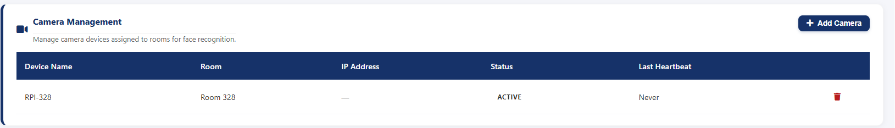

31. Live status must have 3 versions for department head, can be picked via drop down or the existing concept if there is. One choice is personal live status where just like in student module concept, they can see their self only when entering, breraking, or exiting a room with recognition via rerpresentation. another option is the liv status of the room he is teaching with a specific schedule. if now is schedule A and the department head teaches in room A with camera A installed, there will be dots representation like what is in there in faculty live status where color varies depending on the role. the last version is department live status. even if they are not teaching and no active schedule, as long as there is room in their deparmtent whihc has active schedule and camera installed in that room, then the department head can still see its dots representation.

32. same goes with the department attendance which must also has choice through drop down. same layout with all present late break weekly monthy and instead of yearly, make it semestral (use the specific month ad date that the department head will set for the start and end of the sem in the succeeding tasks.) Department Attendance Trends - whole department nlcuding faculty, students and himself as head. Faculty Attendance Trends - for the faculty only under his department incuding the head. Personal Attendance Trends - for personal. Classroom Attendance Trends - for his classes

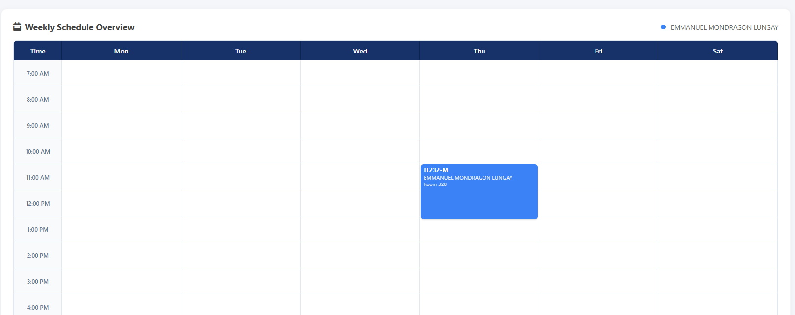

33. department management - the department head must also set date for semstral. i mean specific date, so that when it is used in the calendar, they will know when to start and when to end. if unsure of end date of semestral, assure them that it is okay to change it later just input an initial end date.

34. the subjects that will be reflected or the course load must be dependent on the current academic year and semester. 

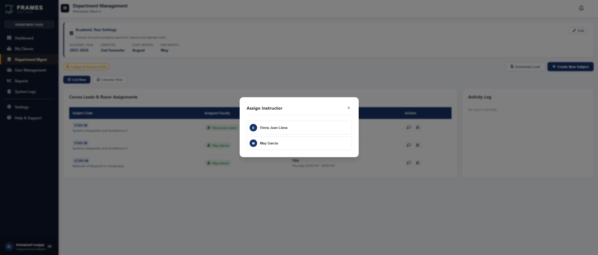

35. instead of assigned instructor, it should be called change instructor since when faculty upload their schedule itautomatically assumes that they teaches that subject so technically there is already an instructor for that. also, when you select instructor, include save button to know if it is saved or not.

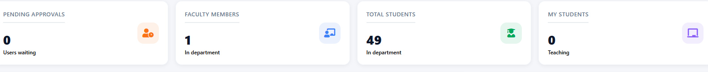

36. select room choices shall be based on what is stored in the database. like when they upload the faculty schedule, room information is saved. If it is another room, then the ddeparmtent head can add a new room and saved it as other options. 

37. There shall also be a camera management here. The department head can assign which camera is set for a particular room. this will be saved in the database. just ask for the necessarry data that can be stored in the database.

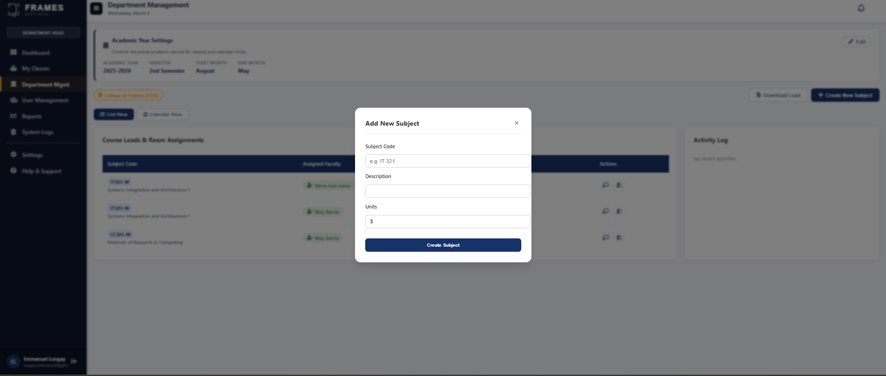

38. creating manual subject shall include the teacher, subject name instead of desciption, code, room or if online. in the course loads and room assignments, there should also be a delete button. 

39. when the department head clicks the row data, she must have the ability to view further data of that subject, who teaches, who is enrolled, and others.

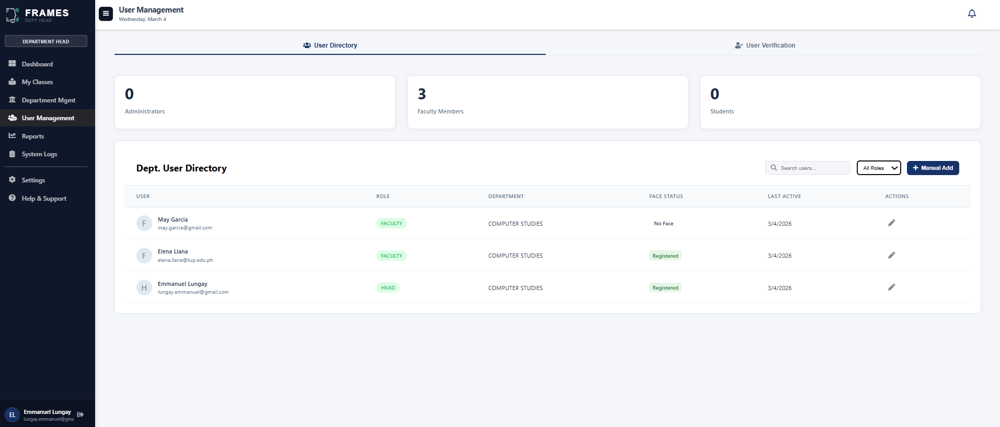

40. by default, user management shall be filtered to faculty. remove admin. All students enrolled in this department shall also be included here whether it is his students or not. when you click the row of data, it does not pop up for more info. also, the actions are not working when you click but it is wokring back then. 

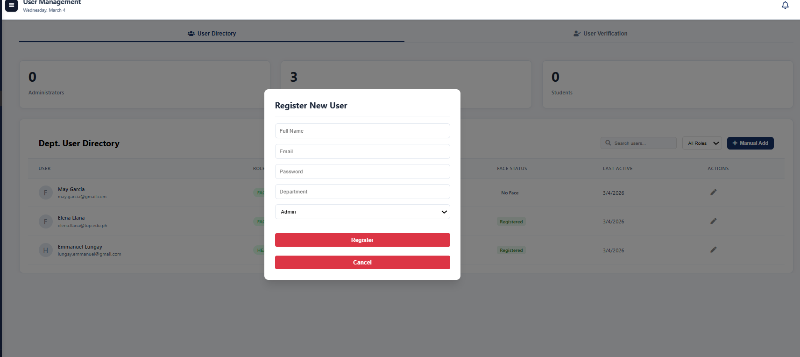

41. user manual add - remove the admin in the role selection. break down the full name into first name, middle name and last name. password must have re-entry password for verification. department must be automatically reflected to the heads department. Program is drop down basis, if it is faculty, omit the Bachelor of Science. but if it is students, include the Bachelor of Science'. if faculty, employee id, if student, tup-m id

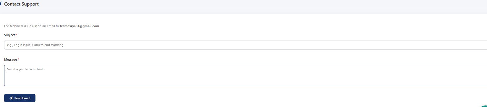

42. aah i see the user_verification is on the other tab. butit must be forFACULTY MEMBERS  only that is registering inside that department

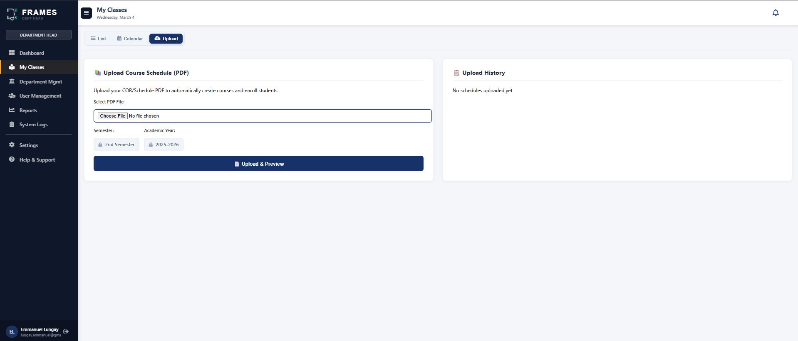

43. itshould be `Upload your Schedule PDF to automatically create courses and enroll students`. reflect also in the faculty module.

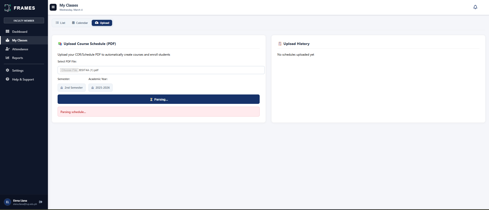

44. Instead of having only text as loading message. add beside it the precentage 0 - 100%., reflect also in the faculty module.

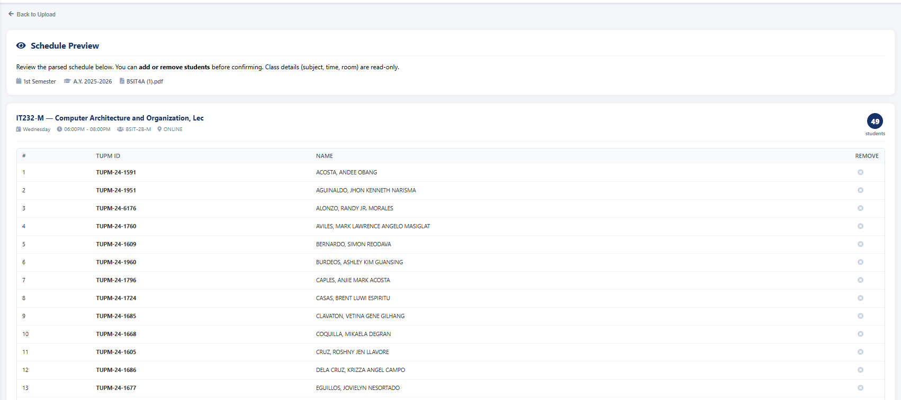

45. remembered that the department head has set the Academic year, month and date, and semester. It should not be overwitten what is in the file. If the uploaded schedule is not the same with the set of department head, it shall reflect an error saying the vital information what makes it error. reflect also in the faculty module.

46. when saving the students, it says after a while a time out 1500 or smething i dont remember. why is tehre a limit or what. but when i hit save for the 3rd time, it is now okay. reflect also in the faculty module. 

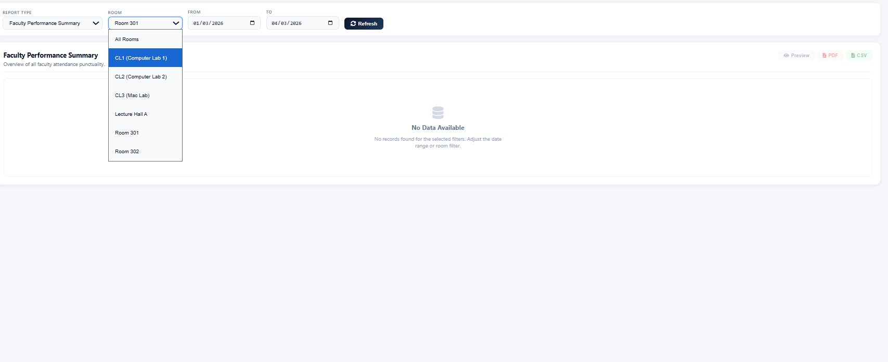

47. in reports, there shall be a default value to filter. for example, the first option in drop down, and in the dates is the start of the semester and the end of the current semester. The room must also be updated to those rooms with device only.

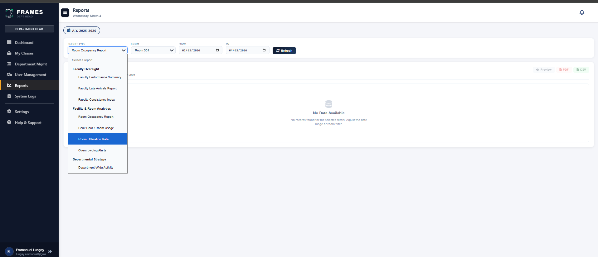

48. in department heaad, there is also missing in the reports. the class-specific reports (since he still teaches so technically the subjects he teaches) and personal records

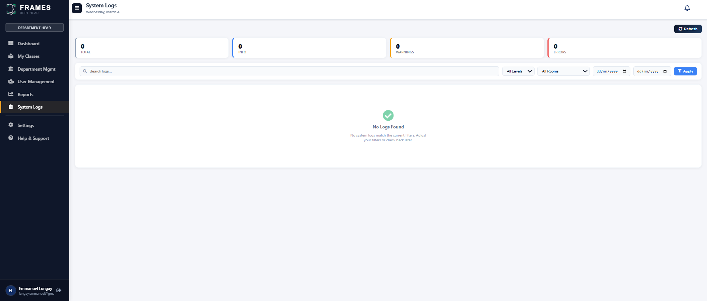

49. i do not know here in system logs where are the data to be collected fetched. make this page works

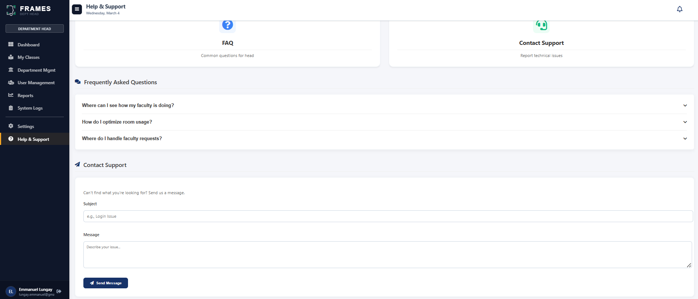

50. there is no contact support maybe because there is no admin, we will remove it. maybe all technical issues can be communicated via our email. ` framessys01@gmail.com` the recipient, which will be reflected. Also require the subject and the message. reflect also in the faculty module.
--

FACULTY MODULE

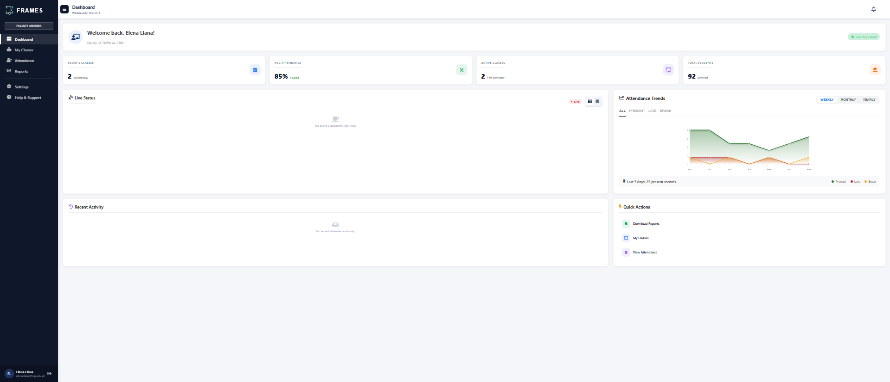

51. there should be a profile tab? because the faculty member cant explicitly know where is the profile tab where they can edit their information. 

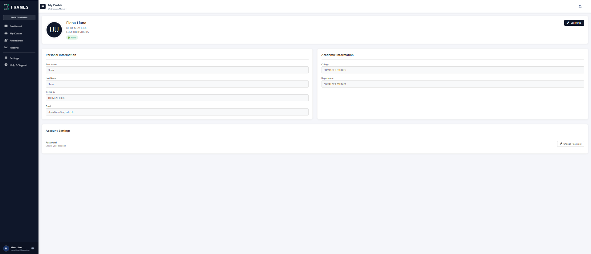

52. in profile section, replace the tup-m id with employee id. also in academic information,  include the college of science, and programs available in their department. edit profile button must be located at the end side of personal information text because the only needed to edit in there is the personal information. 

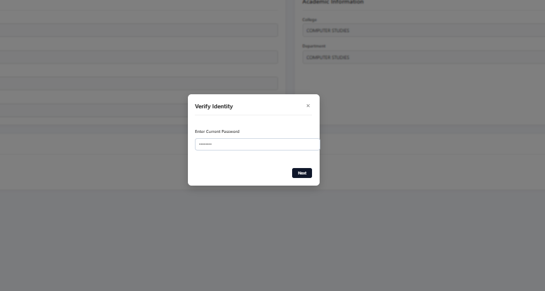

53. change password UI must be fixed since the field space overlaps or exceeds the window. When clicking next and the password is incorrect or no input, the system shall bot be automatically logged out, it shall only be reflected as incorrect and and still allow to retry but with rate limiting

54. Notification shall be working. Like personal notifications sytem wide (own logs and etc), any necessarry general notifications for faculty member. students that they teach, when this user enters, breaks and exits. notification also where the student they teach in a particular subject has not attendend face-to-face set up in an assigned room with recognition device for 3 consecutive days.

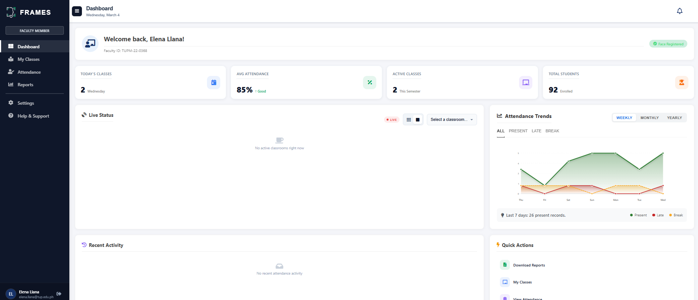

55. Live status must have 2 versions for faculty member, can be picked via drop down or the existing concept if there is. One choice is personal live status where just like in student module concept, they can see their self only when entering, breraking, or exiting a room with recognition via rerpresentation. another option is the live status of the room he is teaching with a specific schedule. if now is schedule A and the faculty member  teaches in room A with camera A installed, there will be dots representation where I think is already done?.

56. same goes with the attendance trends which must also has choice through drop down. ssame layout with all present late break weekly monthy and instead of yearly, make it semestral (use the specific month ad date that the department head will set for the start and end of the sem in the succeeding tasks.) Classroom Attendance Trends - for the faculty only under his department incuding the head. Personal Attendance Trends - for personal.

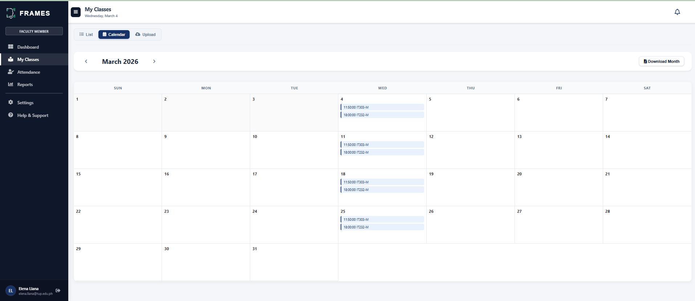

57. reflect in both faculty member and department head. the information here must be subject code, name, roo, faculty, section and and time. Also, use 12 hr time format!

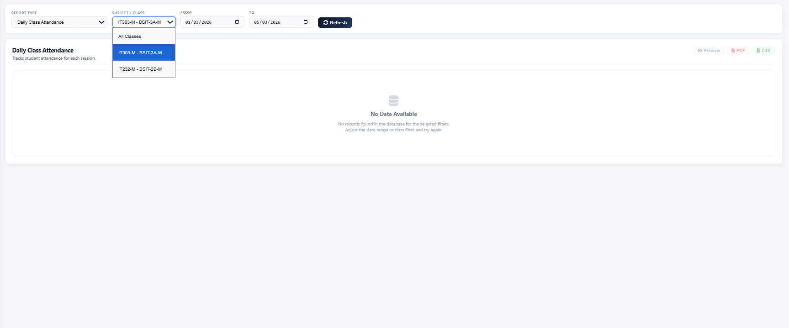

58. in reports, there shall be a default value to filter. for example, the first option in drop down, and in the dates is the start of the semester and the end of the current semester. the reports are not working i guess.

59. In pdf parsing, when auto creating accounts for students, it must not auto create a tup mail, it should be null. 

-- 

STUDENT MODULE

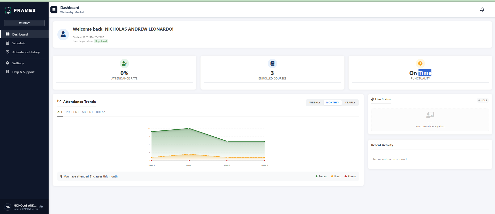

60. attendance rate and puntuality - The system evaluates student discipline using two complementary behavioral metrics: Attendance Rate and Punctuality Rate. Attendance Rate measures overall presence by calculating the percentage of attended sessions against total required sessions, reflecting reliability and participation. Punctuality Rate measures time discipline by calculating the percentage of on-time arrivals relative to total attended sessions, reflecting respect for scheduled class times. By separating presence from timeliness, the system provides a more accurate and behaviorally meaningful assessment of student commitment and responsibility. Percentage	Academic Status
≥95%	Compliant
85–94%	Acceptable
75–84%	Warning
<75%	Probation 
The system converts calculated Attendance and Punctuality Rates into performance tiers to provide meaningful behavioral interpretation. Percentage values are categorized into structured levels such as Outstanding, Excellent, Good, Fair, and At Risk. This conversion framework transforms raw numerical data into actionable academic insights, enabling administrators to easily assess student reliability, discipline, and overall compliance with institutional attendance standards.

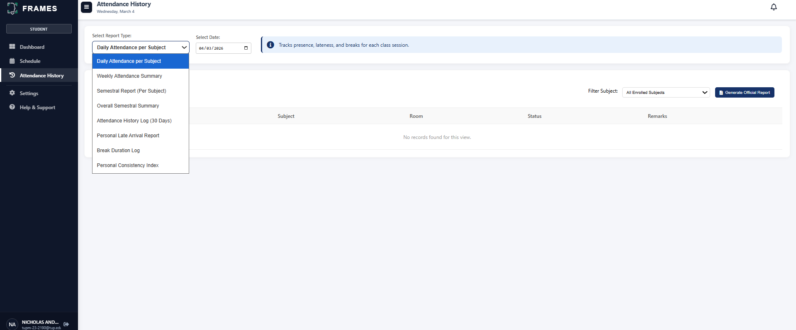

61. again, there should be a default filter. also, make the reports work.

62. there should be a profile tab? because the students cant explicitly know where is the profile tab where they can edit their information. also, have a warning that their tup mail is not set up or saved. make them proceed to editing information in the profiles tab.

63. in profile section in academic information,  include the college where their program belongs to. For example, if their program/course is Bachelor of Science Information Technology then it is under College of Science and under Computer Studies Department. the course/program will be identified by the code they have availble in the section. for example, Bachelor of Science in Information Technology has BSIT code, and their section says BSIT-3A-M, then it matches so it is automatically Bachelor of Science in Information Technology for course/program. the yearlevel will also reflect on the section, just see the number present in the section. If their section is BSIT-3A-M, then the number is 3 and the year level is 3rd Year. The term, academic year will also be reflected from what the department head set. edit profile button must be located at the end side of personal information text because the only needed to edit in there is the personal information. 

64. change password UI must be fixed since the field space overlaps or exceeds the window. When clicking next and the password is incorrect or no input, the system shall bot be automatically logged out, it shall only be reflected as incorrect and and still allow to retry but with rate limiting

65. Notification shall be working. Like personal notifications sytem wide (own logs and etc).

--

AUDIT 

66. Make the reports work for each role beacuse I think all of them is not working. . Here is the description presented in the images below:

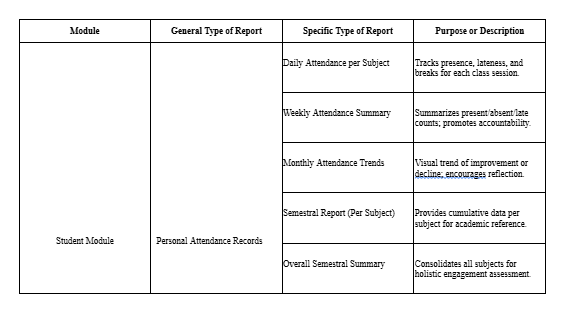
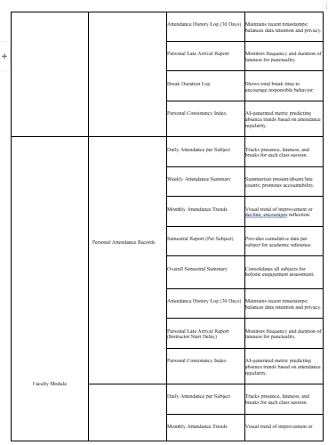
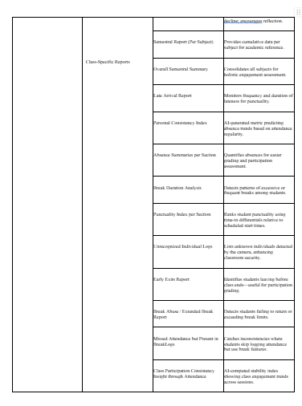
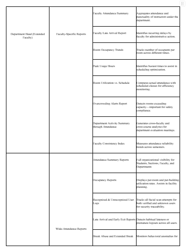
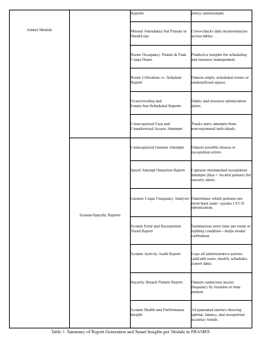

67. all notifications, recent acitivty, activity logs, for all users shall not be vanished once refreshed the site but there shall also be a limit on how many can they can see in those like 10 or there is more like in the past week past day etc.

68. in recognizing face, there is a threshold right? A threshold where it compares the detected or recgonized face data to exisiting data? what is the percetnage again of that? do we need to be strict? if yes, what is acceptable, 75% or higher or what?

69. Make a full audit of our capstone. Reference the previous audit , `FRAMES_Process_Audit_v3.md`, and see and analyze if there is more to work even minor details. Make an .md  documentation file for this.

70. update for the last time the data_dictionary.

--

note: all picutres uploaded here must be included in git ignore not pushed in the repo.
