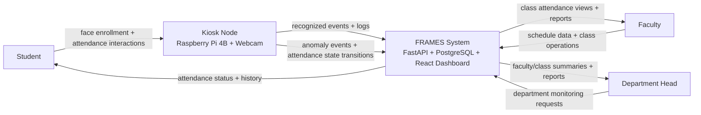

# Figure 3.1 Context Diagram

## Explanation

The context diagram shows FRAMES as a central system connected to three operational user roles (student, faculty, department head) and one kiosk node for attendance capture.
