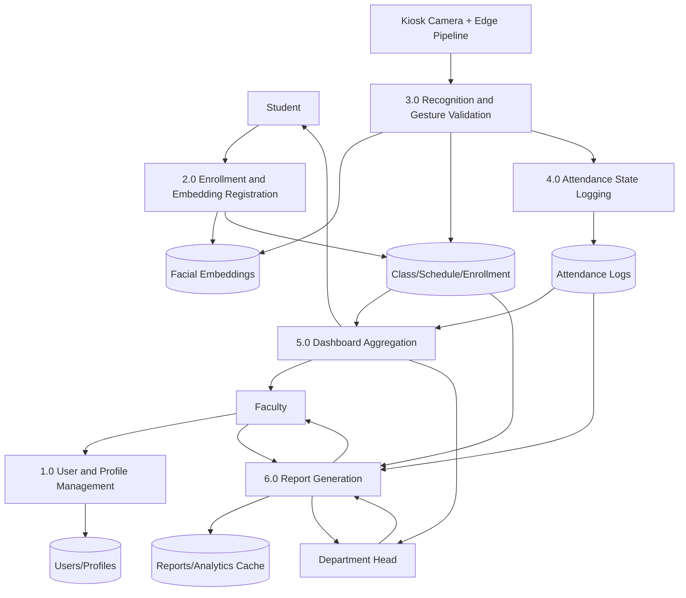

# Figure 3.2 Top-Level Data Flow Diagram (Level 1)

```mermaid
flowchart TD
    U1[Student]
    U2[Faculty]
    U3[Department Head]
    K1[Kiosk Camera + Edge Pipeline]

    P1[1.0 User and Profile Management]
    P2[2.0 Enrollment and Embedding Registration]
    P3[3.0 Recognition and Gesture Validation]
    P4[4.0 Attendance State Logging]
    P5[5.0 Dashboard Aggregation]
    P6[6.0 Report Generation]

    D1[(Users/Profiles)]
    D2[(Facial Embeddings)]
    D3[(Class/Schedule/Enrollment)]
    D4[(Attendance Logs)]
    D5[(Reports/Analytics Cache)]

    U1 --> P2
    U2 --> P1
    U2 --> P6
    U3 --> P6

    P1 --> D1
    P2 --> D2
    P2 --> D3

    K1 --> P3
    P3 --> D2
    P3 --> D3
    P3 --> P4

    P4 --> D4
    D4 --> P5
    D3 --> P5
    P5 --> U1
    P5 --> U2
    P5 --> U3

    D4 --> P6
    D3 --> P6
    P6 --> D5
    P6 --> U2
    P6 --> U3
```

## Explanation

This Level 1 DFD decomposes FRAMES into six major processes from profile handling to report generation.
