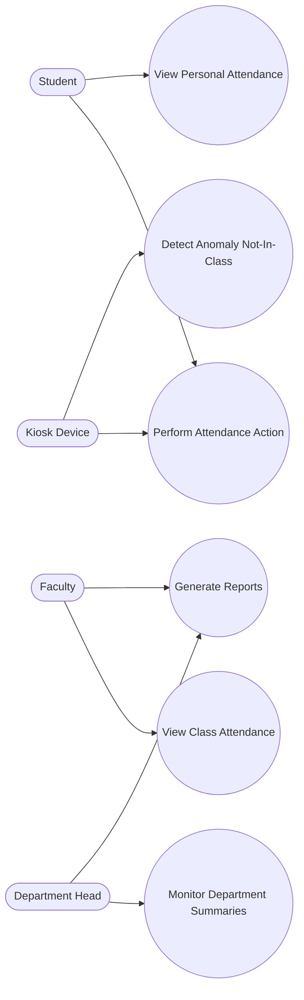

# Figure 3.3 Use Case Diagram

```mermaid
flowchart LR
    student([Student])
    faculty([Faculty])
    head([Department Head])
    kiosk([Kiosk Device])

    UC1((Perform Attendance Action))
    UC2((View Personal Attendance))
    UC3((View Class Attendance))
    UC4((Generate Reports))
    UC5((Monitor Department Summaries))
    UC6((Detect Anomaly Not-In-Class))

    student --> UC1
    student --> UC2

    faculty --> UC3
    faculty --> UC4

    head --> UC5
    head --> UC4

    kiosk --> UC1
    kiosk --> UC6
```

## Explanation

The use case model highlights pilot-role capabilities without including an active admin-role dependency.
