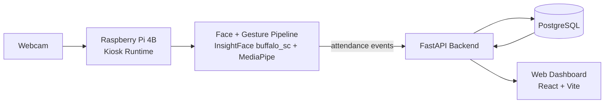

# Figure 3.4 System Block Diagram

```mermaid
flowchart LR
    cam[Webcam]
    pi[Raspberry Pi 4B\nKiosk Runtime]
    recog[Face + Gesture Pipeline\nInsightFace buffalo_sc + MediaPipe]
    api[FastAPI Backend]
    db[(PostgreSQL)]
    web[Web Dashboard\nReact + Vite]

    cam --> pi
    pi --> recog
    recog -->|attendance events| api
    api --> db
    db --> api
    api --> web
```

## Explanation

This block diagram shows the core runtime path from webcam capture to backend storage and dashboard consumption.
