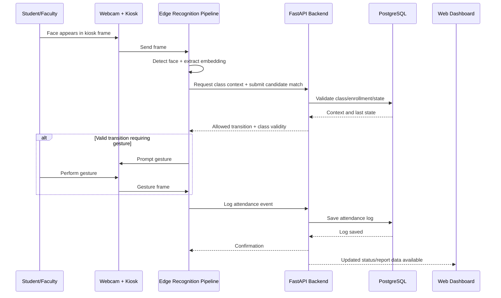

# Figure 3.5 Attendance Operation Sequence Diagram

```mermaid
sequenceDiagram
    participant User as Student/Faculty
    participant Cam as Webcam + Kiosk
    participant Pipe as Edge Recognition Pipeline
    participant API as FastAPI Backend
    participant DB as PostgreSQL
    participant Dash as Web Dashboard

    User->>Cam: Face appears in kiosk frame
    Cam->>Pipe: Send frame
    Pipe->>Pipe: Detect face + extract embedding
    Pipe->>API: Request class context + submit candidate match
    API->>DB: Validate class/enrollment/state
    DB-->>API: Context and last state
    API-->>Pipe: Allowed transition + class validity

    alt Valid transition requiring gesture
        Pipe->>Cam: Prompt gesture
        User->>Cam: Perform gesture
        Cam->>Pipe: Gesture frame
    end

    Pipe->>API: Log attendance event
    API->>DB: Save attendance log
    DB-->>API: Log saved
    API-->>Pipe: Confirmation
    API-->>Dash: Updated status/report data available
```

## Explanation

This sequence represents how recognition, validation, and log persistence occur before dashboard updates.
