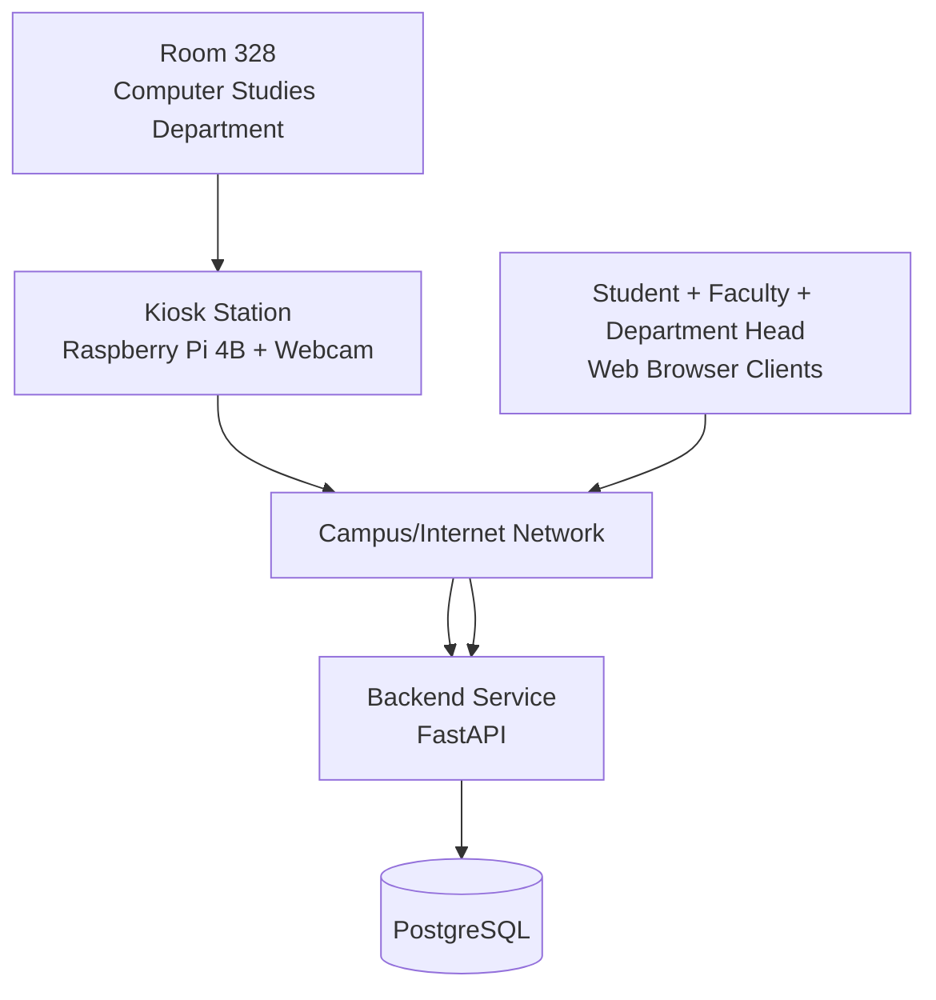

# Figure 3.6 Pilot Deployment Diagram (One-Room Setup)

```mermaid
flowchart TB
    room[Room 328\nComputer Studies Department]
    kiosk[Kiosk Station\nRaspberry Pi 4B + Webcam]
    net[Campus/Internet Network]
    backend[Backend Service\nFastAPI]
    database[(PostgreSQL)]
    users[Student + Faculty + Department Head\nWeb Browser Clients]

    room --> kiosk
    kiosk --> net
    net --> backend
    backend --> database
    users --> net
    net --> backend
```

## Explanation

This deployment view reflects the actual pilot: one room, one kiosk station, and web users accessing backend services.
