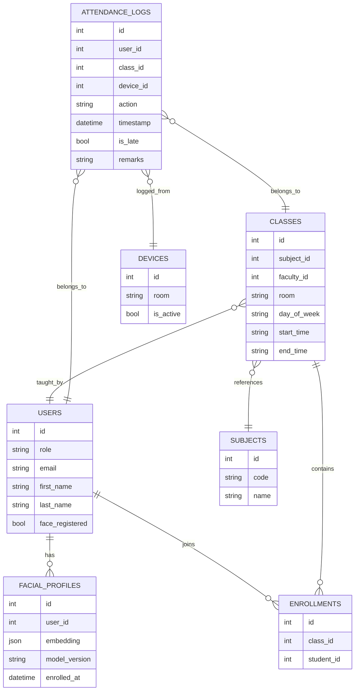

# Figure 3.7 Conceptual ERD (Pilot-Relevant Entities)

```mermaid
erDiagram
    USERS ||--o{ FACIAL_PROFILES : has
    USERS ||--o{ ENROLLMENTS : joins
    CLASSES ||--o{ ENROLLMENTS : contains
    CLASSES }o--|| USERS : taught_by
    CLASSES }o--|| SUBJECTS : references
    ATTENDANCE_LOGS }o--|| USERS : belongs_to
    ATTENDANCE_LOGS }o--|| CLASSES : belongs_to
    ATTENDANCE_LOGS }o--|| DEVICES : logged_from

    USERS {
        int id
        string role
        string email
        string first_name
        string last_name
        bool face_registered
    }

    FACIAL_PROFILES {
        int id
        int user_id
        json embedding
        string model_version
        datetime enrolled_at
    }

    SUBJECTS {
        int id
        string code
        string name
    }

    CLASSES {
        int id
        int subject_id
        int faculty_id
        string room
        string day_of_week
        string start_time
        string end_time
    }

    ENROLLMENTS {
        int id
        int class_id
        int student_id
    }

    DEVICES {
        int id
        string room
        bool is_active
    }

    ATTENDANCE_LOGS {
        int id
        int user_id
        int class_id
        int device_id
        string action
        datetime timestamp
        bool is_late
        string remarks
    }
```

## Explanation

This conceptual ERD focuses on entities required for the pilot attendance lifecycle and reporting outputs.
