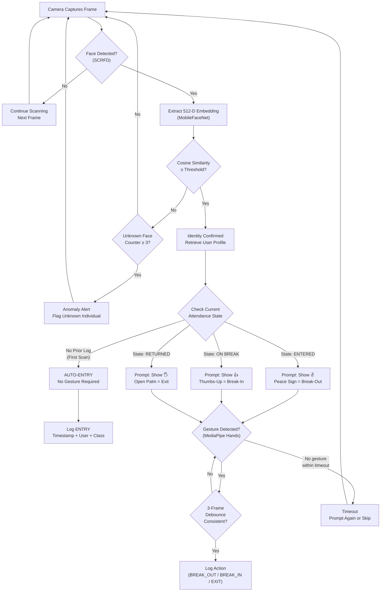
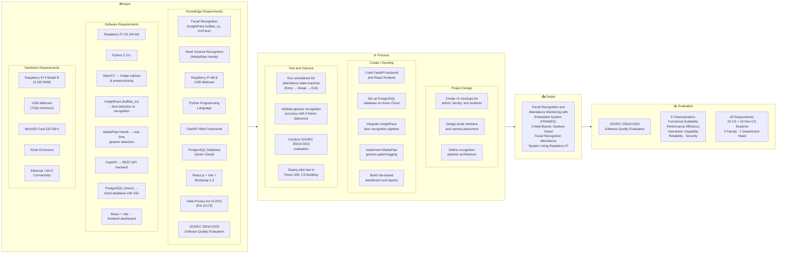

# FRAMES — Figures, Flowcharts, and Conceptual Framework Revisions

This document contains: (1) the Mermaid flowchart for **Figure 2** (Section 2.1.6 — Anti-Spoofing and Gesture-Gated Authentication), and (2) the **revised Conceptual Framework** with a detailed changelog of what was updated from the original.

---

## 1. Figure 2 — FRAMES Sequential Face-and-Gesture Authentication Flow

**Where it goes:** Chapter 2, Section 2.1.6 — at the `[INSERT FIGURE 2 HERE]` placeholder.

### 1.1 Mermaid Code

### 1.2 Key Design Points Shown in the Diagram

| Node | What It Represents | Anti-Spoofing Relevance |
|------|-------------------|------------------------|
| **SCRFD Detection** | Lightweight face detector (~2.5 MB) finds face bounding box | First gate — no face, no processing |
| **Cosine Similarity Check** | Compares live embedding vs. enrolled embeddings | Second gate — rejects unknown faces |
| **Unknown Face Counter** | Tracks repeated unmatched faces across frames | Anomaly detection — alerts for unregistered individuals |
| **Attendance State Machine** | Determines which gesture to require based on current state | Context-aware — prevents out-of-sequence logging |
| **3-Frame Debounce** | Gesture must persist across 3 consecutive frames (~100-150 ms) | Liveness indicator — random movements rejected |
| **Timeout Path** | If no gesture within the window, system resets | Prevents indefinite waiting; deters walk-by attempts |

### 1.3 Spoofing Mitigation Layers (as shown in flow)

1. **Face must be detected live** — static images may produce embeddings but cannot respond to state-dependent gesture prompts
2. **Gesture is state-dependent** — an attacker cannot predict which gesture will be required without seeing the kiosk screen
3. **3-frame debounce** — a photograph cannot perform gestures; a collaborator would need to be physically present and coordinated
4. **Physical deployment** — kiosk placed in narrow single-person entry lane (not shown in software diagram, but documented as essential deployment constraint)

---

## 2. Revised Conceptual Framework (IPO Model)

### 2.1 Structure Assessment

The **IPO (Input → Process → Output) structure is correct and should be kept.** The structure itself follows standard capstone conceptual framework format. What needs updating is the **content within each box** to match the actual FRAMES tech stack and evaluation methodology.

### 2.2 Changelog — Old vs. Revised

| Section | Old (Original Image) | Revised | Reason |
|---------|---------------------|---------|--------|
| **Knowledge: Face Recognition** | "OpenCV, dlib, face_recognition" | **InsightFace buffalo_sc, ArcFace** | FRAMES uses InsightFace, not dlib/face_recognition library |
| **Knowledge: Web Framework** | "Flask Web Framework" | **FastAPI Web Framework** | FRAMES backend is FastAPI, not Flask |
| **Knowledge: Database** | "MySQL / SQLite Database" | **PostgreSQL Database (Aiven Cloud)** | FRAMES uses cloud-hosted PostgreSQL with SSL |
| **Knowledge: Frontend** | "ReactJS / Bootstrap for Web Dashboard" | **React.js + Vite + Bootstrap 5.3** | Added Vite as build tool; specified Bootstrap version |
| **Knowledge: Evaluation** | "Software Quality Evaluation (ISO/IEC 25010)" + "TUP Prototype Evaluation Instrument" | **ISO/IEC 25010:2023 only** | TUP Prototype Evaluation removed per adviser guidance |
| **Software: Face Recognition** | "Face Recognition Library (dlib) → facial encoding & recognition" | **InsightFace (buffalo_sc) → face detection & recognition** | Correct library |
| **Software: Backend** | "Flask / FastAPI → web backend" | **FastAPI → REST API backend** | Flask is not used |
| **Software: Database** | "SQLite/MySQL (user profiles + logs)" | **PostgreSQL (Aiven) → cloud database with SSL** | Correct database |
| **Hardware: Camera** | "Pi Camera" | **USB Webcam (720p minimum)** | FRAMES uses USB webcam, not Pi Camera module |
| **Hardware: Missing** | "Keyboard & mouse" listed | **Ethernet / Wi-Fi Connectivity** added | Network connectivity is essential; keyboard/mouse not needed for kiosk operation |
| **Process: Create** | "Code backend (Flask/FastAPI) and frontend (React.js)" | **Code FastAPI backend and React frontend** | Removed Flask reference |
| **Process: Create** | "Set up database in MySQL" | **Set up PostgreSQL database on Aiven Cloud** | Correct database |
| **Process: Create** | "Integrate facial recognition" (generic) | **Integrate InsightFace face recognition pipeline** + **Implement MediaPipe gesture-gated logging** | Specific technologies; gesture logging was missing |
| **Process: Create** | *(missing)* | **Build role-based dashboard and reports** added | Dashboard/reports are a core deliverable |
| **Process: Test** | "Conduct usability testing and ISO/IEC 25010 evaluation" + "TUP Evaluation prototype" | **Conduct ISO/IEC 25010:2023 evaluation** only | TUP Prototype Evaluation removed |
| **Process: Test** | "Run simulations for attendance and room occupancy" | **Run simulations for attendance state machine (Entry→Break→Exit)** | More specific to actual system behavior |
| **Process: Test** | "Validate hand gesture accuracy" (generic) | **Validate gesture recognition accuracy with 3-frame debounce** | Specific to actual implementation |
| **Process: Test** | *(missing)* | **Deploy pilot test in Room 328, CS Building** added | Specific deployment location |
| **Output: Title** | "...with Hand Gesture Control using Raspberry Pi" | **...A Web-Based, Gesture-Gated Facial Recognition Attendance System Using Raspberry Pi** | Match current official title |
| **Evaluation** | Generic "Evaluation" box (empty) | **ISO/IEC 25010:2023** with **5 characteristics** and **43 respondents** breakdown | Specific evaluation details filled in |

### 2.3 Revised Conceptual Framework — Mermaid Code

### 2.4 Plain-Text Version (For Recreating in Draw.io / PowerPoint)

If you need to recreate this in Draw.io or PowerPoint (for the final manuscript), here are the exact contents for each box:

---

#### Input

The input phase establishes the system's foundation by identifying essential knowledge, software, and hardware requirements.

In terms of knowledge requirements, the study draws on facial recognition techniques using InsightFace (buffalo_sc model: SCRFD detection + MobileFaceNet recognition with ArcFace loss), hand gesture recognition through MediaPipe Hands (static gesture detection with 21-landmark classification), web development with FastAPI (Python, asynchronous backend) and React (Vite, JSX frontend), database management with PostgreSQL (Aiven Cloud, SSL-encrypted connections), compliance with the Data Privacy Act of 2012 (RA 10173) for biometric data handling, and the ISO/IEC 25010:2023 Software Quality Model for system evaluation.

For software requirements, the system runs on Raspberry Pi OS Bookworm 64-bit as the edge device operating system, with Python 3.11+ powering the recognition and gesture pipeline through InsightFace, ONNX Runtime, MediaPipe, and OpenCV. The backend framework uses FastAPI with SQLAlchemy 2.x ORM for database access, while the frontend is built on Vite + React 19.2 with Bootstrap 5.3, Axios, and Chart.js/Recharts for visualization. The cloud database is PostgreSQL hosted on Aiven Cloud with SSL connectivity.

For hardware requirements, the system is deployed on a Raspberry Pi 4 Model B (4 GB RAM, quad-core ARM Cortex-A72) paired with a USB webcam (720p, UVC-compliant, plug-and-play on Pi OS) and a 7-inch HDMI IPS kiosk display (1024×600 resolution). Power is supplied via a 5V 3A USB-C adapter, and network connectivity is provided through Wi-Fi or Ethernet for API synchronization.

#### PROCESS — Project Design
- Create UI mockups for admin, faculty, and students
- Design kiosk interface and camera placement
- Define recognition pipeline architecture

#### PROCESS — Create / Develop
- Code FastAPI backend and React frontend
- Set up PostgreSQL database on Aiven Cloud
- Integrate InsightFace face recognition pipeline
- Implement MediaPipe gesture-gated logging
- Build role-based dashboard and reports

#### PROCESS — Test and Improve
- Run simulations for attendance state machine (Entry → Break → Exit)
- Validate gesture recognition accuracy with 3-frame debounce
- Conduct ISO/IEC 25010:2023 evaluation
- Deploy pilot test in Room 328, CS Building

#### OUTPUT
Facial Recognition and Attendance Monitoring with Embedded System (FRAMES): A Web-Based, Gesture-Gated Facial Recognition Attendance System Using Raspberry Pi

#### EVALUATION
- ISO/IEC 25010:2023 Software Quality Evaluation
- 5 Characteristics: Functional Suitability, Performance Efficiency, Interaction Capability, Reliability, Security
- 43 Respondents: 20 CS + 20 Non-CS Students, 2 Faculty, 1 Department Head

---

## 3. Summary of Recommendations

| Item | Recommendation |
|------|---------------|
| **Framework structure** | Keep IPO format — it's standard and correct |
| **Content** | Update all boxes per the changelog in Section 2.2 |
| **Evaluation box** | Remove "TUP Prototype Evaluation Instrument" entirely; use ISO/IEC 25010:2023 only with the 5 characteristics and 43-respondent breakdown |
| **Figure 2 placement** | Insert the anti-spoofing flowchart at the `[INSERT FIGURE 2 HERE]` marker in Chapter 2, Section 2.1.6 |
| **Rendering format** | For the manuscript PDF: recreate in Draw.io or PowerPoint for clean formatting. The Mermaid code is provided for quick preview and iteration |
