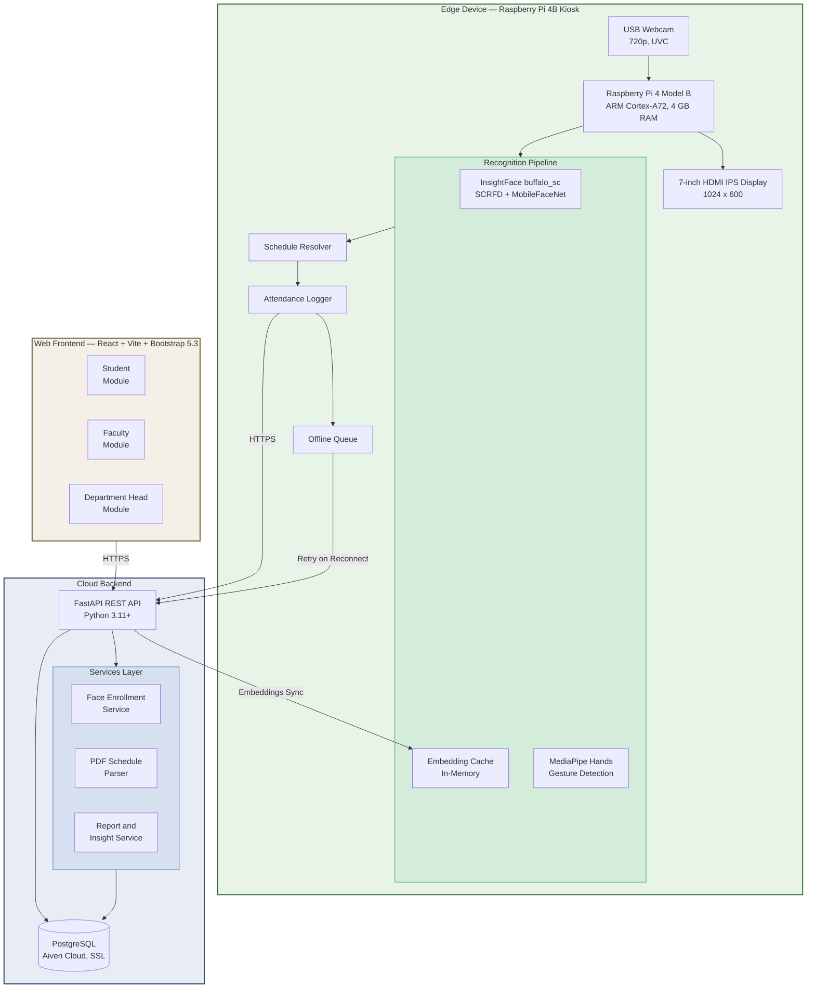
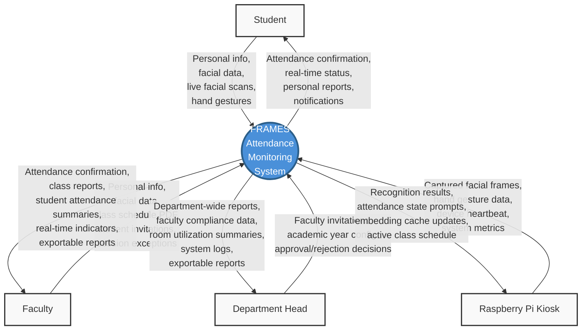
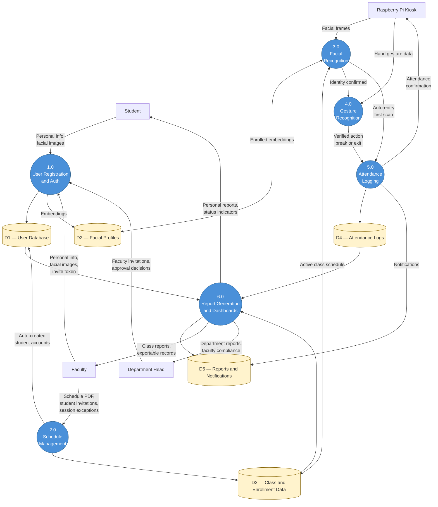
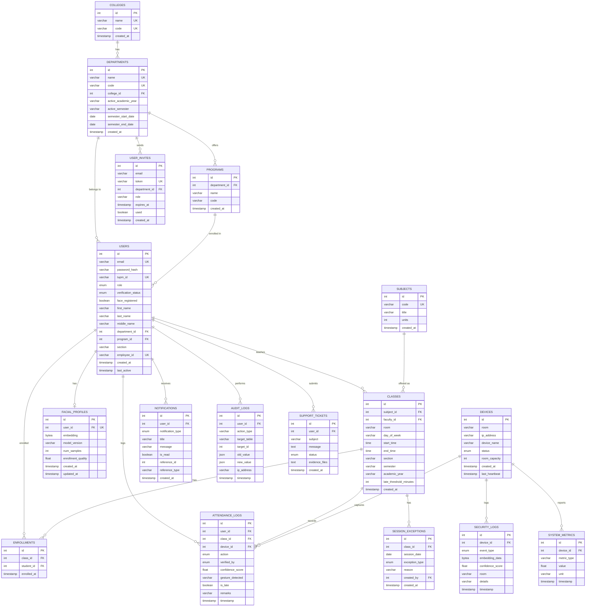
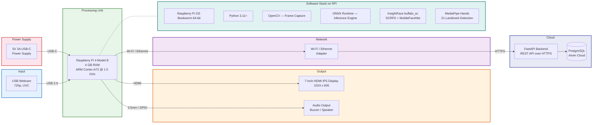
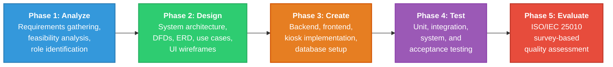
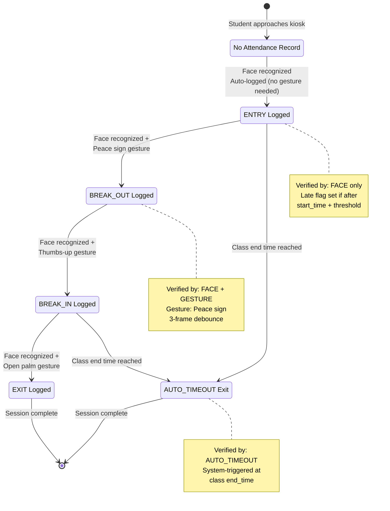
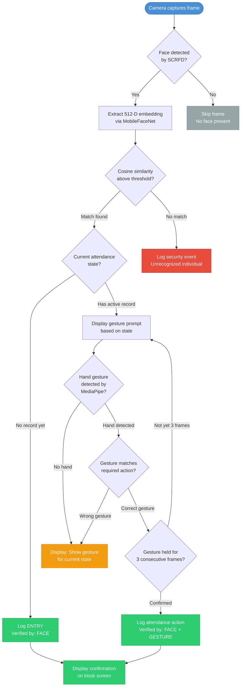

# Chapter 3 — Enhanced Diagrams

All diagrams for the FRAMES Chapter 3 Methodology, redesigned for proper rendering and UML-appropriate styling.

---

## Figure 1. System Architecture of FRAMES

---

## Figure 2. Context Data Flow Diagram of FRAMES

---

## Figure 3. Top-Level Data Flow Diagram of FRAMES

---

## Figure 4. Use Case Diagram of FRAMES

```mermaid
flowchart LR
    %% ===== PRIMARY ACTORS (Left Side) =====
    Student["<b>Student</b>"]:::actor
    Faculty["<b>Faculty</b>"]:::actor

    %% ===== SYSTEM BOUNDARY =====
    subgraph SYSTEM["FRAMES Attendance Monitoring System"]
        direction TB

        subgraph AUTH_GROUP[" "]
            direction TB
            UC_REG(["Register Account"]):::usecase
            UC_LOGIN(["Login / Logout"]):::usecase
            UC_FACE(["Enroll Face"]):::usecase
            UC_RESET(["Reset Password"]):::usecase
        end

        subgraph ATTEND_GROUP[" "]
            direction TB
            UC_SCAN(["Scan Face at Kiosk"]):::usecase
            UC_GESTURE(["Perform Gesture"]):::usecase
            UC_STATUS(["View Real-Time Attendance Status"]):::usecase
            UC_NOTIFY(["Receive Attendance Notification"]):::usecase
            UC_AUTOEXIT(["Auto-Exit at Class End"]):::usecase
        end

        subgraph FACULTY_GROUP[" "]
            direction TB
            UC_UPLOAD(["Upload Schedule PDF"]):::usecase
            UC_MANAGE(["Manage Class Students"]):::usecase
            UC_LATE(["Set Late Threshold"]):::usecase
            UC_EXCEPT(["Create Session Exception"]):::usecase
            UC_INVITE_S(["Invite Students"]):::usecase
            UC_REPORT(["View Class Attendance Reports"]):::usecase
            UC_EXPORT(["Export Reports — CSV/PDF"]):::usecase
        end

        subgraph HEAD_GROUP[" "]
            direction TB
            UC_INVITE_F(["Invite Faculty"]):::usecase
            UC_APPROVE(["Approve / Reject Faculty Accounts"]):::usecase
            UC_CONFIG(["Configure Academic Year / Semester"]):::usecase
            UC_SUBJ(["Manage Subjects and Devices"]):::usecase
            UC_DEPT_RPT(["View Department-Wide Reports"]):::usecase
            UC_COMPLY(["View Faculty Compliance Data"]):::usecase
            UC_LOGS(["View System Audit Logs"]):::usecase
        end

        subgraph KIOSK_GROUP[" "]
            direction TB
            UC_CAPTURE(["Capture Facial Frames"]):::usecase
            UC_DETECT_G(["Detect Hand Gestures"]):::usecase
            UC_RESOLVE(["Resolve Active Class Schedule"]):::usecase
            UC_FLAG(["Flag Unrecognized Individual"]):::usecase
            UC_HEARTBEAT(["Send Device Heartbeat"]):::usecase
        end

        %% Include relationships (dashed arrows)
        UC_GESTURE -.->|"&laquo;include&raquo;"| UC_SCAN
        UC_EXPORT -.->|"&laquo;include&raquo;"| UC_REPORT
        UC_AUTOEXIT -.->|"&laquo;include&raquo;"| UC_RESOLVE
    end

    %% ===== SECONDARY ACTORS (Right Side) =====
    DeptHead["<b>Department<br>Head</b>"]:::actor
    Kiosk["<b>Kiosk<br>Raspberry Pi</b>"]:::actor

    %% ===== STUDENT CONNECTIONS =====
    Student --- UC_REG
    Student --- UC_LOGIN
    Student --- UC_FACE
    Student --- UC_RESET
    Student --- UC_SCAN
    Student --- UC_GESTURE
    Student --- UC_STATUS
    Student --- UC_NOTIFY

    %% ===== FACULTY CONNECTIONS =====
    Faculty --- UC_LOGIN
    Faculty --- UC_FACE
    Faculty --- UC_SCAN
    Faculty --- UC_GESTURE
    Faculty --- UC_STATUS
    Faculty --- UC_UPLOAD
    Faculty --- UC_MANAGE
    Faculty --- UC_LATE
    Faculty --- UC_EXCEPT
    Faculty --- UC_INVITE_S
    Faculty --- UC_REPORT
    Faculty --- UC_EXPORT

    %% ===== DEPARTMENT HEAD CONNECTIONS =====
    DeptHead --- UC_LOGIN
    DeptHead --- UC_INVITE_F
    DeptHead --- UC_APPROVE
    DeptHead --- UC_CONFIG
    DeptHead --- UC_SUBJ
    DeptHead --- UC_DEPT_RPT
    DeptHead --- UC_COMPLY
    DeptHead --- UC_LOGS

    %% ===== KIOSK CONNECTIONS =====
    Kiosk --- UC_CAPTURE
    Kiosk --- UC_DETECT_G
    Kiosk --- UC_RESOLVE
    Kiosk --- UC_FLAG
    Kiosk --- UC_HEARTBEAT
    Kiosk --- UC_AUTOEXIT

    %% ===== STYLES =====
    classDef actor fill:#f9f9f9,stroke:#333,stroke-width:2px,font-weight:bold
    classDef usecase fill:#8bc34a,stroke:#558b2f,color:#fff,stroke-width:1px

    style SYSTEM fill:#fafafa,stroke:#333,stroke-width:2px
    style AUTH_GROUP fill:transparent,stroke:none
    style ATTEND_GROUP fill:transparent,stroke:none
    style FACULTY_GROUP fill:transparent,stroke:none
    style HEAD_GROUP fill:transparent,stroke:none
    style KIOSK_GROUP fill:transparent,stroke:none
```

---

## Figure 5. Entity-Relationship Diagram of the FRAMES Database

---

## Figure 6. Block Diagram of FRAMES Hardware Architecture

---

## Figure 7. Visual Table of Contents — FRAMES Module Structure

```mermaid
flowchart TD
    subgraph STUDENT_MODULE["Student Module"]
        direction TB
        SD["Dashboard<br>Attendance Rate, Recent Activity"]
        SS["Schedule<br>Weekly Class Timetable"]
        SH["Attendance History<br>Per-Class Logs"]
        SR["Reports<br>Personal Summaries"]
        SP["Profile<br>Account Settings, Face Enrollment"]
    end

    subgraph FACULTY_MODULE["Faculty Module"]
        direction TB
        FD["Dashboard<br>Class Stats, Today's Overview"]
        FC["Class Management<br>Upload Schedule, Add/Remove Students"]
        FA["Attendance<br>Live Room Status, Per-Student Logs"]
        FR["Reports<br>Class and Faculty Reports, CSV/PDF Export"]
        FE["Session Exceptions<br>Cancel, Reschedule"]
        FI["Invite Students<br>Email Invitations"]
        FP["Profile<br>Account Settings, Face Enrollment"]
    end

    subgraph HEAD_MODULE["Department Head Module"]
        direction TB
        HD["Dashboard<br>Department Overview, Attendance Trends"]
        HF["Faculty Management<br>Invite, Approve, Reject Faculty"]
        HS["Subjects and Programs<br>CRUD Operations"]
        HV["Devices<br>Register, Monitor Kiosk Units"]
        HR["Reports<br>Department-Wide, Faculty Compliance, Room Utilization"]
        HA["Academic Config<br>Year, Semester, Dates"]
        HL["System Logs<br>Audit Trail"]
    end

    subgraph KIOSK_MODULE["Kiosk Interface"]
        direction TB
        KC["Camera Feed<br>Live Preview with Overlays"]
        KR["Recognition Display<br>Name, Status, Confidence"]
        KG["Gesture Prompt<br>Action Required, Visual Guide"]
        KA["Anomaly Alert<br>Unknown Face Detected"]
        KS["Class Info<br>Current Subject, Room, Time"]
    end

    style STUDENT_MODULE fill:#e3f2fd,stroke:#1565c0,stroke-width:2px
    style FACULTY_MODULE fill:#e8f5e9,stroke:#2e7d32,stroke-width:2px
    style HEAD_MODULE fill:#fff3e0,stroke:#e65100,stroke-width:2px
    style KIOSK_MODULE fill:#f3e5f5,stroke:#6a1b9a,stroke-width:2px
```

---

## Figure 8. Waterfall-Based Project Development Framework for FRAMES

---

## Figure 9. Attendance State Machine — Operation Sequence

This additional diagram shows the attendance state transitions that each student goes through during a class session, which is a core part of the system logic.

---

## Figure 10. Recognition Pipeline Flowchart

This diagram details the step-by-step processing that occurs on the Raspberry Pi kiosk for each camera frame.

---

## Notes on Rendering

- All diagrams use ` ` for line breaks (universally supported across Mermaid renderers)
- Use Case Diagram uses stadium-shaped nodes `(["text"])` to approximate UML ovals
- Use Case Diagram places primary actors (Student, Faculty) on the left and secondary actors (Department Head, Kiosk) on the right, with `<<include>>` relationships shown as dashed arrows
- ERD uses native Mermaid `erDiagram` syntax with proper PK/FK/UK annotations
- State Machine (Figure 9) uses `stateDiagram-v2` for proper UML state diagram notation
- Context DFD and Top-Level DFD use circle nodes `(("text"))` for processes and cylinder nodes `[("text")]` for data stores, following standard DFD conventions
- Color coding is consistent: blue for processes, yellow for data stores, green for success states, red for error/anomaly states
