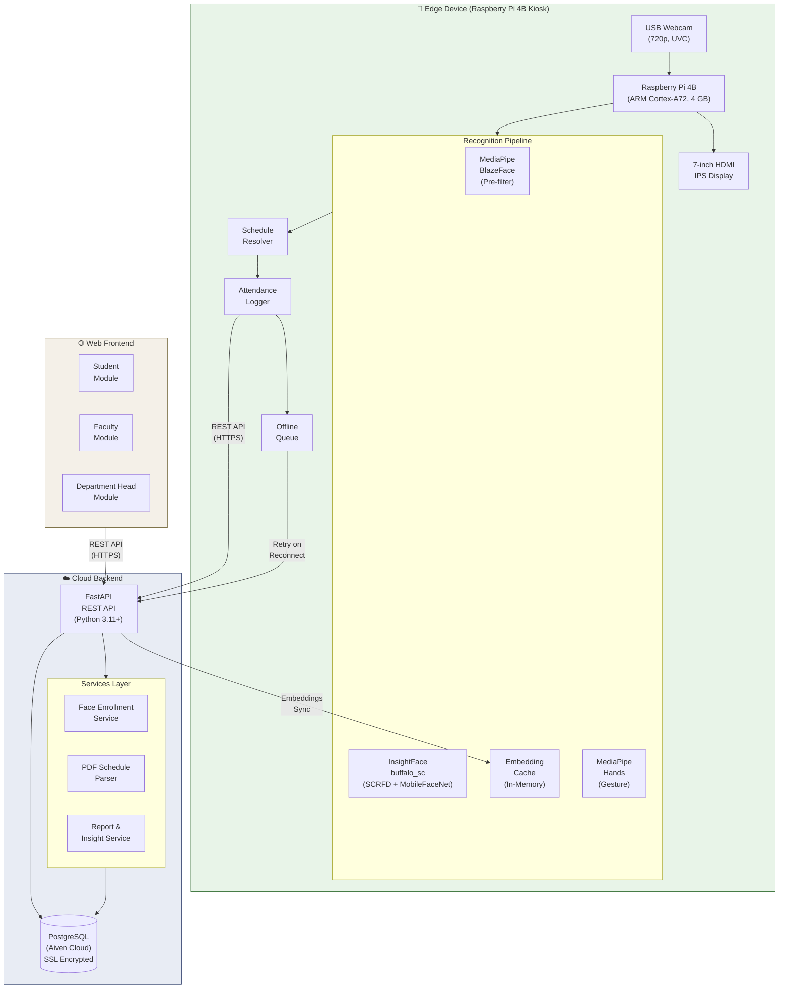
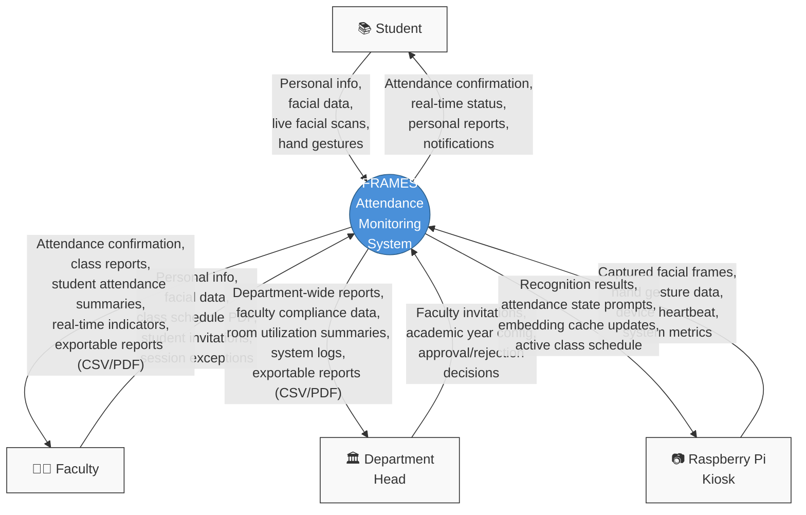
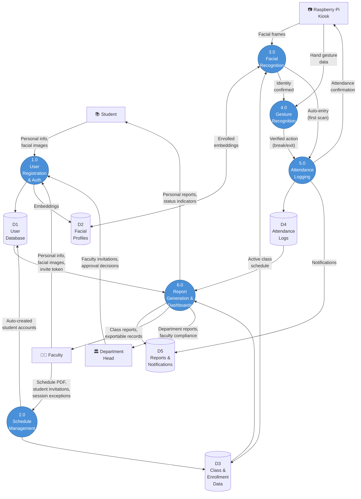
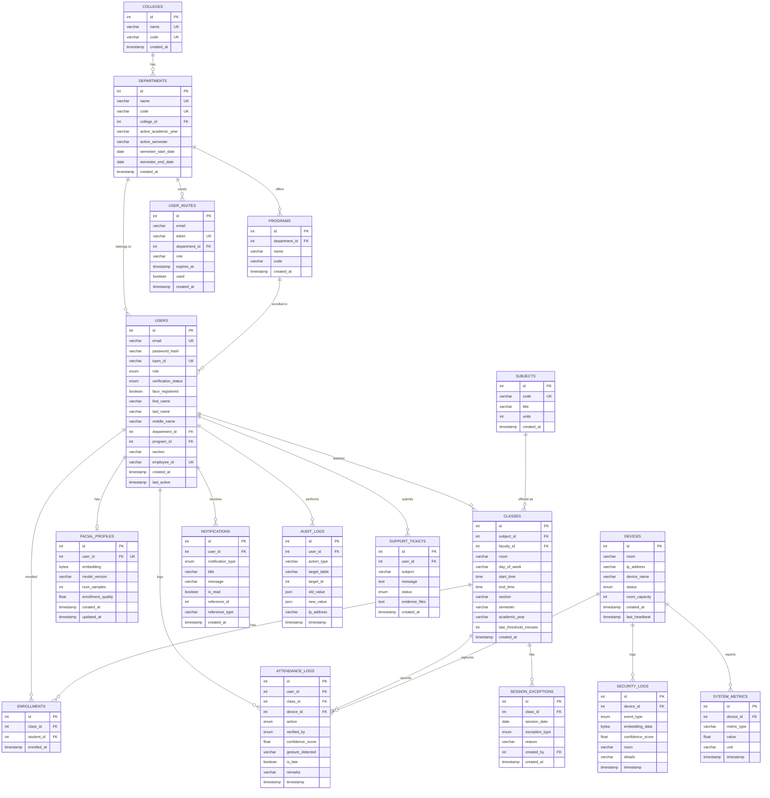
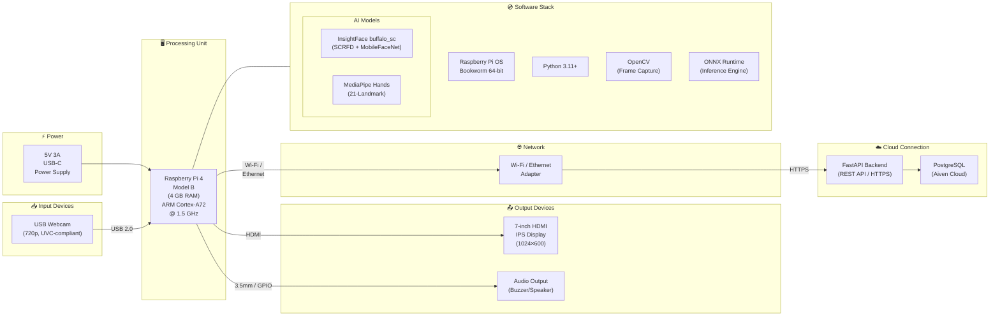
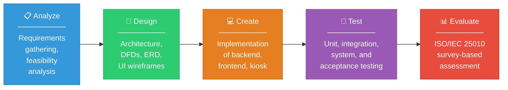

# Chapter 3

## METHODOLOGY

This chapter presents the methodology used in developing **FRAMES (Facial Recognition and Attendance Monitoring with Embedded System): A Web-Based, Gesture-Gated Facial Recognition Attendance System Using Raspberry Pi**. It covers the project design — including the system architecture, context diagram, top-level data flow diagram, use case diagram, database design, and block diagram — as well as the project development process, system operations and testing procedures, and evaluation approach based on the ISO/IEC 25010:2023 Software Quality Model.

---

### Project Design

The study follows a developmental-descriptive design. The developmental aspect involves designing and building a web-based attendance monitoring system that integrates embedded facial recognition and gesture-gated logging on Raspberry Pi hardware with a cloud-connected dashboard. The descriptive aspect focuses on analyzing and presenting the system's capabilities, workflows, and outputs based on pilot testing and user evaluation. This methodology was selected because the study's goal is not only to solve a practical attendance monitoring problem but also to document the process in a manner that could serve as a reference for future embedded biometric system deployments in similar institutional contexts.

The system was designed using standard analysis and modeling tools. A **Context Data Flow Diagram** was created to visualize the external entities interacting with the system. A **Top-Level Data Flow Diagram** was developed to decompose the system into its major internal processes. A **Use Case Diagram** was produced to define role-based interactions and system functions. A **System Architecture Diagram** illustrates the two-pipeline design linking the edge device (Raspberry Pi) to the cloud backend and web frontend. A **Block Diagram** maps the physical hardware components and their connections. Finally, an **Entity-Relationship Diagram (ERD)** documents the database schema design hosted on Aiven Cloud PostgreSQL.

The design emphasizes three architectural principles: (1) separation between edge processing (face recognition and gesture detection on the Raspberry Pi) and cloud storage (attendance records, reports, and dashboards on the FastAPI backend), (2) role-based access control that scopes data visibility to each user's responsibilities, and (3) real-time data synchronization that ensures kiosk attendance events are immediately reflected on the web dashboard.

---

### System Design

#### System Architecture

FRAMES employs a **two-pipeline architecture** that separates enrollment (server-side) from recognition (edge-side), connected through a cloud-hosted PostgreSQL database on Aiven Cloud with SSL encryption.

**Figure 1.** System Architecture of FRAMES

Figure 1 illustrates the overall system architecture of FRAMES, showing the three major subsystems and their interconnections. The architecture is organized into three layers: the Edge Device, the Cloud Backend, and the Web Frontend.

The **Edge Device** layer consists of a Raspberry Pi 4 Model B (4 GB RAM) connected to a USB webcam and a 7-inch HDMI IPS display, housed within a kiosk enclosure and deployed at the classroom entrance. The recognition pipeline on the Pi runs two models sequentially: InsightFace's `buffalo_sc` (combining SCRFD face detection with MobileFaceNet embedding extraction) for identity verification, and MediaPipe Hands for static gesture detection. A schedule resolver determines the currently active class based on room assignment and time of day, so the system knows which enrolled students to match against. An attendance logger transmits recognized events to the cloud backend via HTTPS. When network connectivity is interrupted, an offline queue stores attendance events locally and flushes them upon reconnection, ensuring no data loss during brief outages.

The **Cloud Backend** layer is built on FastAPI (Python 3.11+) with SQLAlchemy ORM, connected to a PostgreSQL database hosted on Aiven Cloud with SSL encryption. The backend provides RESTful API endpoints for authentication, attendance logging, face enrollment, schedule management, and report generation. The face enrollment service processes webcam images uploaded through the web interface, extracts 512-dimensional embeddings using the same `buffalo_sc` model, and stores only the numerical embeddings — no raw facial images are retained. The PDF schedule parser extracts class schedules from faculty-uploaded PDF files exported from the TUP Portal. The report and insight service aggregates attendance data into structured summaries with analytics.

The **Web Frontend** layer is a single-page application built with Vite, React 19.2, Bootstrap 5.3, and Chart.js/Recharts for data visualization. It provides three role-based modules — Student, Faculty, and Department Head — each scoped to display only the data relevant to that role. The frontend communicates with the backend exclusively through the centralized REST API, with JWT-based authentication and Axios interceptors handling token management.

---

#### Context Data Flow Diagram

**Figure 2.** Context Data Flow Diagram of FRAMES

Figure 2 presents the Context Level Data Flow Diagram (DFD) of FRAMES. At this level, the system is represented as a single process that interacts with four external entities: Student, Faculty, Department Head, and the Raspberry Pi Kiosk.

The **Student** entity provides personal information, facial data during web-based enrollment, and live facial scans with hand gestures at the kiosk during class attendance. The system returns attendance confirmation displayed on the kiosk screen, real-time attendance status accessible through the student web dashboard, personal attendance reports, and notifications for attendance events such as late entries or consecutive absences.

The **Faculty** entity provides personal information, facial data for enrollment, class schedule PDFs (exported from the TUP Portal), student invitation codes for account creation, and session exceptions such as class cancellations or rescheduling. The system returns attendance confirmation, class-specific attendance reports with per-student breakdowns, attendance summaries with analytics, real-time indicators for currently active classes, and exportable records in CSV and PDF formats. Faculty can monitor attendance directly from their dashboard without manually tracking individual students.

The **Department Head** entity sends faculty invitations to onboard new instructors, configures the active academic year and semester settings, and issues approval or rejection decisions for pending faculty accounts. The system returns department-wide attendance reports aggregated across all classes and faculty members, faculty compliance data showing teaching activity, room utilization summaries, system audit logs, and exportable reports. These outputs support data-driven departmental oversight without requiring the department head to physically inspect classrooms.

The **Raspberry Pi Kiosk** entity sends captured facial frames and hand gesture data from the USB webcam, periodic device heartbeat signals indicating operational status, and system metrics such as frame processing time and memory usage. The system returns recognition results (match or anomaly), attendance state prompts directing the user to perform the appropriate gesture, embedding cache updates when new students are enrolled, and the active class schedule for the assigned room. This bidirectional data flow ensures that the kiosk operates as a responsive, real-time recognition terminal synchronized with the cloud backend.

---

#### Top-Level Data Flow Diagram

**Figure 3.** Top-Level Data Flow Diagram of FRAMES

Figure 3 expands the single FRAMES process from the Context Diagram into six interconnected processes, showing how inputs from users and hardware are transformed into attendance logs, reports, and dashboards. Five data stores (D1–D5) serve as persistent repositories.

**Process 1.0: User Registration and Authentication.** Students, faculty, and the department head interact with this process for account creation and identity management. Students submit personal information and facial images through the web interface; the system extracts 512-dimensional face embeddings using InsightFace's `buffalo_sc` model and stores them in the Facial Profiles store (D2), while user credentials and profile data are recorded in the User Database (D1). Faculty members register through invite tokens sent by the department head. The department head approves or rejects pending faculty accounts, controlling system access. No raw facial images are retained — only numerical embedding vectors.

**Process 2.0: Schedule Management.** Faculty members upload class schedule PDFs exported from the TUP Portal. The system's PDF parser extracts subject codes, sections, room assignments, days of the week, and time slots, then creates class records in the Class and Enrollment Data store (D3). Student accounts are auto-created from the parsed student lists and linked to class enrollments. Faculty can also manage session exceptions (cancellations, rescheduling) and configure late arrival thresholds per class.

**Process 3.0: Facial Recognition.** The Raspberry Pi Kiosk sends captured facial frames to this process, where they undergo face detection (SCRFD) and embedding extraction (MobileFaceNet). The extracted embedding is compared against enrolled embeddings from D2, filtered to only those students enrolled in the currently active class resolved from D3. If the student's first scan of the session has no prior attendance record, the system proceeds directly to Process 5.0 for auto-entry logging. If the student already has an active attendance record, the system forwards the confirmed identity to Process 4.0 for gesture verification.

**Process 4.0: Gesture Recognition.** After identity is confirmed, the kiosk's MediaPipe Hands module captures the student's hand gesture. The required gesture depends on the student's current attendance state: peace sign for break-out, thumbs-up for break-in, or open palm for exit. The gesture must persist across three consecutive frames (temporal debouncing) before a verified action is forwarded to Process 5.0.

**Process 5.0: Attendance Logging.** This process receives verified attendance events — either auto-entries from Process 3.0 or gesture-confirmed state transitions from Process 4.0 — and records them in the Attendance Logs store (D4) with timestamps, user identity, class association, verification method (FACE or FACE+GESTURE), confidence scores, and late status. Attendance confirmation is displayed on the kiosk screen. Notifications are generated and stored in D5 for the relevant student and faculty member.

**Process 6.0: Report Generation and Dashboards.** This process aggregates data from Attendance Logs (D4), Class and Enrollment Data (D3), and User Database (D1) to produce role-specific reports. Students receive personal attendance histories and status indicators. Faculty receive class-level summaries with per-student attendance rates, late counts, and exportable CSV/PDF reports. The department head receives department-wide attendance analytics, faculty compliance data, and room utilization summaries. All generated outputs are stored in D5 for subsequent retrieval through the web dashboard.

---

#### Use Case Diagram

```mermaid
flowchart LR
    subgraph Actors
        S["👤 Student"]
        F["👤 Faculty"]
        DH["👤 Department\nHead"]
        K["📷 Kiosk\n(RPi)"]
    end

    subgraph FRAMES_SYSTEM["FRAMES System"]
        direction TB
        
        subgraph AUTH["Authentication"]
            UC1["Register Account"]
            UC2["Login / Logout"]
            UC3["Enroll Face\n(Upload Images)"]
            UC4["Reset Password"]
        end
        
        subgraph ATTEND["Attendance Operations"]
            UC5["Scan Face at Kiosk\n(Auto-Entry)"]
            UC6["Perform Gesture\n(Break/Exit)"]
            UC7["View Real-Time\nAttendance Status"]
            UC8["Receive Attendance\nNotification"]
            UC9["Auto-Exit at\nClass End Time"]
        end
        
        subgraph FACULTY_OPS["Faculty Management"]
            UC10["Upload Schedule PDF"]
            UC11["Manage Class\n(Add/Remove Students)"]
            UC12["Set Late Threshold"]
            UC13["Create Session\nException"]
            UC14["Invite Students"]
            UC15["View Class\nAttendance Reports"]
            UC16["Export Reports\n(CSV/PDF)"]
        end
        
        subgraph HEAD_OPS["Department Head Operations"]
            UC17["Invite Faculty"]
            UC18["Approve/Reject\nFaculty Accounts"]
            UC19["Configure Academic\nYear/Semester"]
            UC20["Manage Subjects\n& Devices"]
            UC21["View Department-Wide\nReports"]
            UC22["View Faculty\nCompliance Data"]
            UC23["View System\nAudit Logs"]
        end
        
        subgraph KIOSK_OPS["Kiosk Operations"]
            UC24["Capture Facial\nFrames"]
            UC25["Detect Hand\nGestures"]
            UC26["Resolve Active\nClass Schedule"]
            UC27["Flag Unrecognized\nIndividual"]
            UC28["Send Device\nHeartbeat"]
        end
    end

    %% Student connections
    S --- UC1
    S --- UC2
    S --- UC3
    S --- UC4
    S --- UC5
    S --- UC6
    S --- UC7
    S --- UC8

    %% Faculty connections
    F --- UC2
    F --- UC3
    F --- UC5
    F --- UC6
    F --- UC7
    F --- UC10
    F --- UC11
    F --- UC12
    F --- UC13
    F --- UC14
    F --- UC15
    F --- UC16

    %% Department Head connections
    DH --- UC2
    DH --- UC17
    DH --- UC18
    DH --- UC19
    DH --- UC20
    DH --- UC21
    DH --- UC22
    DH --- UC23

    %% Kiosk connections
    K --- UC24
    K --- UC25
    K --- UC26
    K --- UC27
    K --- UC28
    K --- UC9
```

**Figure 4.** Use Case Diagram of FRAMES

Figure 4 presents the Use Case Diagram of FRAMES, showing how each actor interacts with specific system functions organized into five logical groups: Authentication, Attendance Operations, Faculty Management, Department Head Operations, and Kiosk Operations.

The **Student** actor interacts with eight use cases. Students register their accounts (either through auto-creation during schedule upload or self-registration via invite link), log in and out of the web dashboard, enroll their face by uploading facial images through the web interface, and reset their passwords when needed. At the kiosk, students scan their face for automatic entry logging and perform gestures (peace sign, thumbs-up, or open palm) for break and exit actions. Through the web dashboard, students view their real-time attendance status and receive notifications for attendance events.

The **Faculty** actor interacts with twelve use cases spanning attendance and class management. Faculty share the authentication and kiosk interaction use cases with students — they register, log in, enroll their face, and scan at the kiosk for their own attendance tracking. In addition, faculty upload class schedule PDFs from the TUP Portal, which the system parses to create class records and auto-generate student accounts. Faculty can manually add or remove students from their classes, set late arrival thresholds (in minutes) per class, create session exceptions for cancelled or rescheduled sessions, and invite students via email. Faculty view class-specific attendance reports with per-student breakdowns and export these reports in CSV and PDF formats.

The **Department Head** actor interacts with seven use cases focused on departmental oversight and system configuration. The department head invites new faculty members via email, approves or rejects pending faculty account verifications, and configures the active academic year and semester. Additional management functions include maintaining the subjects catalog and managing device registrations. For monitoring, the department head views department-wide attendance reports aggregated across all classes and faculty, reviews faculty compliance data showing teaching activity patterns, and accesses system audit logs for administrative transparency.

The **Kiosk (Raspberry Pi)** actor represents the automated hardware component. It captures facial frames from the USB webcam, detects hand gestures through MediaPipe Hands, resolves the currently active class based on room assignment and time schedule, flags unrecognized individuals as anomalies for security logging, and sends periodic device heartbeat signals to confirm operational status. The auto-exit use case is triggered automatically by the kiosk when the class end time is reached, logging an EXIT record with AUTO_TIMEOUT verification for all students who remain in an active attendance session.

---

#### Database Design

**Figure 5.** Entity-Relationship Diagram of the FRAMES Database

Figure 5 illustrates the Entity-Relationship Diagram (ERD) of the FRAMES database, hosted on Aiven Cloud PostgreSQL with SSL encryption. The schema is designed to support automated attendance tracking with facial recognition, gesture-gated state logging, schedule management, role-based reporting, anomaly detection, and system monitoring.

The **organizational hierarchy** follows a three-tier structure. The `colleges` table sits at the top level (e.g., College of Science). Each college contains one or more `departments` (e.g., Computer Studies Department), and each department offers one or more `programs` (e.g., BSIT, BSIS, BSCS). The `departments` table also stores the active academic year and semester settings, along with semester start and end dates that govern the system's scheduling scope.

The **users** table is the central entity, supporting four roles through the `userrole` enumeration: STUDENT, FACULTY, HEAD (Department Head), and ADMIN. Each user belongs to a department and optionally to a program. The `verification_status` field (PENDING, VERIFIED, REJECTED) controls account activation — faculty accounts require department head approval before gaining system access. The `face_registered` boolean tracks whether the user has completed facial enrollment.

The **facial_profiles** table stores one record per user (enforced by a unique constraint on `user_id`), containing the 512-dimensional face embedding as a binary array (`bytea`), the model version (e.g., `insightface_buffalo_sc`), the number of enrollment samples, and an enrollment quality score. No raw facial images are stored, implementing a privacy-by-design approach consistent with the Data Privacy Act of 2012 (RA 10173).

The **classes** table records individual class sections, each linked to a subject and a faculty member. Fields include room assignment, day of the week, start and end times, section code, semester, academic year, and a configurable late threshold in minutes. The **enrollments** table establishes a many-to-many relationship between students and classes, with a unique constraint on `(class_id, student_id)` preventing duplicate enrollments. Both foreign keys use `ON DELETE CASCADE` to maintain referential integrity when classes or students are removed.

The **attendance_logs** table is the highest-volume table in the schema and records every attendance event. Each log entry captures the user, class, device, action type (ENTRY, BREAK_OUT, BREAK_IN, EXIT), verification method (FACE, FACE+GESTURE, or AUTO_TIMEOUT), recognition confidence score, detected gesture name, late status, remarks, and timestamp. A composite index on `(user_id, class_id, timestamp)` optimizes the most frequent query pattern: retrieving a student's attendance history for a specific class within a date range.

The **devices** table tracks registered Raspberry Pi kiosk units, each assigned to a room. Fields include IP address, device name, operational status (ACTIVE, INACTIVE, MAINTENANCE), room capacity, and the last heartbeat timestamp used for monitoring device uptime.

Supporting tables complete the schema: **notifications** stores per-user alerts for attendance events, late arrivals, and system messages; **security_logs** records anomaly events such as unrecognized faces, gesture failures, and spoof attempts detected by the kiosk; **session_exceptions** allows faculty to mark specific class sessions as cancelled, online, or holiday; **audit_logs** provides an administrative trail of system actions; **user_invites** manages time-limited email invitation tokens for onboarding faculty and students; **support_tickets** enables users to report issues; and **system_metrics** captures performance data from kiosk devices such as frame processing times and memory usage.

---

#### Block Diagram

**Figure 6.** Block Diagram of FRAMES Hardware Architecture

Figure 6 shows the physical hardware components of the FRAMES kiosk and their interconnections.

The **Power Supply** delivers 5V at 3A through a USB-C connector to the Raspberry Pi 4 Model B, which serves as the central processing unit. The Pi features a quad-core ARM Cortex-A72 processor clocked at 1.5 GHz with 4 GB of LPDDR4 RAM, providing sufficient computational power to run the face recognition and gesture detection models concurrently.

The **USB Webcam** (720p resolution, UVC-compliant) connects via USB 2.0 and serves as the sole image input device. UVC compliance ensures plug-and-play operation on Raspberry Pi OS without requiring proprietary drivers.

The **7-inch HDMI IPS Display** (1024×600 resolution) provides the kiosk user interface, displaying real-time camera feed with recognition overlays, attendance confirmation messages, gesture prompts, and status indicators. An optional audio output (buzzer or speaker connected via 3.5 mm jack or GPIO) provides audible feedback for successful recognition events.

Network connectivity is established through either the Pi's built-in **Wi-Fi adapter** or an **Ethernet** connection. All communication with the cloud backend uses HTTPS for encryption in transit. The backend FastAPI server processes API requests and stores data in the Aiven Cloud PostgreSQL database.

The **Software Stack** running on the Pi includes Raspberry Pi OS Bookworm 64-bit as the operating system, Python 3.11+ as the runtime, OpenCV for frame capture and image preprocessing, ONNX Runtime as the inference engine for the InsightFace `buffalo_sc` model (SCRFD detector + MobileFaceNet recognizer), and MediaPipe Hands for 21-landmark hand gesture detection. These components execute the complete recognition pipeline locally on the edge device.

---

#### Visual Table of Contents

**Figure 7.** Visual Table of Contents — FRAMES Module Structure

Figure 7 presents the visual table of contents showing the hierarchical feature structure of each module within the FRAMES system.

The **Student Module** consists of five areas. The Dashboard displays the student's overall attendance rate and recent activity. The Schedule shows the weekly class timetable with room and time details. The Attendance History provides per-class logs with timestamps and status (on time, late, absent). The Reports section generates personal attendance summaries. The Profile area handles account settings and face enrollment through webcam image upload.

The **Faculty Module** consists of seven areas. The Dashboard presents class-level statistics and an overview of the current day's attendance activity. Class Management handles schedule uploading (PDF parsing from the TUP Portal) and manual student addition or removal. The Attendance area shows live room status from the kiosk and per-student attendance logs. Reports generate class-specific and faculty-level summaries with export options in CSV and PDF formats. Session Exceptions allow faculty to mark sessions as cancelled, rescheduled, or holiday. The Invite Students area sends email invitation links for student account creation. The Profile area handles account settings and face enrollment.

The **Department Head Module** consists of seven areas. The Dashboard provides a department-wide overview with attendance trends across all classes and faculty. Faculty Management handles inviting new faculty via email and approving or rejecting pending verification requests. Subjects and Programs offers CRUD operations for maintaining the academic catalog. Devices allows registration and monitoring of kiosk units, including heartbeat status and room assignments. Reports generate department-wide attendance analytics, faculty compliance data, and room utilization summaries. Academic Configuration sets the active academic year, semester, and semester date boundaries. System Logs provide an audit trail of administrative actions performed within the system.

The **Kiosk Interface** consists of five display areas running on the 7-inch HDMI display. The Camera Feed shows a live preview with recognition overlays (bounding boxes and name labels). The Recognition Display shows the identified user's name, attendance status, and confidence score. The Gesture Prompt area displays which gesture is required based on the user's current attendance state, with a visual guide. The Anomaly Alert area appears when an unrecognized face is detected, flagging a potential security event. The Class Info area shows the currently active class subject, room number, and scheduled time.

---

### Project Development

To ensure a systematic and structured approach in the development of FRAMES, the researchers employed the **Waterfall methodology**. This sequential model provides a step-by-step framework where each phase must be completed before the next begins. The Waterfall approach was selected because the system's requirements were well-defined from the outset — the recognition pipeline, gesture mapping, dashboard features, and database schema could be specified in advance, making a linear development model appropriate. The methodology consists of five phases: Analyze, Design, Create, Test, and Evaluate.

**Figure 8.** Waterfall-Based Project Development Framework for FRAMES

#### Analyze

In the analysis phase, the researchers identified and documented the functional and non-functional requirements of FRAMES. The core requirements include: real-time attendance tracking through facial recognition, gesture-gated state logging for entry, break-out, break-in, and exit transitions, an early entry window (10 minutes before class start), auto-exit at class end time, role-based dashboards for students, faculty, and the department head, exportable attendance reports in CSV and PDF formats, and anomaly detection for unrecognized individuals.

A feasibility analysis confirmed that the Raspberry Pi 4 Model B with a USB webcam provides an affordable and scalable hardware platform for running InsightFace's `buffalo_sc` model at 300–500 ms inference per recognition cycle. The cloud-hosted database on Aiven Cloud was selected to avoid the complexity and cost of self-hosted PostgreSQL infrastructure while ensuring SSL-encrypted connections. The analysis also identified three user roles — Student, Faculty, and Department Head — and scoped their respective system interactions.

#### Design

The design phase produced the diagrams and schemas presented in the preceding sections: the System Architecture, Context DFD, Top-Level DFD, Use Case Diagram, ERD, Block Diagram, and Visual Table of Contents. Key design decisions include:

- **Two-pipeline separation**: face enrollment through the web interface (server-side) and face recognition at the kiosk (edge-side), ensuring that the embedded device handles only inference, not model training
- **Embedding-only biometric storage**: no raw facial images are stored, aligning with privacy requirements under RA 10173
- **Decision-level multimodal fusion**: face recognition produces an accept/reject decision, then gesture recognition produces an independent accept/reject decision — both must succeed for non-entry attendance actions
- **State machine for attendance**: each student progresses through ENTRY → BREAK_OUT → BREAK_IN → EXIT, with transitions gated by specific gestures
- **Role-based access scoping**: students see only their own data, faculty see only their classes, and the department head sees department-wide aggregations

#### Create

Implementation integrated the following technologies:

| Component | Technology | Purpose |
|-----------|-----------|---------|
| Backend framework | FastAPI (Python 3.11+) | Asynchronous REST API with automatic OpenAPI documentation |
| ORM | SQLAlchemy 2.x | Database access with query optimization |
| Database | PostgreSQL (Aiven Cloud, SSL) | Persistent storage for all system data |
| Frontend framework | Vite + React 19.2 | Single-page application with hot module replacement |
| UI library | Bootstrap 5.3 | Responsive, mobile-friendly interface components |
| Visualization | Chart.js, Recharts | Attendance charts and analytics graphs |
| HTTP client | Axios | Centralized API client with JWT interceptors |
| Face recognition | InsightFace buffalo_sc (SCRFD + MobileFaceNet) | Face detection and 512-D embedding extraction |
| Inference engine | ONNX Runtime | Optimized model inference on ARM CPU |
| Gesture detection | MediaPipe Hands | 21-landmark static hand gesture classification |
| Image processing | OpenCV | Frame capture and image preprocessing |
| Edge device OS | Raspberry Pi OS Bookworm 64-bit | Operating system for the Raspberry Pi |
| PDF parsing | Custom parser (Python) | Extracts class schedules from TUP Portal PDFs |
| Email service | SMTP integration | Sends invitation links and password reset emails |

The backend was organized into a service-layer architecture: routers handle HTTP concerns, services contain business logic, and models define database schemas. Eleven API routers were implemented covering authentication, student operations, faculty operations, department head operations, kiosk communication, face enrollment, report generation, invitations, and support tickets.

The kiosk application on the Raspberry Pi follows a modular pipeline: `camera.py` handles frame capture, `face_detector.py` runs SCRFD detection, `face_recognizer.py` compares embeddings against the in-memory cache, `gesture_detector.py` classifies hand poses, `schedule_resolver.py` determines the active class, `attendance_logger.py` transmits events to the API (with offline fallback), `embedding_cache.py` manages periodic synchronization of enrolled embeddings, and `main_kiosk.py` orchestrates the complete loop.

#### Test

Testing ensured system accuracy, reliability, and usability across all components.

- **Unit testing**: Individual modules for facial recognition accuracy, gesture detection classification, attendance state machine transitions, and database query correctness
- **Integration testing**: Verified smooth communication between the Raspberry Pi kiosk, FastAPI backend, PostgreSQL database, and React frontend, confirming that attendance events logged at the kiosk appeared on the web dashboard in real time
- **System testing**: Validated the end-to-end attendance workflow — from face scan to gesture confirmation to dashboard display — under realistic classroom conditions in Room 328, College of Science Building
- **User acceptance testing**: Conducted with the 43 designated respondents (20 CS students via live kiosk interaction, 20 non-CS students via video demonstration, 2 faculty members, and 1 department head), ensuring that the system met functional expectations and usability standards

---

### Evaluation Procedure

The system was evaluated using the **ISO/IEC 25010:2023 Software Quality Model**, focusing on five quality characteristics relevant to the system's scope and deployment context.

| Quality Characteristic | Definition | What Is Assessed |
|----------------------|-----------|-----------------|
| **Functional Suitability** | The degree to which the system performs functions that meet stated and implied needs | Face recognition accuracy, gesture logging correctness, report completeness, enrollment process, anomaly detection |
| **Performance Efficiency** | The degree to which the system provides appropriate performance relative to resources used | Kiosk recognition speed (≤5 seconds), dashboard load time, sequential processing throughput |
| **Interaction Capability** | The degree to which the system can be understood, learned, used, and is attractive to the user | Dashboard intuitiveness, gesture learnability, feature organization, visual design, time reduction vs. manual methods |
| **Reliability** | The degree to which the system performs specified functions under stated conditions | Recognition consistency, log completeness (no missing or duplicate entries), system stability, error recovery |
| **Security** | The degree to which the system protects information and data with appropriate access control | Multimodal proxy prevention, role-based access restriction, biometric data handling, data privacy alignment |

Evaluation was conducted through structured survey questionnaires administered to all 43 respondents after their respective interaction or demonstration sessions. The survey uses a **4-point Likert acceptability scale**:

| Score | Label | Descriptor |
|-------|-------|------------|
| 4 | Highly Acceptable | Works excellently with no issues |
| 3 | Acceptable | Works adequately with minor issues at most |
| 2 | Unacceptable | Has significant issues that affect functionality |
| 1 | Highly Unacceptable | Does not work properly or fails to meet requirements |

**Interpretation of weighted mean:**

| Mean Range | Verbal Interpretation |
|------------|----------------------|
| 3.25 – 4.00 | Highly Acceptable |
| 2.50 – 3.24 | Acceptable |
| 1.75 – 2.49 | Unacceptable |
| 1.00 – 1.74 | Highly Unacceptable |

Two parallel survey instruments were administered: (1) an **experience-based instrument** for respondents who physically interacted with the system (20 CS students, faculty, and department head), containing question items phrased as "based on your experience using the FRAMES system," and (2) an **observation-based instrument** for respondents who watched a recorded video demonstration (20 non-CS students and any faculty who did not interact directly), containing question items phrased as "based on your observation of the FRAMES system video demonstration." Both instruments use the same 4-point Likert scale and cover the same five ISO/IEC 25010 quality characteristics, but differ in their question wording to appropriately match the evaluation context.

Each survey consists of five parts corresponding to the five ISO characteristics, plus an overall assessment section and open-ended questions for qualitative feedback. The weighted mean and standard deviation are computed per item, per characteristic, and overall. Results are analyzed separately for each respondent group (CS students, non-CS students, faculty, department head) and then aggregated to produce overall system acceptability ratings.
