<!--
╔═══════════════════════════════════════════════════════════╗
║     REVISION LOG — Codebase Audit (2026-04-15)           ║
║     All changes verified against actual source code.     ║
╠═══════════════════════════════════════════════════════════╣
║                                                           ║
║  📊 DIAGRAMS EDITED:                                     ║
║  ✏️ Fig 2  — Context DFD                                 ║
║       → Removed "approval/rejection decisions" from       ║
║         Department Head input flow                        ║
║  ✏️ Fig 3  — Top-Level DFD                               ║
║       → Removed "approval decisions" from DeptHead → P1   ║
║  ✏️ Fig 4  — Use Case Diagram                            ║
║       → Removed UC_APPROVE node and DeptHead connection   ║
║  ✏️ Fig 7  — Attendance State Machine                    ║
║       → EXIT now transitions to re-entry (not [*])        ║
║  ✏️ Fig 8  — Recognition Pipeline Flowchart              ║
║       → DEBOUNCE node: "3 consecutive" → "3 of last 8"   ║
║  ✏️ Fig 9  — Visual Table of Contents                    ║
║       → HF node: "Invite, Approve, Reject" → "Invite     ║
║         Faculty via Email Invitation Links"               ║
║  ✏️ Fig 10 — Attendance Sequence Diagram                 ║
║       → "3-frame temporal debounce" → "Window-based       ║
║         smoothing (3 of 8 frames)"                        ║
║                                                           ║
║  📝 TEXT SECTIONS EDITED:                                 ║
║  ✏️ System Architecture (Fig 1 description)              ║
║       → Quality threshold: "minimum 0.75" → two-level     ║
║         (per-frame 0.5, average 0.75)                     ║
║  ✏️ Context DFD description (Student entity)             ║
║       → "5–30 webcam frames" → "15 webcam frames at       ║
║         500ms intervals"                                  ║
║  ✏️ Context DFD description (Dept Head entity)           ║
║       → Removed approve/reject; added auto-verification   ║
║         via 48-hour invite tokens                         ║
║  ✏️ Process 1.0 description                              ║
║       → Removed approval step; fixed frames to 15;        ║
║         added two-level quality; added 5 min valid frames ║
║  ✏️ Process 4.0 description                              ║
║       → "3 consecutive frames" → "3 out of last 8 frames  ║
║         (window-based temporal smoothing)"                ║
║  ✏️ Use Case description (Student actor)                 ║
║       → "5 to 30 webcam frames" → "15 webcam frames"      ║
║  ✏️ Use Case description (Dept Head actor)               ║
║       → Removed approve/reject; added auto-verification   ║
║  ✏️ Use Case description (Kiosk actor)                   ║
║       → "three-frame temporal debouncing" → "window-based  ║
║         temporal smoothing (3 of last 8)"                 ║
║  ✏️ ERD description (users table)                        ║
║       → "require dept head approval" → "auto-verified      ║
║         via invitation link"                              ║
║  ✏️ ERD description (facial_profiles table)              ║
║       → Added two-level quality + 5/15 min valid frames   ║
║  ✏️ State Machine description                            ║
║       → Added re-entry after EXIT; fixed debouncing desc  ║
║  ✏️ Pipeline Flowchart description                       ║
║       → Fixed debouncing to window-based                  ║
║  ✏️ VTOC description (Dept Head Module)                  ║
║       → Removed approve/reject; added auto-verification   ║
║  ✏️ Sequence Diagram description (Break/Exit Flow)       ║
║       → Fixed debouncing to window-based                  ║
║  ✏️ Design decisions list                                ║
║       → Fixed debouncing to window-based                  ║
║  ✏️ Create section (backend description)                 ║
║       → "faculty verification" → "faculty invitation       ║
║         management"                                       ║
║                                                           ║
║  ✅ VERIFIED CORRECT (no changes needed):                 ║
║     0.40 match threshold, 0.45 strict threshold,          ║
║     0.55 duplicate threshold, 1.3 extension ratio,        ║
║     24h/7d JWT tokens, 48h invite tokens, 5min flush,     ║
║     30min cache refresh, 17 tables, 11 routers,           ║
║     buffalo_sc model, 512-D embeddings, 2048 bytes,       ║
║     480×360/15fps RPi, 640×480/30fps laptop,              ║
║     10min early entry, 11 notification types,             ║
║     8 report types, Room 328, 43 respondents              ║
║                                                           ║
╚═══════════════════════════════════════════════════════════╝
-->

# Chapter 3

## METHODOLOGY

This chapter presents the methodology used in developing **FRAMES (Facial Recognition and Attendance Monitoring with Embedded System): A Web-Based, Gesture-Gated Facial Recognition Attendance System Using Raspberry Pi**. It covers the project design — including the system architecture, context diagram, top-level data flow diagram, use case diagram, database design, and block diagram — as well as the project development process, system operations and testing procedures, and evaluation approach based on the ISO/IEC 25010:2023 Software Quality Model.

---

### Project Design

The study follows a developmental-descriptive design. The developmental aspect involves designing and building a web-based attendance monitoring system that integrates embedded facial recognition and gesture-gated logging on Raspberry Pi hardware with a cloud-connected dashboard. The descriptive aspect focuses on analyzing and presenting the system's capabilities, workflows, and outputs based on pilot testing and user evaluation. This methodology was selected because the study's goal is not only to solve a practical attendance monitoring problem but also to document the process in a manner that could serve as a reference for future embedded biometric system deployments in similar institutional contexts.

The system was designed using standard analysis and modeling tools. A **Context Data Flow Diagram** was created to visualize the external entities interacting with the system. A **Top-Level Data Flow Diagram** was developed to decompose the system into its major internal processes. A **Use Case Diagram** was produced to define role-based interactions and system functions. A **System Architecture Diagram** illustrates the two-pipeline design linking the edge device (Raspberry Pi) to the cloud backend and web frontend. A **Block Diagram** maps the physical hardware components and their connections. Finally, an **Entity-Relationship Diagram (ERD)** documents the database schema design hosted on Aiven Cloud PostgreSQL.

The design emphasizes three architectural principles: (1) separation between edge processing (face recognition and gesture detection on the Raspberry Pi) and cloud storage (attendance records, reports, and dashboards on the FastAPI backend), (2) role-based access control that scopes data visibility to each user's responsibilities, and (3) real-time data synchronization that ensures kiosk attendance events are immediately reflected on the web dashboard.

---

### System Design

#### System Architecture

FRAMES employs a **two-pipeline architecture** that separates enrollment (server-side) from recognition (edge-side), connected through a cloud-hosted PostgreSQL database on Aiven Cloud with SSL encryption.

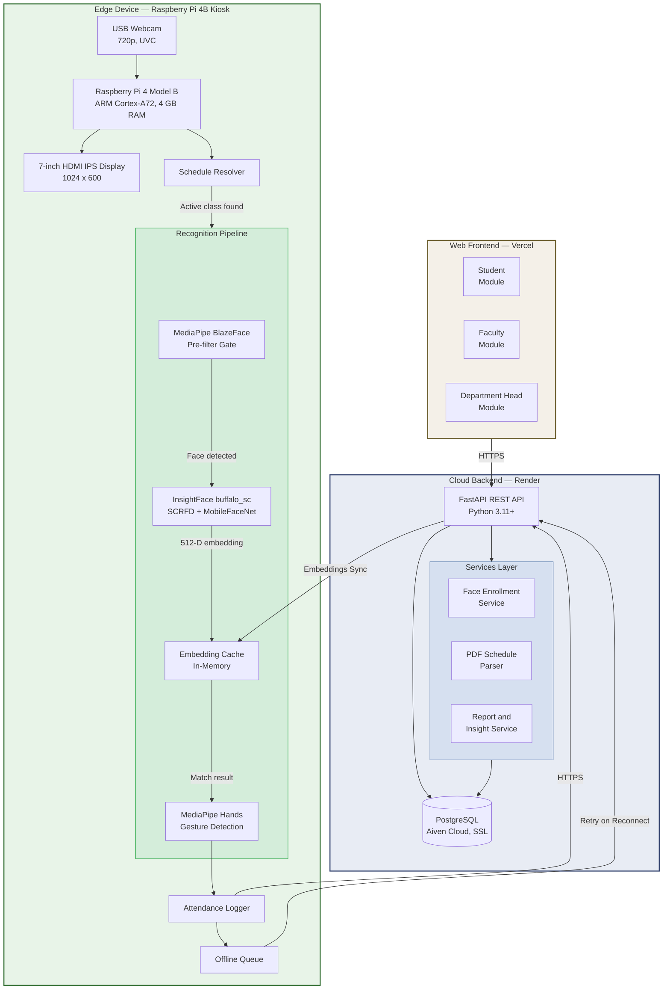

**Figure 1.** System Architecture of FRAMES

Figure 1 illustrates the overall system architecture of FRAMES, showing the three major subsystems and their interconnections. The architecture is organized into three layers: the Edge Device, the Cloud Backend, and the Web Frontend.

The **Edge Device** layer consists of a Raspberry Pi 4 Model B (4 GB RAM) connected to a USB webcam and a 7-inch HDMI IPS display, housed within a kiosk enclosure and deployed at the classroom entrance. Before any recognition occurs, a schedule resolver queries the backend API (with local cache fallback) to determine the currently active class for the assigned room based on day and time of day. If no class is currently scheduled, the kiosk displays an idle screen and skips all recognition processing — no CPU resources are consumed on empty periods. When an active class is resolved, the kiosk loads the enrolled students' facial embeddings and activates the recognition pipeline, which runs a two-stage gated detection approach: MediaPipe BlazeFace acts as a lightweight pre-filter (~30 ms) to determine whether a face is present in the frame. Only when a face is detected does the system invoke InsightFace's `buffalo_sc` model (combining SCRFD face detection with MobileFaceNet embedding extraction, ~200 ms), which produces a 512-dimensional embedding. This gated architecture conserves processing resources on the ARM CPU by skipping the heavier recognition step when no face is visible. After identity verification, MediaPipe Hands performs static gesture detection for attendance state transitions. An attendance logger transmits recognized events to the cloud backend via HTTPS. When network connectivity is interrupted, an offline queue stores attendance events locally as JSON and flushes them upon reconnection at five-minute intervals, ensuring no data loss during outages.

The **Cloud Backend** layer is built on FastAPI (Python 3.11+) with SQLAlchemy ORM, deployed on Render, and connected to a PostgreSQL database hosted on Aiven Cloud with SSL encryption. The backend provides RESTful API endpoints for authentication, attendance logging, face enrollment, schedule management, and report generation. The face enrollment service processes base64-encoded webcam frames uploaded through the web interface, detects faces, extracts 512-dimensional embeddings using the same `buffalo_sc` model, performs two-level quality validation (individual frames must exceed a detection quality score of 0.5, and the averaged quality across all valid frames must exceed 0.75), checks for duplicate identities via cosine similarity (threshold 0.55), averages multiple sample embeddings into a single stable vector, and stores only the normalized numerical embedding — no raw facial images are retained. The PDF schedule parser uses `pdfplumber` to extract data from faculty class list PDFs exported from the TUP Portal — each PDF contains one subject with its schedule details and the complete roster of enrolled students with their TUPM IDs. The report and insight service aggregates attendance data into structured summaries with analytics, using a thread-safe in-memory cache with 15-second TTL.

The **Web Frontend** layer is a single-page application built with Vite, React 19.2, Bootstrap 5.3, and Chart.js/Recharts for data visualization, deployed on Vercel. It provides three role-based modules — Student, Faculty, and Department Head — each scoped to display only the data relevant to that role. The frontend communicates with the backend exclusively through a centralized Axios API client, with JWT-based authentication (24-hour access tokens, 7-day refresh tokens) and interceptors handling automatic token attachment and 401 redirect logic.

---

#### Context Data Flow Diagram

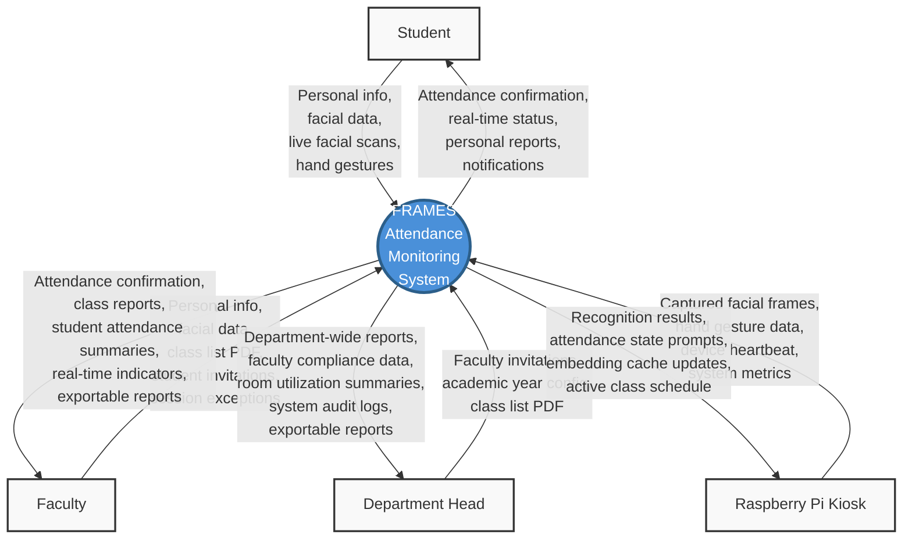

**Figure 2.** Context Data Flow Diagram of FRAMES

Figure 2 presents the Context Level Data Flow Diagram (DFD) of FRAMES. At this level, the system is represented as a single process that interacts with four external entities: Student, Faculty, Department Head, and the Raspberry Pi Kiosk.

The **Student** entity provides personal information, facial data during web-based enrollment (15 webcam frames captured automatically at 500-millisecond intervals), and live facial scans with hand gestures at the kiosk during class attendance. The system returns attendance confirmation displayed on the kiosk screen, real-time attendance status accessible through the student web dashboard, personal attendance reports with compliance tier indicators (Compliant at 95% or above, Acceptable at 85% or above, Warning at 75% or above, and Probation below 75%), and notifications for attendance events such as late entries or consecutive absences.

The **Faculty** entity provides personal information, facial data for enrollment, class list PDFs exported from the TUP Portal (each containing one subject with its schedule and the full roster of enrolled students), student invitation codes for account creation, and session exceptions such as class cancellations, rescheduling, or marking sessions as online. The system returns attendance confirmation at the kiosk (faculty also scan for their own attendance tracking), class-specific attendance reports with per-student breakdowns, attendance summaries with analytics, real-time indicators for currently active classes, and exportable records in CSV and PDF formats. Faculty can monitor attendance directly from their dashboard without manually tracking individual students.

The **Department Head** entity functions as both a teacher and a department manager. As a teacher, the department head uploads class list PDFs, manages enrolled students, and tracks personal attendance at the kiosk. As a manager, the department head sends faculty invitations to onboard new instructors via 48-hour email invitation tokens — the invitation link itself serves as verification, so faculty who register through a valid invitation link are automatically verified and can immediately access the system without a separate approval step. The department head also configures the active academic year and semester settings with start and end dates, and manages the subjects catalog and device registrations. The system returns department-wide attendance reports aggregated across all classes and faculty members, faculty compliance data showing teaching activity, room utilization summaries, system audit logs for administrative transparency, and exportable reports. These outputs support data-driven departmental oversight without requiring the department head to physically inspect classrooms.

The **Raspberry Pi Kiosk** entity sends captured facial frames from the USB webcam, hand gesture data detected by MediaPipe Hands, periodic device heartbeat signals indicating operational status, and system metrics such as frame processing time and memory usage. The system returns recognition results (match or anomaly), attendance state prompts directing the user to perform the appropriate gesture based on their current state, embedding cache updates when new students are enrolled or existing enrollments change, and the active class schedule for the assigned room. This bidirectional data flow ensures that the kiosk operates as a responsive, real-time recognition terminal synchronized with the cloud backend while maintaining operational capability during network interruptions.

---

#### Top-Level Data Flow Diagram

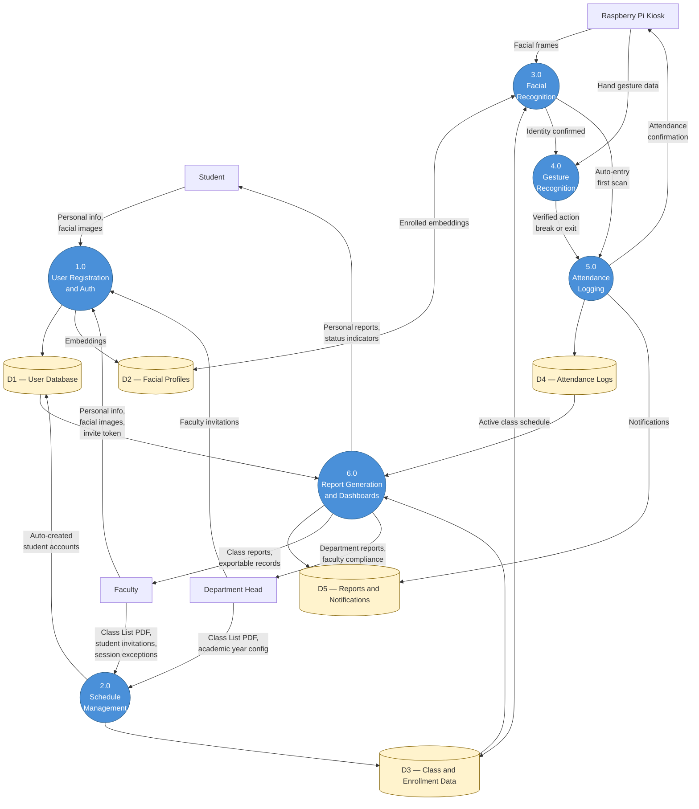

**Figure 3.** Top-Level Data Flow Diagram of FRAMES

Figure 3 expands the single FRAMES process from the Context Diagram into six interconnected processes, showing how inputs from users and hardware are transformed into attendance logs, reports, and dashboards. Five data stores (D1–D5) serve as persistent repositories.

**Process 1.0: User Registration and Authentication.** Students, faculty, and the department head interact with this process for account creation and identity management. Students may be auto-created during schedule upload (receiving default credentials based on their TUPM-ID) or they may self-register via invitation links; faculty register through 48-hour email invite tokens sent by the department head and are automatically verified upon registration — no separate approval step is required since the invitation link itself serves as verification. During facial enrollment, users capture 15 webcam frames automatically at 500-millisecond intervals through the web interface; the system extracts 512-dimensional face embeddings using InsightFace's `buffalo_sc` model, performs two-level quality validation (individual frames must exceed a detection quality score of 0.5 to be included, and the averaged quality across all valid frames must exceed 0.75), checks for duplicate identities (cosine similarity threshold 0.55), averages the multiple sample embeddings into a single stable vector, normalizes it, and stores the result in the Facial Profiles store (D2). At least 5 valid frames out of the 15 captured must pass quality validation for enrollment to proceed. User credentials, profile data, and the `face_registered` boolean flag are recorded in the User Database (D1). No raw facial images are retained — only the 2,048-byte numerical embedding vector.

**Process 2.0: Schedule Management.** Faculty members and the department head upload class list PDFs exported from the TUP Portal — each PDF contains one subject with its schedule details (day, time, venue, section) and the complete roster of enrolled students with their TUPM IDs. The system's PDF parser, built with `pdfplumber`, extracts subject codes, subject names, sections, room assignments (venues), days of the week, and time slots, then creates class records in the Class and Enrollment Data store (D3). Student accounts are auto-created from the parsed student lists with TUPM-IDs and linked to class enrollments. Faculty can also manage session exceptions (cancellations, rescheduling to online, or holiday designations) and configure late arrival thresholds in minutes per class. The department head can additionally configure the active academic year, semester, semester start and end dates, and manage the subjects catalog.

**Process 3.0: Facial Recognition.** This process operates entirely on the edge device (Raspberry Pi). Before any recognition occurs, the kiosk's schedule resolver determines the currently active class for its assigned room by querying the backend API (with local cache fallback for offline operation). If no class is scheduled, the kiosk idles and skips all recognition processing. When an active class is resolved, the kiosk loads the enrolled students' embeddings from D3 into an in-memory cache and activates the two-stage gated recognition pipeline. MediaPipe BlazeFace runs first as a lightweight pre-filter (~30 ms) to detect whether a face is present. Only when a face is detected does the system invoke InsightFace's `buffalo_sc` model to perform precise face detection via SCRFD and embedding extraction via MobileFaceNet (~200 ms). The resulting 512-dimensional embedding is compared via cosine similarity against the in-memory embedding cache. Matching uses a threshold of 0.40 cosine similarity. If the student's first scan of the session has no prior attendance record, the system proceeds directly to Process 5.0 for automatic entry logging (face only, no gesture required). If the student already has an active attendance record, the system forwards the confirmed identity to Process 4.0 for gesture verification.

**Process 4.0: Gesture Recognition.** After identity is confirmed and the student already has an active attendance record, the kiosk's MediaPipe Hands module captures the student's hand gesture using a 21-landmark hand detection model. The required gesture depends on the student's current attendance state: peace sign (two extended fingers) for break-out, thumbs-up for break-in, or open palm (all five fingers extended) for exit. Gesture classification uses distance-based finger extension detection with an extension ratio threshold of 1.3. The gesture must be detected in at least three out of the last eight frames (window-based temporal smoothing) before a verified action is forwarded to Process 5.0 — this approach tolerates occasional hand-detection drops by MediaPipe while still preventing false positives from momentary hand positions.

**Process 5.0: Attendance Logging.** This process receives verified attendance events — either auto-entries from Process 3.0 or gesture-confirmed state transitions from Process 4.0 — and records them in the Attendance Logs store (D4). Each log entry captures: user identity, class association, device identifier, action type (ENTRY, BREAK_OUT, BREAK_IN, or EXIT), verification method (FACE for auto-entries, FACE+GESTURE for gesture-confirmed actions, or AUTO_TIMEOUT for system-triggered exits), recognition confidence score, detected gesture name, late status (flagged if entry occurs after `start_time + late_threshold_minutes`), timestamp, and optional remarks. When the class end time is reached, the system automatically generates EXIT records with AUTO_TIMEOUT verification for all students who remain in an active attendance session. Attendance confirmation is displayed on the kiosk screen. Notifications are generated and stored in D5 for the relevant student and faculty member.

**Process 6.0: Report Generation and Dashboards.** This process aggregates data from Attendance Logs (D4), Class and Enrollment Data (D3), and User Database (D1) to produce role-specific reports. The service supports eight report types: daily attendance, late analysis, break log, weekly summary, monthly trends, 30-day history, attendance consistency, and absent log. Students receive personal attendance histories with compliance tier indicators (Compliant, Acceptable, Warning, or Probation based on attendance rate thresholds). Faculty receive class-level summaries with per-student attendance rates, late counts, and exportable CSV/PDF reports. The department head receives department-wide attendance analytics, faculty compliance data across all classes and instructors, and room utilization summaries. All processed reports use a thread-safe in-memory cache with 15-second TTL and are retrievable through the web dashboard.

---

#### Use Case Diagram

```mermaid
flowchart LR
    %% ===== PRIMARY ACTORS (Left Side) =====
    Student["Student"]:::actor
    Faculty["Faculty"]:::actor

    %% ===== SYSTEM BOUNDARY =====
    subgraph SYSTEM["FRAMES Attendance Monitoring System"]
        direction TB

        subgraph AUTH_GROUP[" "]
            direction TB
            UC_REG(["Register Account"]):::usecase
            UC_LOGIN(["Login / Logout"]):::usecase
            UC_FACE(["Enroll Face"]):::usecase
            UC_RESET(["Reset Password"]):::usecase
        end

        subgraph ATTEND_GROUP[" "]
            direction TB
            UC_SCAN(["Scan Face at Kiosk"]):::usecase
            UC_GESTURE(["Perform Gesture"]):::usecase
            UC_STATUS(["View Real-Time Attendance Status"]):::usecase
            UC_NOTIFY(["Receive Attendance Notification"]):::usecase
            UC_AUTOEXIT(["Auto-Exit at Class End"]):::usecase
        end

        subgraph FACULTY_GROUP[" "]
            direction TB
            UC_UPLOAD(["Upload Class List PDF"]):::usecase
            UC_MANAGE(["Manage Class Students"]):::usecase
            UC_LATE(["Set Late Threshold"]):::usecase
            UC_EXCEPT(["Create Session Exception"]):::usecase
            UC_INVITE_S(["Invite Students"]):::usecase
            UC_REPORT(["View Class Attendance Reports"]):::usecase
            UC_EXPORT(["Export Reports — CSV/PDF"]):::usecase
        end

        subgraph HEAD_GROUP[" "]
            direction TB
            UC_INVITE_F(["Invite Faculty"]):::usecase

            UC_CONFIG(["Configure Academic Year / Semester"]):::usecase
            UC_SUBJ(["Manage Subjects and Devices"]):::usecase
            UC_DEPT_RPT(["View Department-Wide Reports"]):::usecase
            UC_COMPLY(["View Faculty Compliance Data"]):::usecase
            UC_LOGS(["View System Audit Logs"]):::usecase
        end

        subgraph KIOSK_GROUP[" "]
            direction TB
            UC_CAPTURE(["Capture Facial Frames"]):::usecase
            UC_DETECT_G(["Detect Hand Gestures"]):::usecase
            UC_RESOLVE(["Resolve Active Class Schedule"]):::usecase
            UC_FLAG(["Flag Unrecognized Individual"]):::usecase
            UC_HEARTBEAT(["Send Device Heartbeat"]):::usecase
        end

        %% Include relationships
        UC_GESTURE -.->|"include"| UC_SCAN
        UC_EXPORT -.->|"include"| UC_REPORT
        UC_AUTOEXIT -.->|"include"| UC_RESOLVE
    end

    %% ===== SECONDARY ACTORS (Right Side) =====
    DeptHead["Department<br>Head"]:::actor
    Kiosk["Kiosk<br>Raspberry Pi"]:::actor

    %% ===== STUDENT CONNECTIONS =====
    Student --- UC_REG
    Student --- UC_LOGIN
    Student --- UC_FACE
    Student --- UC_RESET
    Student --- UC_SCAN
    Student --- UC_GESTURE
    Student --- UC_STATUS
    Student --- UC_NOTIFY

    %% ===== FACULTY CONNECTIONS =====
    Faculty --- UC_LOGIN
    Faculty --- UC_FACE
    Faculty --- UC_SCAN
    Faculty --- UC_GESTURE
    Faculty --- UC_STATUS
    Faculty --- UC_UPLOAD
    Faculty --- UC_MANAGE
    Faculty --- UC_LATE
    Faculty --- UC_EXCEPT
    Faculty --- UC_INVITE_S
    Faculty --- UC_REPORT
    Faculty --- UC_EXPORT

    %% ===== DEPARTMENT HEAD CONNECTIONS =====
    DeptHead --- UC_LOGIN
    DeptHead --- UC_FACE
    DeptHead --- UC_UPLOAD
    DeptHead --- UC_INVITE_F

    DeptHead --- UC_CONFIG
    DeptHead --- UC_SUBJ
    DeptHead --- UC_DEPT_RPT
    DeptHead --- UC_COMPLY
    DeptHead --- UC_LOGS

    %% ===== KIOSK CONNECTIONS =====
    Kiosk --- UC_CAPTURE
    Kiosk --- UC_DETECT_G
    Kiosk --- UC_RESOLVE
    Kiosk --- UC_FLAG
    Kiosk --- UC_HEARTBEAT
    Kiosk --- UC_AUTOEXIT

    %% ===== STYLES =====
    classDef actor fill:#f9f9f9,stroke:#333,stroke-width:2px,font-weight:bold
    classDef usecase fill:#8bc34a,stroke:#558b2f,color:#fff,stroke-width:1px

    style SYSTEM fill:#fafafa,stroke:#333,stroke-width:2px
    style AUTH_GROUP fill:transparent,stroke:none
    style ATTEND_GROUP fill:transparent,stroke:none
    style FACULTY_GROUP fill:transparent,stroke:none
    style HEAD_GROUP fill:transparent,stroke:none
    style KIOSK_GROUP fill:transparent,stroke:none
```

**Figure 4.** Use Case Diagram of FRAMES

Figure 4 presents the Use Case Diagram of FRAMES, depicting how each actor participates in the core system functions. The diagram organizes these interactions around four actors — Faculty Member and Department Head on the left, and Kiosk and Student on the right — connected to use cases grouped by shared or role-specific scope.

The **Student** actor participates in four use cases. Students enroll their facial data through the web interface by capturing 15 webcam frames at 500-millisecond intervals, from which the system extracts and stores a 512-dimensional embedding. At the kiosk, the student's face is automatically scanned for an ENTRY log on first arrival; subsequent state transitions — BREAK_OUT, BREAK_IN, and EXIT — are triggered through gestures: a peace sign, a thumbs-up, and an open palm, respectively. Students access the web dashboard to view real-time attendance status with compliance tier indicators (Compliant at 95% or above, Acceptable at 85% or above, Warning at 75% or above, and Probation below 75%) and to retrieve their personal attendance reports showing per-class breakdowns and history.

The **Faculty Member** actor participates in all four use cases shared with students — facial data registration, attendance logging at the kiosk, real-time attendance monitoring, and personal report generation — and additionally in four faculty-exclusive use cases. Faculty upload class list PDFs exported from the TUP Portal; each PDF contains one subject with its schedule and the complete roster of enrolled students with their TUPM IDs, which the system parses using `pdfplumber` to create class records and auto-generate student accounts. Faculty manage session exceptions by marking individual sessions as cancelled, rescheduled, online, or holiday, so those sessions are excluded from attendance calculations. Faculty configure late arrival thresholds in minutes per class and generate class-level attendance reports with per-student breakdowns, exportable in CSV and PDF formats.

The **Department Head** actor participates in all use cases available to the Faculty Member and additionally in management-exclusive use cases. As a department manager, the department head sends faculty invitations via 48-hour email tokens — faculty who register through these invitation links are automatically verified and can immediately access the system, eliminating the need for a separate manual approval step. The department head generates faculty-level reports, which aggregate attendance data across all classes and instructors into department-wide analytics, faculty compliance summaries, and room utilization data. The department head also configures department and academic settings: setting the active academic year, semester, and semester date boundaries, and managing the subjects catalog and device registrations for kiosk units.

The **Kiosk** actor represents the Raspberry Pi hardware unit deployed at the classroom entrance. All five of its use cases execute automatically without direct human interaction. The kiosk first resolves the active class for its assigned room by querying the backend API — with local cache fallback for offline operation — and activates the recognition pipeline only when an active class is found. It then captures facial frames from the USB webcam through the two-stage gated pipeline (MediaPipe BlazeFace pre-filter at approximately 30 ms, followed by InsightFace buffalo_sc embedding extraction at approximately 200 ms) and detects hand gestures using MediaPipe Hands with window-based temporal smoothing (three detections out of the last eight frames) to prevent false positives. When a detected face cannot be matched to any enrolled student — falling below the cosine similarity threshold of 0.40 — the kiosk flags the individual as an unrecognized entry, logging the anomaly in the security_logs table. The kiosk also transmits periodic device heartbeat signals to the backend, reporting operational status and system metrics such as frame processing time and memory usage.

---

#### Database Design

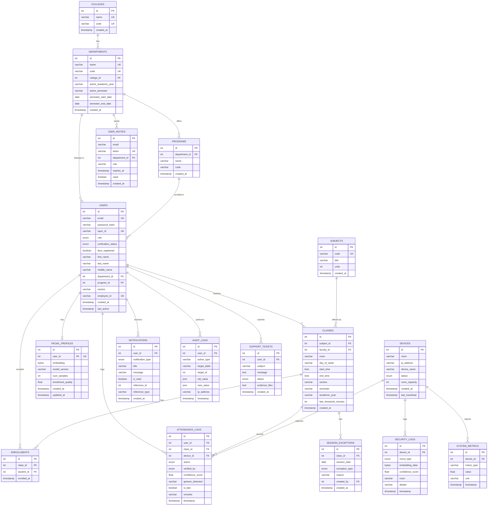

**Figure 5.** Entity-Relationship Diagram of the FRAMES Database

Figure 5 illustrates the Entity-Relationship Diagram (ERD) of the FRAMES database, hosted on Aiven Cloud PostgreSQL with SSL encryption. The schema comprises 17 tables designed to support automated attendance tracking with facial recognition, gesture-gated state logging, schedule management, role-based reporting, anomaly detection, and system monitoring.

The **organizational hierarchy** follows a three-tier structure. The `colleges` table sits at the top level (e.g., College of Science). Each college contains one or more `departments` (e.g., Computer Studies Department), and each department offers one or more `programs` (e.g., BSIT, BSIS, BSCS). The `departments` table also stores the active academic year and semester settings, along with semester start and end dates that govern the system's scheduling scope.

The **users** table is the central entity, supporting four roles through the `userrole` enumeration: STUDENT, FACULTY, HEAD (Department Head), and ADMIN. Each user belongs to a department and optionally to a program. Students are identified by `tupm_id` (e.g., TUPM-XX-XXXXX), while faculty and department heads are identified by `employee_id`. The `verification_status` field (PENDING, VERIFIED, REJECTED) controls account activation — faculty who register through the department head's invitation link are automatically set to VERIFIED upon registration, while non-invited registrations remain PENDING until an administrator approves them. The `face_registered` boolean tracks whether the user has completed facial enrollment, which is mandatory before accessing the web dashboard features.

The **facial_profiles** table stores one record per user (enforced by a unique constraint on `user_id`), containing the 512-dimensional face embedding as a binary array (`bytea`, 2,048 bytes for 512 float32 values), the model version (defaulting to `insightface_buffalo_sc_v1`), the number of enrollment samples used (out of 15 captured frames, at least 5 must pass the per-frame quality threshold of 0.5), and an enrollment quality score (the average across all valid frames must exceed 0.75). No raw facial images are stored, implementing a privacy-by-design approach consistent with the Data Privacy Act of 2012 (RA 10173).

The **classes** table records individual class sections, each linked to a subject and a faculty member. Fields include room assignment, day of the week, start and end times (SQL `Time` type), section code, semester, academic year, and a configurable `late_threshold_minutes` (default 0) that determines when an entry is flagged as late. The **enrollments** table establishes a many-to-many relationship between students and classes, with a unique constraint on `(class_id, student_id)` preventing duplicate enrollments. Both foreign keys use `ON DELETE CASCADE` to maintain referential integrity when classes or students are removed.

The **attendance_logs** table is the highest-volume table in the schema and records every attendance event. Each log entry captures the user, class, device, action type (ENTRY, BREAK_OUT, BREAK_IN, EXIT via the `attendanceaction` enum), verification method (FACE, FACE+GESTURE, or AUTO_TIMEOUT via the `verificationmethod` enum), recognition confidence score, detected gesture name, late status, remarks, and timestamp. A composite index on `(user_id, class_id, timestamp)` optimizes the most frequent query pattern: retrieving a student's attendance history for a specific class within a date range.

The **devices** table tracks registered Raspberry Pi kiosk units, each assigned to a room. Fields include IP address, device name, operational status (ACTIVE, INACTIVE, MAINTENANCE via the `devicestatus` enum), room capacity, and the `last_heartbeat` timestamp used for monitoring device uptime.

Supporting tables complete the schema: **notifications** stores per-user alerts with 11 notification types for attendance events, late arrivals, and system messages; **security_logs** records anomaly events such as unrecognized faces, gesture failures, spoof attempts, and unauthorized access detected by the kiosk; **session_exceptions** allows faculty to mark specific class sessions as cancelled, online, or holiday (with `onsite` as the default); **audit_logs** provides an administrative trail of system actions with JSON-serialized old and new values; **user_invites** manages time-limited email invitation tokens with 48-hour expiry for onboarding faculty and students; **support_tickets** enables users to report issues with file attachment support (up to 3 JPGs or 1 PDF, maximum 5 MB); and **system_metrics** captures performance telemetry from kiosk devices such as frame processing times and memory usage.

---

#### Block Diagram

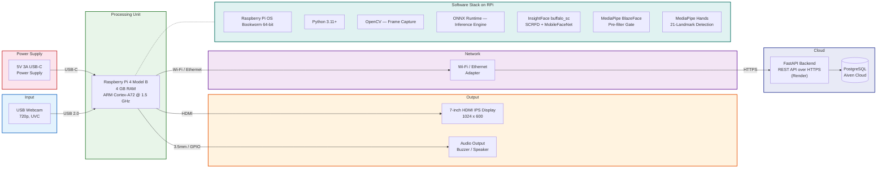

**Figure 6.** Block Diagram of FRAMES Hardware Architecture

Figure 6 shows the physical hardware components of the FRAMES kiosk and their interconnections.

The **Power Supply** delivers 5V at 3A through a USB-C connector to the Raspberry Pi 4 Model B, which serves as the central processing unit. The Pi features a quad-core ARM Cortex-A72 processor clocked at 1.5 GHz with 4 GB of LPDDR4 RAM, providing sufficient computational power to run the face recognition and gesture detection models concurrently.

The **USB Webcam** (720p resolution, UVC-compliant) connects via USB 2.0 and serves as the sole image input device. On the Raspberry Pi, the camera interface is abstracted to support both Picamera2 (for the native CSI camera on Bookworm) and OpenCV VideoCapture (for USB webcams or laptop testing). The default kiosk configuration captures frames at 480x360 resolution at 15 FPS on the Raspberry Pi to conserve processing bandwidth, while laptop testing uses 640x480 at 30 FPS.

The **7-inch HDMI IPS Display** (1024x600 resolution) provides the kiosk user interface, displaying a real-time camera feed with recognition overlays (bounding boxes and name labels), attendance confirmation messages, gesture prompts with visual guides indicating which gesture to perform, anomaly alerts for unrecognized individuals, and class information showing the currently active subject, room, and time. An optional audio output (buzzer or speaker connected via 3.5 mm jack or GPIO) provides audible feedback for successful recognition events.

Network connectivity is established through either the Pi's built-in **Wi-Fi adapter** or an **Ethernet** connection. All communication with the cloud backend uses HTTPS for encryption in transit. The backend FastAPI server, deployed on Render, processes API requests and stores data in the Aiven Cloud PostgreSQL database.

The **Software Stack** running on the Pi includes Raspberry Pi OS Bookworm 64-bit as the operating system, Python 3.11+ as the runtime, OpenCV for frame capture and image preprocessing, **ONNX Runtime** (with CPUExecutionProvider) as the inference engine, InsightFace `buffalo_sc` for face detection (SCRFD) and recognition (MobileFaceNet), MediaPipe BlazeFace as the lightweight pre-filter gate that runs before InsightFace on every frame, and MediaPipe Hands for 21-landmark hand gesture detection. These components execute the complete recognition pipeline locally on the edge device — the kiosk never sends raw frames to the API for recognition; it performs all matching in-memory using numpy-based batch cosine similarity.

---

#### Attendance State Machine

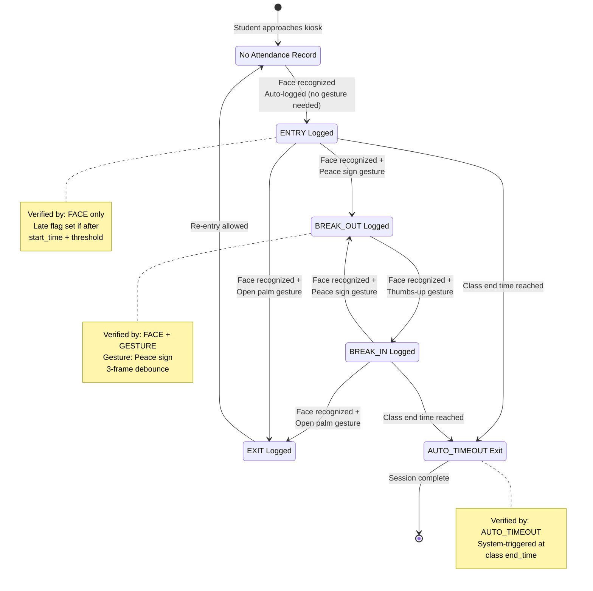

**Figure 7.** Attendance State Machine — Operation Sequence

Figure 7 shows the attendance state transitions that each student progresses through during a class session, which forms the core operational logic of FRAMES.

When a student approaches the kiosk and their face is recognized for the first time in the session (no prior attendance record for the current class on the current day), the system automatically logs an **ENTRY** record verified by FACE only — no gesture is required since the act of standing before the camera implies attendance intent. If the entry occurs after `start_time + late_threshold_minutes`, the record is flagged as late.

From the ENTRY state, the student may perform a **peace sign** gesture (two extended fingers) to transition to BREAK_OUT, logging their departure for a break. From BREAK_OUT, a **thumbs-up** gesture transitions to BREAK_IN, logging their return. From BREAK_IN, the student may either take another break (peace sign back to BREAK_OUT) or perform an **open palm** gesture (five extended fingers) to log an EXIT. A student may also exit directly from the ENTRY state without taking a break, using the open palm gesture. After an EXIT, the student may re-enter via a new face scan if they return to class, transitioning back to the no-record state and allowing a fresh ENTRY.

All gesture-gated transitions require both successful face re-recognition and correct gesture detection (verified by FACE+GESTURE). The gesture must be detected in at least three out of the last eight frames (window-based temporal smoothing) to prevent false positives from momentary hand positions while tolerating occasional hand-detection drops.

When the scheduled class end time is reached, the system automatically triggers **AUTO_TIMEOUT** exits for all students who still have an active attendance session (in ENTRY or BREAK_IN state), ensuring complete attendance records even when students forget to scan out.

---

#### Recognition Pipeline Flowchart

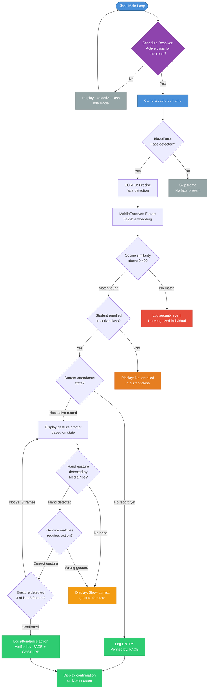

**Figure 8.** Recognition Pipeline Flowchart

Figure 8 details the step-by-step processing that occurs on the Raspberry Pi kiosk during each iteration of the main loop, showing the full decision tree from schedule resolution through frame capture to attendance confirmation.

The loop begins with the **schedule resolver**, which checks whether an active class is currently scheduled for the kiosk's assigned room. If no class is active, the kiosk enters idle mode — displaying a "No active class" message and skipping all recognition processing until the next iteration. When an active class is found, the kiosk captures a camera frame and the recognition pipeline activates. MediaPipe **BlazeFace** runs first as a lightweight gate (~30 ms). If no face is detected, the frame is skipped entirely — this optimization saves approximately 200 ms per frame by avoiding the heavier InsightFace inference when no one is in front of the camera. When a face is detected, the **SCRFD** face detector (part of InsightFace buffalo_sc) performs precise face localization, followed by **MobileFaceNet** which extracts a 512-dimensional embedding vector.

The extracted embedding is compared via batch cosine similarity against the in-memory embedding cache (precomputed as a numpy matrix for efficient `np.dot()` computation). If the highest similarity score falls below the 0.40 threshold, the individual is flagged as unrecognized and a security event is logged. If a match is found, the system verifies that the matched student is enrolled in the currently active class. If not enrolled, a message is displayed indicating that the student is not part of the current class.

For enrolled students, the system checks the current attendance state. If no record exists for the current session, an ENTRY is automatically logged (face only). If an active record exists, the system displays a gesture prompt corresponding to the next valid action — the student must then present the correct hand gesture, which MediaPipe Hands analyzes using distance-based finger extension detection. Only after the correct gesture is detected in at least three out of the last eight frames (window-based temporal smoothing) is the attendance action logged.

---

#### Visual Table of Contents

```mermaid
flowchart TD
    subgraph STUDENT_MODULE["Student Module"]
        direction TB
        SD["Dashboard<br>Attendance Rate, Compliance Tier,<br>Recent Activity"]
        SS["Schedule<br>Weekly Class Timetable"]
        SH["Attendance History<br>Per-Class Logs, Paginated"]
        SR["Reports<br>8 Report Types,<br>Personal Summaries"]
        SP["Profile<br>Account Settings,<br>Face Enrollment"]
    end

    subgraph FACULTY_MODULE["Faculty Module"]
        direction TB
        FD["Dashboard<br>Class Stats, Today's Overview"]
        FC["Class Management<br>Upload Class List PDF,<br>Add/Remove Students"]
        FA["Attendance<br>Live Room Status,<br>Per-Student Logs"]
        FR["Reports<br>Class and Faculty Reports,<br>CSV/PDF Export"]
        FE["Session Exceptions<br>Cancel, Reschedule, Online"]
        FI["Invite Students<br>48-Hour Email Invitations"]
        FP["Profile<br>Account Settings,<br>Face Enrollment"]
    end

    subgraph HEAD_MODULE["Department Head Module"]
        direction TB
        HD["Dashboard<br>Department Overview,<br>Attendance Trends"]
        HF["Faculty Management<br>Invite Faculty via<br>Email Invitation Links"]
        HS["Subjects and Programs<br>CRUD Operations"]
        HV["Devices<br>Register, Monitor<br>Kiosk Units"]
        HR["Reports<br>Department-Wide,<br>Faculty Compliance,<br>Room Utilization"]
        HA["Academic Config<br>Year, Semester, Dates"]
        HL["System Logs<br>Audit Trail"]
    end

    subgraph KIOSK_MODULE["Kiosk Interface"]
        direction TB
        KC["Camera Feed<br>Live Preview with<br>Recognition Overlays"]
        KR["Recognition Display<br>Name, Status, Confidence"]
        KG["Gesture Prompt<br>Action Required,<br>Visual Guide"]
        KA["Anomaly Alert<br>Unknown Face Detected"]
        KS["Class Info<br>Current Subject,<br>Room, Time"]
    end

    style STUDENT_MODULE fill:#e3f2fd,stroke:#1565c0,stroke-width:2px
    style FACULTY_MODULE fill:#e8f5e9,stroke:#2e7d32,stroke-width:2px
    style HEAD_MODULE fill:#fff3e0,stroke:#e65100,stroke-width:2px
    style KIOSK_MODULE fill:#f3e5f5,stroke:#6a1b9a,stroke-width:2px
```

**Figure 9.** Visual Table of Contents — FRAMES Module Structure

Figure 9 presents the visual table of contents showing the hierarchical feature structure of each module within the FRAMES system.

The **Student Module** consists of five areas. The Dashboard displays the student's overall attendance rate, compliance tier indicator (Compliant, Acceptable, Warning, or Probation based on percentage thresholds), and recent activity. The Schedule shows the weekly class timetable with room and time details. The Attendance History provides paginated per-class logs with timestamps, action types, and status (on time or late). The Reports section generates personal attendance summaries across eight report types (daily, late analysis, break log, weekly summary, monthly trends, 30-day history, consistency, and absent log). The Profile area handles account settings and face enrollment through webcam image upload.

The **Faculty Module** consists of seven areas. The Dashboard presents class-level statistics and an overview of the current day's attendance activity. Class Management handles uploading of class list PDFs from the TUP Portal (parsed by `pdfplumber`) and manual student addition or removal. The Attendance area shows live room status from the kiosk and per-student attendance logs. Reports generate class-specific and faculty-level summaries with export options in CSV and PDF formats. Session Exceptions allow faculty to mark sessions as cancelled, rescheduled, online, or holiday. The Invite Students area sends 48-hour email invitation links for student account creation. The Profile area handles account settings and face enrollment.

The **Department Head Module** consists of seven areas. The Dashboard provides a department-wide overview with attendance trends across all classes and faculty. Faculty Management handles inviting new faculty via 48-hour email invitation links — faculty who register through these links are automatically verified without a separate approval step. Subjects and Programs offers CRUD operations for maintaining the academic catalog. Devices allows registration and monitoring of kiosk units, including heartbeat status and room assignments. Reports generate department-wide attendance analytics, faculty compliance data, and room utilization summaries. Academic Configuration sets the active academic year, semester, and semester date boundaries. System Logs provide an audit trail of administrative actions performed within the system.

The **Kiosk Interface** consists of five display areas running on the 7-inch HDMI display. The Camera Feed shows a live preview with recognition overlays (bounding boxes and name labels). The Recognition Display shows the identified user's name, attendance status, and confidence score. The Gesture Prompt area displays which gesture is required based on the user's current attendance state, with a visual guide. The Anomaly Alert area appears when an unrecognized face is detected, flagging a potential security event. The Class Info area shows the currently active class subject, room number, and scheduled time.

---

#### Complete Attendance Data Flow Sequence

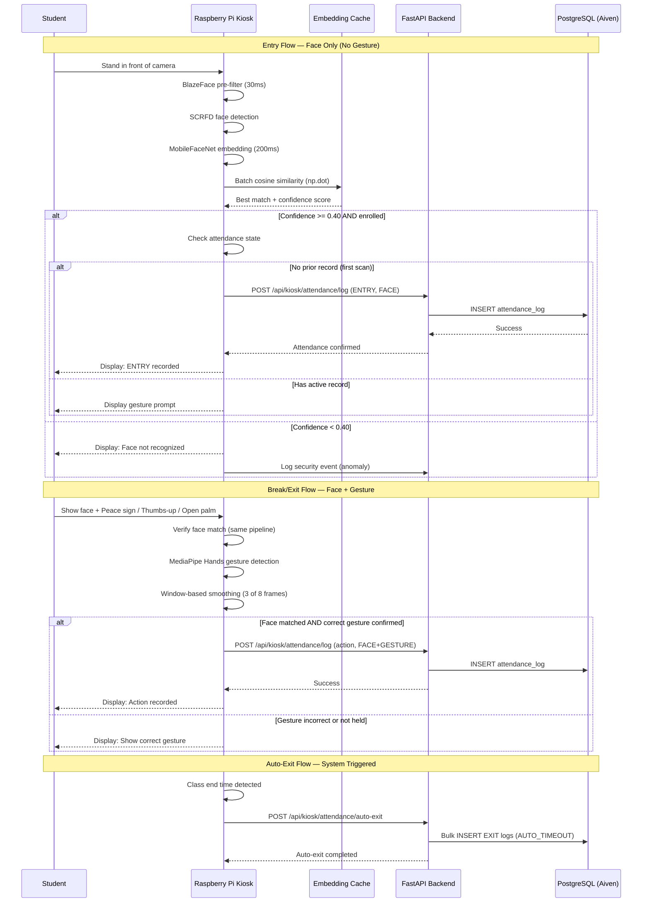

**Figure 10.** Complete Attendance Data Flow Sequence

Figure 10 shows the full sequence of interactions during the three primary attendance flows: initial entry, gesture-gated break and exit transitions, and automatic timeout at class end.

In the **Entry Flow**, the student approaches the kiosk. The camera frame is processed through the two-stage pipeline: BlazeFace pre-filter (~30 ms) followed by InsightFace buffalo_sc (SCRFD detection + MobileFaceNet embedding, ~200 ms). The resulting 512-dimensional embedding is compared against the in-memory embedding cache using batch cosine similarity. If the best match exceeds the 0.40 threshold and the identified student is enrolled in the currently active class, the system checks the attendance state. For a first scan (no prior record), ENTRY is logged automatically with FACE verification — the kiosk posts directly to the backend API, which inserts the record into PostgreSQL.

In the **Break/Exit Flow**, the student must present both their face and the correct gesture. The system re-verifies identity through the same recognition pipeline and simultaneously detects the hand gesture using MediaPipe Hands. The gesture must be correct for the student's current state (peace sign for break-out, thumbs-up for break-in, open palm for exit) and must be detected in at least three out of the last eight frames (window-based temporal smoothing) before the action is confirmed and logged with FACE+GESTURE verification.

In the **Auto-Exit Flow**, when the kiosk detects that the class end time has been reached (via the schedule resolver), it sends a bulk auto-exit request to the backend API. The API generates EXIT records with AUTO_TIMEOUT verification for all students who remain in an active session (ENTRY or BREAK_IN state), ensuring complete attendance records.

---

### Project Development

To ensure a systematic and structured approach in the development of FRAMES, the researchers employed the **Waterfall methodology**. This sequential model provides a step-by-step framework where each phase must be completed before the next begins. The Waterfall approach was selected because the system's requirements were well-defined from the outset — the recognition pipeline, gesture mapping, dashboard features, and database schema could be specified in advance, making a linear development model appropriate. The methodology consists of five phases: Analyze, Design, Create, Test, and Evaluate.

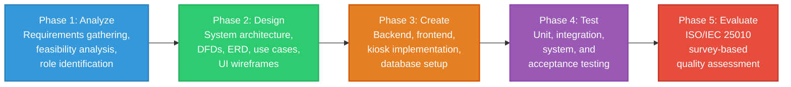

**Figure 11.** Waterfall-Based Project Development Framework for FRAMES

#### Analyze

In the analysis phase, the researchers identified and documented the functional and non-functional requirements of FRAMES. The core requirements include: real-time attendance tracking through facial recognition, gesture-gated state logging for entry, break-out, break-in, and exit transitions, an early entry window (10 minutes before class start), auto-exit at class end time, role-based dashboards for students, faculty, and the department head, exportable attendance reports in CSV and PDF formats, and anomaly detection for unrecognized individuals.

A feasibility analysis confirmed that the Raspberry Pi 4 Model B with a USB webcam provides an affordable and scalable hardware platform for running InsightFace's `buffalo_sc` model at 200–300 ms inference per recognition cycle when combined with the BlazeFace pre-filter gate. The cloud-hosted database on Aiven Cloud was selected to avoid the complexity and cost of self-hosted PostgreSQL infrastructure while ensuring SSL-encrypted connections. The analysis also identified four user roles — Student, Faculty, Department Head, and Admin — and scoped their respective system interactions.

#### Design

The design phase produced the diagrams and schemas presented in the preceding sections: the System Architecture, Context DFD, Top-Level DFD, Use Case Diagram, ERD, Block Diagram, Attendance State Machine, Recognition Pipeline Flowchart, Visual Table of Contents, and Attendance Sequence Diagram. Key design decisions include:

- **Two-pipeline separation**: face enrollment through the web interface (server-side using InsightFace buffalo_sc) and face recognition at the kiosk (edge-side using the same buffalo_sc model with ONNX Runtime), ensuring that the kiosk handles only inference against cached embeddings, not model training or API-dependent recognition
- **Gated detection architecture**: MediaPipe BlazeFace as a fast pre-filter (~30 ms) before the heavier InsightFace pipeline (~200 ms), enabling the Raspberry Pi to maintain responsive frame processing by skipping heavy inference when no face is visible
- **Embedding-only biometric storage**: no raw facial images are stored — only 512-dimensional float32 embedding vectors (2,048 bytes per user), aligning with privacy requirements under RA 10173
- **Decision-level multimodal fusion**: face recognition produces an accept/reject decision, then gesture recognition produces an independent accept/reject decision — both must succeed for non-entry attendance actions
- **State machine for attendance**: each student progresses through ENTRY, BREAK_OUT, BREAK_IN, and EXIT, with state transitions gated by specific gestures and window-based temporal smoothing (three detections out of the last eight frames)
- **Role-based access scoping**: students see only their own data, faculty see only their classes, and the department head sees department-wide aggregations
- **Offline-first kiosk**: the embedded device maintains a local embedding cache, local schedule cache, and offline attendance queue to ensure continuous operation during network interruptions

#### Create

Implementation integrated the following technologies:

| Component | Technology | Purpose |
|-----------|-----------|---------|
| Backend framework | FastAPI (Python 3.11+) | Asynchronous REST API with automatic OpenAPI documentation |
| ORM | SQLAlchemy 2.x | Database access with query optimization |
| Database | PostgreSQL (Aiven Cloud, SSL) | Persistent storage for all system data |
| Frontend framework | Vite + React 19.2 | Single-page application with hot module replacement |
| UI library | Bootstrap 5.3 | Responsive, mobile-friendly interface components |
| Visualization | Chart.js, Recharts | Attendance charts and analytics graphs |
| HTTP client | Axios | Centralized API client with JWT interceptors |
| Face recognition | InsightFace buffalo_sc (SCRFD + MobileFaceNet) | Face detection and 512-D embedding extraction |
| Pre-filter gate | MediaPipe BlazeFace | Lightweight face presence detection on RPi (~30 ms) |
| Inference engine | ONNX Runtime (CPUExecutionProvider) | Optimized model inference on ARM CPU |
| Gesture detection | MediaPipe Hands (21-landmark) | Static hand gesture classification |
| Image processing | OpenCV | Frame capture and image preprocessing |
| Edge device OS | Raspberry Pi OS Bookworm 64-bit | Operating system for the Raspberry Pi |
| PDF parsing | pdfplumber | Extracts class data from faculty class list PDFs exported from the TUP Portal |
| Email service | SendGrid + SMTP Gmail fallback | Sends invitations, approvals, and password reset emails |
| Backend deployment | Render | Cloud hosting for FastAPI backend |
| Frontend deployment | Vercel | Static site hosting for React SPA |
| Authentication | python-jose (JWT) | Dual-token system: 24h access, 7d refresh |
| Rate limiting | slowapi | Request throttling on sensitive endpoints |

The backend was organized into a service-layer architecture: routers handle HTTP concerns, services contain business logic, and models define database schemas. Eleven API routers were implemented covering authentication (login, register, password reset, token refresh), student operations (dashboard, schedule, attendance history, reports), faculty operations (schedule upload, class management, session exceptions, invitations), department head operations (faculty invitation management, academic configuration, subjects management, device management, department reports), kiosk communication (active class resolution, attendance logging, enrollment fetching, auto-exit), face enrollment (frame processing, quality validation, duplicate checking), report generation, user profile management, support tickets, and invitation management.

The kiosk application on the Raspberry Pi follows a modular pipeline: `camera.py` abstracts frame capture across Picamera2 and OpenCV interfaces, `face_detector.py` implements the MediaPipe BlazeFace pre-filter gate, `face_recognizer.py` runs InsightFace buffalo_sc for precise detection and embedding extraction, `gesture_detector.py` classifies hand poses using distance-based finger extension ratios, `schedule_resolver.py` determines the active class via API queries with local cache fallback and failure backoff, `attendance_logger.py` transmits events to the API with an offline JSON queue for network failures, `embedding_cache.py` manages periodic synchronization (30-minute intervals) of enrolled embeddings with precomputed numpy matrices for batch cosine similarity, `metrics_collector.py` tracks and reports frame processing performance, and `main_kiosk.py` orchestrates the complete loop with SIGTERM handling for graceful systemd shutdown.

#### Test

Testing ensured system accuracy, reliability, and usability across all components.

- **Unit testing**: Individual modules for facial recognition accuracy, gesture detection classification, attendance state machine transitions, and database query correctness
- **Integration testing**: Verified smooth communication between the Raspberry Pi kiosk, FastAPI backend, PostgreSQL database, and React frontend, confirming that attendance events logged at the kiosk appeared on the web dashboard in real time
- **System testing**: Validated the end-to-end attendance workflow — from face scan to gesture confirmation to dashboard display — under realistic classroom conditions in Room 328, College of Science Building
- **User acceptance testing**: Conducted with the 43 designated respondents (20 CS students via live kiosk interaction, 20 non-CS students via video demonstration, 2 faculty members, and 1 department head), ensuring that the system met functional expectations and usability standards

---

### Evaluation Procedure

The system was evaluated using the **ISO/IEC 25010:2023 Software Quality Model**, focusing on five quality characteristics relevant to the system's scope and deployment context.

| Quality Characteristic | Definition | What Is Assessed |
|----------------------|-----------|-----------------|
| **Functional Suitability** | The degree to which the system performs functions that meet stated and implied needs | Face recognition accuracy, gesture logging correctness, report completeness, enrollment process, anomaly detection |
| **Performance Efficiency** | The degree to which the system provides appropriate performance relative to resources used | Kiosk recognition speed (target under 5 seconds per recognition cycle), dashboard load time, sequential processing throughput |
| **Interaction Capability** | The degree to which the system can be understood, learned, used, and is attractive to the user | Dashboard intuitiveness, gesture learnability, feature organization, visual design, time reduction vs. manual methods |
| **Reliability** | The degree to which the system performs specified functions under stated conditions | Recognition consistency, log completeness (no missing or duplicate entries), system stability, error recovery, offline mode resilience |
| **Security** | The degree to which the system protects information and data with appropriate access control | Multimodal proxy prevention, role-based access restriction, biometric data handling (embedding-only storage), data privacy alignment with RA 10173 |

Evaluation was conducted through structured survey questionnaires administered to all 43 respondents after their respective interaction or demonstration sessions. The survey uses a **4-point Likert acceptability scale**:

| Score | Label | Descriptor |
|-------|-------|------------|
| 4 | Highly Acceptable | Works excellently with no issues |
| 3 | Acceptable | Works adequately with minor issues at most |
| 2 | Unacceptable | Has significant issues that affect functionality |
| 1 | Highly Unacceptable | Does not work properly or fails to meet requirements |

**Interpretation of weighted mean:**

| Mean Range | Verbal Interpretation |
|------------|----------------------|
| 3.25 – 4.00 | Highly Acceptable |
| 2.50 – 3.24 | Acceptable |
| 1.75 – 2.49 | Unacceptable |
| 1.00 – 1.74 | Highly Unacceptable |

Two parallel survey instruments were administered: (1) an **experience-based instrument** for respondents who physically interacted with the system (20 CS students, faculty, and department head), containing question items phrased as "based on your experience using the FRAMES system," and (2) an **observation-based instrument** for respondents who watched a recorded video demonstration (20 non-CS students and any faculty who did not interact directly), containing question items phrased as "based on your observation of the FRAMES system video demonstration." Both instruments use the same 4-point Likert scale and cover the same five ISO/IEC 25010 quality characteristics, but differ in their question wording to appropriately match the evaluation context.

Each survey consists of five parts corresponding to the five ISO characteristics, plus an overall assessment section and open-ended questions for qualitative feedback. The weighted mean and standard deviation are computed per item, per characteristic, and overall. Results are analyzed separately for each respondent group (CS students, non-CS students, faculty, department head) and then aggregated to produce overall system acceptability ratings.
