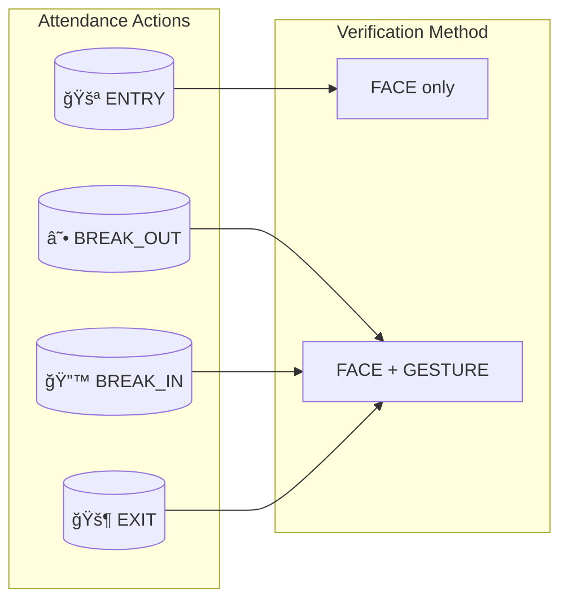

# 📊 FRAMES Top-Level Data Flow Diagram
## System Data Architecture & Information Flow

**FRAMES** - Facial Recognition Attendance and Monitoring System  
**Version:** 1.0 | **Date:** February 7, 2026

---

## 🎯 Overview

This document presents the **top-level data flow diagrams** showing how data moves through the FRAMES system, from user registration to attendance reporting.

---

## 📊 Level 0: Context Diagram

The highest-level view showing FRAMES as a single system interacting with external entities.

> [!IMPORTANT]
> **Registration-First Policy:** All users (Students, Faculty, Department Head) must complete **facial enrollment** before accessing the dashboard. The system blocks dashboard access until `face_registered = true`.

```mermaid
flowchart TB
    subgraph USERS["👥 System Users"]
        direction LR
        STU["👤 Student"]
        FAC["👨‍🏫 Faculty"]
        HEAD["👔 Department Head"]
    end

    subgraph MGMT["⚙️ Management"]
        ADMIN["🔧 Admin"]
    end

    subgraph EDGE["📱 Edge Devices"]
        KIOSK["📟 Raspberry Pi\nKiosk"]
    end

    FRAMES[("🖥️ FRAMES\n━━━━━━━━━━\nFacial Recognition\nAttendance &\nMonitoring System")]

    %% STEP 1: Account Creation (by Faculty/Head or self-register)
    FAC & HEAD -->|"1️⃣ Create account\n+ Upload schedule\n(auto-creates students)"| FRAMES
    STU -->|"1️⃣ Login with\nauto-created credentials"| FRAMES

    %% STEP 2: Mandatory Face Enrollment (BEFORE dashboard access)
    STU & FAC & HEAD -->|"2️⃣ Register face data\n(required first)"| FRAMES

    %% STEP 3: Dashboard Access (AFTER face enrollment)
    FRAMES -->|"3️⃣ Personal attendance\n(after face enrolled)"| STU
    FRAMES -->|"3️⃣ Class summaries\n+ Upload schedules"| FAC
    FRAMES -->|"3️⃣ Dept reports\n+ Verify faculty"| HEAD

    %% Admin (no face enrollment needed)
    ADMIN -->|"System config,\nanalytics"| FRAMES
    FRAMES -->|"System reports"| ADMIN

    %% Kiosk Attendance
    KIOSK <-->|"Face/gesture capture\n↔ Attendance logs"| FRAMES
```

### User Access Flow Summary

```mermaid
flowchart LR
    subgraph STEP1["1️⃣ Account Creation"]
        direction TB
        A1["Faculty/Head uploads schedule"]
        A2["Students auto-created"]
        A1 --> A2
    end

    subgraph STEP2["2️⃣ Face Enrollment"]
        direction TB
        B1["User logs in"]
        B2["face_registered = false?"]
        B3["Redirect to\nFacial Enrollment"]
        B4["Capture 15 frames\n→ Store embedding"]
        B1 --> B2 --> B3 --> B4
    end

    subgraph STEP3["3️⃣ Dashboard Access"]
        direction TB
        C1["face_registered = true"]
        C2["Access dashboard\n& features"]
        C1 --> C2
    end

    STEP1 ~~~ STEP2 ~~~ STEP3
    STEP1 --> STEP2 --> STEP3
```

---

## 📊 Level 1: System Data Flow Diagram

Decomposition of FRAMES into major subsystems showing data stores and processes.

> [!NOTE]
> **Process 2.0 (Facial Enrollment)** acts as a **gate** — users cannot access Process 5.0 (Reporting) until they complete face registration.

```mermaid
flowchart TB
    subgraph USERS["👥 External Actors"]
        direction LR
        STU["👤 Students"]
        FAC["👨‍🏫 Faculty"]
        HEAD["👔 Dept Head"]
        ADMIN["⚙️ Admin"]
    end

    subgraph EDGE["📱 Edge Devices"]
        KIOSK["Raspberry Pi\nKiosk"]
    end

    subgraph PROCESSES["⚙️ Core Processes"]
        direction LR
        P1[["1.0\nUser\nManagement"]]
        P2[["2.0\nFacial\nEnrollment\n━━━━━━━\n⛔ GATE"]]
        P3[["3.0\nSchedule\nManagement"]]
        P4[["4.0\nAttendance\nRecognition"]]
        P5[["5.0\nReporting &\nAnalytics"]]
    end

    subgraph DATASTORES["🗄️ Data Stores"]
        direction LR
        D1[("D1: users")]
        D2[("D2: facial_profiles")]
        D3[("D3: departments\nprograms\nsubjects")]
        D4[("D4: classes\nenrollments")]
        D5[("D5: devices")]
        D6[("D6: attendance_logs")]
    end

    %% STEP 1: User Management flows
    STU & FAC & HEAD -->|"Registration data"| P1
    P1 -->|"User records"| D1
    P1 -->|"Academic links"| D3
    HEAD -->|"Verify faculty"| P1

    %% STEP 2: Facial Enrollment flows (MANDATORY GATE)
    STU & FAC & HEAD -->|"Face frames\n(15 captures)"| P2
    P2 <-->|"User lookup"| D1
    P2 -->|"Face embedding\n(512-d vector)"| D2
    P2 -->|"Set face_registered\n= true"| D1

    %% STEP 3: Schedule Management flows
    FAC & HEAD -->|"Schedule upload\n(CSV/Excel)"| P3
    P3 <-->|"Subject lookup"| D3
    P3 -->|"Class records"| D4
    P3 -->|"Auto-create\nstudents"| D1

    %% STEP 4: Attendance Recognition flows (Edge)
    KIOSK -->|"Face capture\n+ gesture"| P4
    P4 <-->|"Embedding\nlookup"| D2
    P4 <-->|"Class\nverification"| D4
    P4 <-->|"Device info"| D5
    P4 -->|"Attendance\nrecord"| D6

    %% STEP 5: Reporting flows (REQUIRES face_registered = true)
    D6 -->|"Logs"| P5
    D4 -->|"Class info"| P5
    D1 -->|"User info"| P5
    D2 -.->|"⛔ Check\nface_registered"| P5
    P5 -->|"Personal attendance"| STU
    P5 -->|"Class reports"| FAC
    P5 -->|"Dept reports"| HEAD
    P5 -->|"System analytics"| ADMIN
```

---

## 🔄 Key Data Flow Processes

### Process 1.0: User Management

**Data Elements:**
| Input | Processing | Output |
|-------|------------|--------|
| email, password, tupm_id, name | Validation, bcrypt hashing | users record |
| department_id, program_id | FK validation | Academic links |
| role, verification_status | Enum validation | Account status |

---

### Process 2.0: Facial Enrollment

```mermaid
flowchart TB
    subgraph INPUT["📸 Input"]
        A1["Webcam Feed\n15 frames"]
    end

    subgraph PROCESS["2.0 Facial Enrollment (Server-Side)"]
        B1["Face Detection\nMTCNN/RetinaFace"]
        B2["Face Alignment\n5-point landmark"]
        B3["Embedding Extraction\nInsightFace Buffalo"]
        B4["Embedding Averaging\n512-d vector"]
        B5["Quality Scoring\n0.0 - 1.0"]
    end

    subgraph OUTPUT["💾 Output"]
        C1[("facial_profiles")]
        C2[("users.face_registered\n= true")]
    end

    A1 --> B1 --> B2 --> B3 --> B4 --> B5
    B5 --> C1
    B5 --> C2
```

**Data Elements:**
| Input | Processing | Output |
|-------|------------|--------|
| 15 webcam frames | Face detection, alignment | Detected faces |
| Aligned faces | InsightFace inference | 512-d embedding per frame |
| Multiple embeddings | Averaging | Single stable embedding |
| Final embedding | Quality calculation | facial_profiles record |

> [!NOTE]
> **Privacy:** Only the 512-dimensional embedding vector (~2KB) is stored. No raw images are saved.

---

### Process 3.0: Schedule Management

**Data Elements:**
| Input | Processing | Output |
|-------|------------|--------|
| subject_code, title, units | Subject lookup/creation | subjects record |
| student_id, name, section | User lookup/creation | users record |
| faculty, room, time, day | Class creation | classes record |
| student ↔ class pairs | Enrollment creation | enrollments record |

---

### Process 4.0: Attendance Recognition (Edge)

```mermaid
flowchart TB
    subgraph INPUT["📱 Raspberry Pi Input"]
        A1["Pi Camera Feed"]
        A2["Hand Gesture\n(for breaks/exit)"]
    end

    subgraph PROCESS["4.0 Attendance Recognition"]
        B1["Face Detection\nTFLite"]
        B2["Embedding Extraction\nFaceNet INT8"]
        B3["Cosine Similarity\nMatching"]
        B4["Threshold Check\n≥ 0.6"]
        B5["Gesture Detection\nMediaPipe Hands"]
        B6["Action Validation"]
    end

    subgraph DATASTORES["🗄️ Data Lookup"]
        D1[("facial_profiles\nembeddings")]
        D2[("enrollments\nclass verification")]
        D3[("devices")]
    end

    subgraph OUTPUT["💾 Output"]
        C1[("attendance_logs")]
        C2["Display Confirmation"]
    end

    A1 --> B1 --> B2
    B2 --> B3
    D1 -.->|"Compare"| B3
    B3 --> B4

    B4 -->|"ENTRY"| B6
    A2 --> B5 -->|"BREAK/EXIT"| B6

    D2 -.->|"Verify enrollment"| B6
    D3 -.->|"Device info"| B6

    B6 --> C1
    B6 --> C2
```

**Attendance Action Flow:**

**Gesture Meanings:**
| Gesture | Action | Description |
|---------|--------|-------------|
| ✌️ Peace Sign | BREAK_OUT | Two fingers raised |
| 👍 Thumbs Up | BREAK_IN | Return from break |
| 🖐️ Open Palm | EXIT | Leave the class |

---

### Process 5.0: Reporting & Analytics

```mermaid
flowchart TB
    subgraph INPUT["📊 Data Sources"]
        D1[("attendance_logs")]
        D2[("classes")]
        D3[("users")]
        D4[("departments")]
    end

    subgraph PROCESS["5.0 Reporting & Analytics"]
        B1["Aggregate by\nStudent"]
        B2["Aggregate by\nClass/Section"]
        B3["Aggregate by\nFaculty"]
        B4["Aggregate by\nDepartment"]
        B5["Generate Charts"]
    end

    subgraph OUTPUT["📈 Reports"]
        C1["Student\nAttendance"]
        C2["Class\nSummaries"]
        C3["Faculty\nReports"]
        C4["Dept\nDashboard"]
        C5["Export\nCSV/PDF"]
    end

    D1 & D2 & D3 --> B1 --> C1
    D1 & D2 --> B2 --> C2
    D1 & D2 & D3 --> B3 --> C3
    D1 & D4 --> B4 --> C4
    B1 & B2 & B3 & B4 --> B5 --> C5
```

---

## 🔄 Complete Attendance Data Flow Sequence

```mermaid
sequenceDiagram
    participant STU as 👤 Student
    participant KIOSK as 📱 Kiosk (RPi)
    participant API as 🖥️ Backend API
    participant DB as 🗄️ PostgreSQL

    Note over STU,DB: Attendance Entry Flow (Face Only)
    STU->>KIOSK: Stand in front of camera
    KIOSK->>KIOSK: Capture face frame
    KIOSK->>KIOSK: Extract embedding (TFLite FaceNet)
    KIOSK->>API: Send embedding for matching
    API->>DB: Query facial_profiles
    DB-->>API: Return matches with confidence
    
    alt Confidence ≥ Threshold
        API->>DB: Verify enrollment in current class
        DB-->>API: Enrollment confirmed
        API->>DB: INSERT attendance_log (action=ENTRY, verified_by=FACE)
        API-->>KIOSK: Success response
        KIOSK-->>STU: "✅ Attendance Recorded: John Doe"
    else Confidence < Threshold
        API-->>KIOSK: No match found
        KIOSK-->>STU: "❌ Face not recognized"
    end

    Note over STU,DB: Break-Out Flow (Face + Gesture)
    STU->>KIOSK: Show face + Peace sign ✌️
    KIOSK->>KIOSK: Verify face match
    KIOSK->>KIOSK: Detect gesture (MediaPipe)
    
    alt Face + Gesture Valid
        KIOSK->>API: Log break-out
        API->>DB: INSERT attendance_log (action=BREAK_OUT, verified_by=FACE+GESTURE)
        API-->>KIOSK: Success
        KIOSK-->>STU: "✅ Break recorded"
    else Invalid
        KIOSK-->>STU: "❌ Action rejected"
    end
```

---

## 🏗️ System Architecture Data Flow

```mermaid
flowchart TB
    subgraph CLIENT["🌐 Frontend (Vite + React)"]
        WEB["Web Dashboard"]
    end

    subgraph EDGE["📱 Edge (Raspberry Pi)"]
        CAM["Pi Camera v2"]
        TFLITE["TFLite FaceNet"]
        MEDIAPIPE["MediaPipe Hands"]
    end

    subgraph SERVER["🖥️ Backend (FastAPI)"]
        API["REST API\n(async)"]
        INSIGHT["InsightFace\n(enrollment)"]
    end

    subgraph DATABASE["🗄️ Database (Aiven PostgreSQL)"]
        PG[("PostgreSQL\n\n• users\n• facial_profiles\n• classes\n• enrollments\n• attendance_logs\n• devices\n• departments\n• programs\n• subjects")]
    end

    WEB <-->|"HTTP/JSON"| API
    CAM -->|"Frames"| TFLITE
    TFLITE -->|"Embeddings"| API
    CAM -->|"Frames"| MEDIAPIPE
    MEDIAPIPE -->|"Gestures"| API
    
    WEB -->|"Webcam frames"| INSIGHT
    INSIGHT -->|"Embeddings"| API
    
    API <-->|"SQLAlchemy\nSSL Connection"| PG
```

---

## 📋 Data Store Summary

| Data Store | Tables | Primary Data | Access Pattern |
|------------|--------|--------------|----------------|
| D1: User Data | users | Credentials, roles, academic info | Read-heavy (auth, lookup) |
| D2: Biometric Data | facial_profiles | Face embeddings | Read-heavy (recognition) |
| D3: Academic Structure | departments, programs, subjects | Org hierarchy | Read-only (reference) |
| D4: Scheduling | classes, enrollments | Class schedules, student links | Read-heavy, write on enrollment |
| D5: Devices | devices | Kiosk info, status | Read-heavy, periodic heartbeat writes |
| D6: Attendance | attendance_logs | All attendance records | Write-heavy, read for reports |

---

## 📊 Data Volume Estimates

| Entity | Expected Volume | Growth Rate |
|--------|-----------------|-------------|
| Users | 1,000 - 5,000 | Per semester |
| Facial Profiles | 1:1 with users | Same as users |
| Classes | 50 - 200 per semester | Per semester |
| Enrollments | 20-30 per student | Per semester |
| Attendance Logs | 100-500 per student per semester | Continuous |
| Devices | 5-20 | Slow (hardware) |

---

**Document generated:** February 7, 2026  
**System architecture verified against:** FRAMES_DOCUMENTATION_RECENT.md
