# 🗄️ FRAMES Database Schema Documentation
## Complete Technical Reference & Entity Relationship Diagrams

**FRAMES** - Facial Recognition Attendance and Monitoring System  
**Version:** 1.0 | **Database:** PostgreSQL (Aiven) | **ORM:** SQLAlchemy

---

## 📖 Table of Contents

1. [System Overview](#-system-overview)
2. [Quick Terminology Guide](#-quick-terminology-guide)
3. [Database Architecture](#-database-architecture)
4. [Entity Relationship Diagram (ERD)](#-entity-relationship-diagram-erd)
5. [Detailed Table Specifications](#-detailed-table-specifications)
6. [Relationship Analysis](#-relationship-analysis)
7. [Enum Definitions](#-enum-definitions)
8. [Constraints & Indexes](#-constraints--indexes)
9. [Data Integrity Rules](#-data-integrity-rules)

---

## 🎯 System Overview

FRAMES is a web-based smart attendance system for classroom environments that:
- **Automates attendance logging** using facial recognition
- **Introduces gesture-gated confirmation** for sensitive actions (breaks, exit)
- **Deploys on Raspberry Pi kiosks** in classrooms
- **Provides centralized reporting** via web dashboard

### Core Actors
| Role | Description |
|------|-------------|
| **STUDENT** | Register face, attend classes, view personal attendance |
| **FACULTY** | Teach classes, upload schedules, view class summaries |
| **HEAD** | Department head, verifies faculty, views department reports |
| **ADMIN** | System-wide analytics, manages programs/departments |

---

## 📚 Quick Terminology Guide

| Term | Plain English | Database Example |
|------|---------------|------------------|
| **Table** | A structured data container (like a spreadsheet) | `users`, `classes` |
| **Primary Key (PK)** | Unique identifier for each row | `users.id = 1` |
| **Foreign Key (FK)** | Reference linking to another table's PK | `programs.department_id → departments.id` |
| **Enum** | Predefined list of allowed values | `UserRole`: STUDENT, FACULTY, HEAD, ADMIN |
| **One-to-One (1:1)** | Each row relates to exactly one row | User ↔ FacialProfile |
| **One-to-Many (1:N)** | One row relates to multiple rows | Department → many Users |
| **Many-to-Many (N:M)** | Multiple rows relate to multiple rows | Students ↔ Classes via Enrollments |
| **Cascade Delete** | Automatically delete related records | Delete User → Delete FacialProfile |
| **LargeBinary** | Binary data storage | Face embedding vectors |

---

## 🏗️ Database Architecture

### Table Categories

The FRAMES database consists of **10 tables** organized into **4 logical categories**:

```
┌─────────────────────────────────────────────────────────────────────────────┐
│                        FRAMES DATABASE ARCHITECTURE                         │
├─────────────────────────────────────────────────────────────────────────────┤
│                                                                             │
│  ┌─────────────────────────┐    ┌─────────────────────────────────────┐    │
│  │  🏫 ACADEMIC STRUCTURE  │    │        👥 USER & IDENTITY           │    │
│  │  ─────────────────────  │    │  ───────────────────────────────    │    │
│  │  • departments          │    │  • users                            │    │
│  │  • programs             │    │  • facial_profiles                  │    │
│  │  • subjects             │    │                                     │    │
│  └─────────────────────────┘    └─────────────────────────────────────┘    │
│                                                                             │
│  ┌─────────────────────────┐    ┌─────────────────────────────────────┐    │
│  │  📅 CLASS SCHEDULING    │    │       ✅ ATTENDANCE TRACKING        │    │
│  │  ─────────────────────  │    │  ───────────────────────────────    │    │
│  │  • classes              │    │  • devices                          │    │
│  │  • enrollments          │    │  • attendance_logs                  │    │
│  │  • session_exceptions   │    │                                     │    │
│  └─────────────────────────┘    └─────────────────────────────────────┘    │
│                                                                             │
└─────────────────────────────────────────────────────────────────────────────┘
```

### Summary Statistics

| Category | Tables | Purpose |
|----------|--------|---------|
| 🏫 Academic Structure | 3 | Organizational hierarchy (departments, programs, subjects) |
| 👥 User & Identity | 2 | People and biometric data (users, facial_profiles) |
| 📅 Class Scheduling | 3 | Schedule management (classes, enrollments, session_exceptions) |
| ✅ Attendance Tracking | 2 | Devices and records (devices, attendance_logs) |
| **TOTAL** | **10** | |

---

## 📊 Entity Relationship Diagram (ERD)

### Complete ERD with All Attributes


### Simplified Relationship View

```mermaid
flowchart TB
    subgraph ACADEMIC["🏫 Academic Structure"]
        DEP[("departments")]
        PRG[("programs")]
        SUB[("subjects")]
    end
    
    subgraph IDENTITY["👥 User & Identity"]
        USR[("users")]
        FP[("facial_profiles")]
    end
    
    subgraph SCHEDULE["📅 Class Scheduling"]
        CLS[("classes")]
        ENR[("enrollments")]
        EXC[("session_exceptions")]
    end
    
    subgraph ATTEND["✅ Attendance Tracking"]
        DEV[("devices")]
        ATT[("attendance_logs")]
    end
    
    DEP -->|"1:N"| PRG
    DEP -->|"1:N"| USR
    PRG -->|"1:N"| USR
    
    USR -->|"1:1"| FP
    USR -->|"1:N"| ENR
    USR -->|"1:N faculty"| CLS
    USR -->|"1:N"| ATT
    
    SUB -->|"1:N"| CLS
    CLS -->|"1:N"| ENR
    CLS -->|"1:N"| ATT
    CLS -->|"1:N"| EXC
    
    USR -->|"1:N faculty"| EXC
    
    DEV -->|"1:N"| ATT
```



---

## 📋 Detailed Table Specifications

### 🏫 Category 1: Academic Structure

#### 📋 `departments`
**Purpose:** Stores academic departments/colleges (e.g., "College of Industrial Technology")

| Column | Data Type | Constraints | Description | Example |
|--------|-----------|-------------|-------------|---------|
| `id` | INTEGER | PK, AUTO_INCREMENT | Unique identifier | `1` |
| `name` | VARCHAR(100) | UNIQUE, NOT NULL | Department full name | "College of Industrial Technology" |
| `code` | VARCHAR(20) | UNIQUE | Short code | "CIT" |
| `created_at` | DATETIME | DEFAULT NOW() | Record creation time | 2026-01-15 08:00:00 |

**Relationships:**
- → Has many `programs` (1:N)
- → Has many `users` (1:N)

---

#### 📋 `programs`
**Purpose:** Stores degree programs (e.g., "BS Information Technology")

| Column | Data Type | Constraints | Description | Example |
|--------|-----------|-------------|-------------|---------|
| `id` | INTEGER | PK, AUTO_INCREMENT | Unique identifier | `1` |
| `department_id` | INTEGER | FK → departments.id, NOT NULL | Parent department | `1` |
| `name` | VARCHAR(100) | NOT NULL | Program full name | "Bachelor of Science in Information Technology" |
| `code` | VARCHAR(20) | | Short code | "BSIT" |
| `created_at` | DATETIME | DEFAULT NOW() | Record creation time | 2026-01-15 08:00:00 |

**Relationships:**
- ← Belongs to one `department` (N:1)
- → Has many `users` (1:N)

---

#### 📋 `subjects`
**Purpose:** Stores academic subjects/courses

| Column | Data Type | Constraints | Description | Example |
|--------|-----------|-------------|-------------|---------|
| `id` | INTEGER | PK, AUTO_INCREMENT | Unique identifier | `1` |
| `code` | VARCHAR(50) | UNIQUE, NOT NULL | Subject code | "IT302" |
| `title` | VARCHAR(255) | NOT NULL | Full subject name | "Data Structures & Algorithms" |
| `units` | INTEGER | DEFAULT 3 | Credit units | `3` |
| `created_at` | DATETIME | DEFAULT NOW() | Record creation time | 2026-01-15 08:00:00 |

**Relationships:**
- → Has many `classes` (1:N)

---

### 👥 Category 2: User & Identity

#### 📋 `users`
**Purpose:** Central table storing ALL system users (Students, Faculty, Department Heads, Admins)

| Column | Data Type | Constraints | Description | Example |
|--------|-----------|-------------|-------------|---------|
| `id` | INTEGER | PK, AUTO_INCREMENT | Unique identifier | `1` |
| `email` | VARCHAR(255) | UNIQUE, NOT NULL | Login email | "john.doe@tup.edu.ph" |
| `password_hash` | VARCHAR(255) | NOT NULL | Bcrypt encrypted password | "$2b$12$..." |
| `tupm_id` | VARCHAR(50) | UNIQUE, NOT NULL | School ID number | "TUPM-21-1234" |
| `role` | ENUM | NOT NULL | User type | `STUDENT`, `FACULTY`, `HEAD`, `ADMIN` |
| `verification_status` | ENUM | DEFAULT 'Pending' | Account status | `Pending`, `Verified`, `Rejected` |
| `face_registered` | BOOLEAN | DEFAULT FALSE | Has enrolled face? | `true` / `false` |
| `first_name` | VARCHAR(100) | NOT NULL | First name | "John" |
| `last_name` | VARCHAR(100) | NOT NULL | Last name | "Doe" |
| `middle_name` | VARCHAR(100) | | Middle name (optional) | "Smith" |
| `department_id` | INTEGER | FK → departments.id | Associated department | `1` |
| `program_id` | INTEGER | FK → programs.id | Enrolled program | `1` |
| `year_level` | VARCHAR(20) | | Student's year | "4th Year" |
| `section` | VARCHAR(50) | | Student's section | "BSIT-4A" |
| `created_at` | DATETIME | DEFAULT NOW() | Account creation | 2026-01-15 08:00:00 |
| `last_active` | DATETIME | AUTO UPDATE | Last activity | 2026-02-02 10:30:00 |

**Relationships:**
- ← Belongs to one `department` (N:1)
- ← Belongs to one `program` (N:1)
- → Has one `facial_profile` (1:1, CASCADE DELETE)
- → Has many `enrollments` (1:N, CASCADE DELETE)
- → Has many `taught_classes` (1:N - faculty only)
- → Has many `attendance_logs` (1:N, CASCADE DELETE)

---

#### 📋 `facial_profiles`
**Purpose:** Stores face recognition embeddings separately for efficient AI queries

| Column | Data Type | Constraints | Description | Example |
|--------|-----------|-------------|-------------|---------|
| `id` | INTEGER | PK, AUTO_INCREMENT | Unique identifier | `1` |
| `user_id` | INTEGER | FK → users.id, UNIQUE, NOT NULL, ON DELETE CASCADE | Associated user | `1` |
| `embedding` | LARGEBINARY | | 512-dim face vector (~2048 bytes) | Binary data |
| `model_version` | VARCHAR(50) | DEFAULT 'insightface_buffalo_l_v1' | AI model used | "insightface_buffalo_l_v1" |
| `num_samples` | INTEGER | DEFAULT 0 | Frames used for enrollment | `5` |
| `enrollment_quality` | FLOAT | DEFAULT 0.0 | Quality score (0-1) | `0.95` |
| `created_at` | DATETIME | DEFAULT NOW() | First enrollment | 2026-01-15 08:00:00 |
| `updated_at` | DATETIME | AUTO UPDATE | Last update | 2026-02-01 14:00:00 |

**Relationships:**
- ← Belongs to one `user` (1:1, CASCADE DELETE)

> [!IMPORTANT]
> **Privacy by Design:** Only face embedding vectors (512 floats = ~2KB) are stored, **NOT raw images**. This ensures GDPR/Data Privacy Act compliance.

---

### 📅 Category 3: Class Scheduling

#### 📋 `classes`
**Purpose:** Represents scheduled class sessions (subject + faculty + time + room)

| Column | Data Type | Constraints | Description | Example |
|--------|-----------|-------------|-------------|---------|
| `id` | INTEGER | PK, AUTO_INCREMENT | Unique identifier | `1` |
| `subject_id` | INTEGER | FK → subjects.id, NOT NULL | Subject taught | `1` |
| `faculty_id` | INTEGER | FK → users.id, NOT NULL | Instructor | `5` |
| `room` | VARCHAR(100) | | Classroom/Lab | "CL1" |
| `day_of_week` | VARCHAR(20) | | Day | "Monday" |
| `start_time` | TIME | | Class start time | 08:00:00 |
| `end_time` | TIME | | Class end time | 10:00:00 |
| `section` | VARCHAR(50) | | Section name | "BSIT-4A" |
| `semester` | VARCHAR(50) | | Semester | "1st Semester" |
| `academic_year` | VARCHAR(20) | | School year | "2025-2026" |
| `created_at` | DATETIME | DEFAULT NOW() | Record creation | 2026-01-15 08:00:00 |

**Relationships:**
- ← Belongs to one `subject` (N:1)
- ← Taught by one `user` (N:1 - faculty)
- → Has many `enrollments` (1:N, CASCADE DELETE)
- → Has many `attendance_logs` (1:N, CASCADE DELETE)

---

#### 📋 `enrollments`
**Purpose:** Junction table linking Students to Classes (many-to-many resolver)

| Column | Data Type | Constraints | Description | Example |
|--------|-----------|-------------|-------------|---------|
| `id` | INTEGER | PK, AUTO_INCREMENT | Unique identifier | `1` |
| `class_id` | INTEGER | FK → classes.id, NOT NULL, ON DELETE CASCADE | Enrolled class | `1` |
| `student_id` | INTEGER | FK → users.id, NOT NULL, ON DELETE CASCADE | Enrolled student | `10` |
| `enrolled_at` | DATETIME | DEFAULT NOW() | Enrollment timestamp | 2026-01-20 09:00:00 |

**Unique Constraint:** `(class_id, student_id)` - A student can only enroll once per class

**Relationships:**
- ← Belongs to one `class` (N:1)
- ← Belongs to one `student/user` (N:1)

> [!TIP]
> This is a **junction table** (bridge table) that resolves the many-to-many relationship: one student enrolls in many classes, one class has many students.

---

#### 📋 `session_exceptions`
**Purpose:** Tracks class session exceptions (cancelled, online mode, holidays) for attendance reporting

| Column | Data Type | Constraints | Description | Example |
|--------|-----------|-------------|-------------|---------|
| `id` | INTEGER | PK, AUTO_INCREMENT | Unique identifier | `1` |
| `class_id` | INTEGER | FK → classes.id, NOT NULL | Affected class | `5` |
| `session_date` | DATE | NOT NULL | Specific date affected | 2026-02-14 |
| `exception_type` | ENUM | NOT NULL | Type of exception | `ONSITE`, `ONLINE`, `CANCELLED`, `HOLIDAY` |
| `reason` | VARCHAR(255) | | Reason for exception | "Natural Disaster" |
| `created_by` | INTEGER | FK → users.id, NOT NULL | Faculty who created | `3` |
| `created_at` | DATETIME | DEFAULT NOW() | Record creation | 2026-02-07 15:00:00 |

**Predefined Reasons (Frontend dropdown):**
- Health Related
- Natural Disaster
- Internet Connectivity
- Holiday
- Faculty Leave
- University Event
- Others

**Relationships:**
- ← Belongs to one `class` (N:1)
- ← Created by one `user/faculty` (N:1)

> [!TIP]
> This table enables tracking of class mode (onsite/online/cancelled) for monthly attendance reports. Run `python scripts/migrate_session_exceptions.py` once to create this table.

---

### ✅ Category 4: Attendance Tracking

#### 📋 `devices`
**Purpose:** Stores Raspberry Pi kiosk devices deployed in classrooms

| Column | Data Type | Constraints | Description | Example |
|--------|-----------|-------------|-------------|---------|
| `id` | INTEGER | PK, AUTO_INCREMENT | Unique identifier | `1` |
| `room` | VARCHAR(100) | | Room location | "CL1" |
| `ip_address` | VARCHAR(45) | | IPv4 or IPv6 | "192.168.1.100" |
| `device_name` | VARCHAR(100) | | Device identifier | "KIOSK-CL1" |
| `status` | ENUM | DEFAULT 'ACTIVE' | Current status | `ACTIVE`, `INACTIVE`, `MAINTENANCE` |
| `created_at` | DATETIME | DEFAULT NOW() | Registration time | 2026-01-15 08:00:00 |
| `last_heartbeat` | DATETIME | | Last ping time | 2026-02-02 17:55:00 |

**Relationships:**
- → Has many `attendance_logs` (1:N)

---

#### 📋 `attendance_logs`
**Purpose:** Core table storing all attendance records with face/gesture verification

| Column | Data Type | Constraints | Description | Example |
|--------|-----------|-------------|-------------|---------|
| `id` | INTEGER | PK, AUTO_INCREMENT | Unique identifier | `1` |
| `user_id` | INTEGER | FK → users.id, NOT NULL | User being logged | `10` |
| `class_id` | INTEGER | FK → classes.id | Associated class | `1` |
| `device_id` | INTEGER | FK → devices.id | Capturing device | `1` |
| `action` | ENUM | NOT NULL | Attendance action type | `ENTRY`, `BREAK_OUT`, `BREAK_IN`, `EXIT` |
| `verified_by` | ENUM | | Verification method | `FACE`, `FACE+GESTURE` |
| `confidence_score` | FLOAT | | Face recognition confidence | `0.92` |
| `gesture_detected` | VARCHAR(50) | | Gesture used (if any) | "PEACE_SIGN", "THUMBS_UP", "OPEN_PALM" |
| `timestamp` | DATETIME | DEFAULT NOW() | Log timestamp | 2026-02-02 08:02:15 |
| `remarks` | VARCHAR(255) | | Optional notes | "Late entry - traffic" |

**Relationships:**
- ← Belongs to one `user` (N:1)
- ← Belongs to one `class` (N:1)
- ← Captured by one `device` (N:1)

> [!IMPORTANT]
> **Gesture-Gated Security:**
> - **FACE only:** Used for ENTRY (simple face recognition)
> - **FACE+GESTURE:** Required for BREAK_OUT, BREAK_IN, EXIT (prevents accidental/unauthorized logging)

---

## 🔗 Relationship Analysis

### Complete Relationship Matrix

| Table A | Relationship | Table B | Cardinality | Delete Behavior |
|---------|-------------|---------|-------------|-----------------|
| departments | → | programs | 1:N | - |
| departments | → | users | 1:N | - |
| programs | → | users | 1:N | - |
| users | → | facial_profiles | 1:1 | CASCADE |
| users | → | enrollments | 1:N | CASCADE |
| users | → | classes (taught) | 1:N | - |
| users | → | attendance_logs | 1:N | CASCADE |
| users | → | session_exceptions (created) | 1:N | - |
| subjects | → | classes | 1:N | - |
| classes | → | enrollments | 1:N | CASCADE |
| classes | → | attendance_logs | 1:N | CASCADE |
| classes | → | session_exceptions | 1:N | CASCADE |
| devices | → | attendance_logs | 1:N | - |

### Many-to-Many Relationships

```mermaid
flowchart LR
    subgraph "Many-to-Many: Students ↔ Classes"
        S["👤 Student (User)"]
        E["📝 Enrollment"]
        C["📅 Class"]
        S -->|"student_id"| E
        E -->|"class_id"| C
    end
```



---

## 📊 Enum Definitions

### UserRole
```python
class UserRole(enum.Enum):
    STUDENT = "STUDENT"    # Regular student
    FACULTY = "FACULTY"    # Teacher/Instructor
    HEAD = "HEAD"          # Department Head (also faculty)
    ADMIN = "ADMIN"        # System Administrator
```

### VerificationStatus
```python
class VerificationStatus(enum.Enum):
    PENDING = "Pending"    # Awaiting verification
    VERIFIED = "Verified"  # Account approved
    REJECTED = "Rejected"  # Account rejected
```

### DeviceStatus
```python
class DeviceStatus(enum.Enum):
    ACTIVE = "ACTIVE"           # Device is operational
    INACTIVE = "INACTIVE"       # Device is offline
    MAINTENANCE = "MAINTENANCE" # Device under maintenance
```

### AttendanceAction
```python
class AttendanceAction(enum.Enum):
    ENTRY = "ENTRY"         # Entering the classroom
    BREAK_OUT = "BREAK_OUT" # Leaving for break
    BREAK_IN = "BREAK_IN"   # Returning from break
    EXIT = "EXIT"           # Leaving the class
```

### VerifiedBy
```python
class VerifiedBy(enum.Enum):
    FACE = "FACE"               # Face recognition only
    FACE_GESTURE = "FACE+GESTURE" # Face + hand gesture
```

### ExceptionType
```python
class ExceptionType(enum.Enum):
    ONSITE = "ONSITE"       # Regular in-person class
    ONLINE = "ONLINE"       # Online/remote class
    CANCELLED = "CANCELLED" # Class cancelled
    HOLIDAY = "HOLIDAY"     # Holiday, no classes
```

---

## 🔒 Constraints & Indexes

### Primary Keys (Unique Identifiers)
All tables use auto-incrementing integer primary keys.

### Unique Constraints

| Table | Column(s) | Constraint Name |
|-------|-----------|-----------------|
| departments | name | (implicit) |
| departments | code | (implicit) |
| programs | - | (none) |
| subjects | code | (implicit) |
| users | email | (implicit) |
| users | tupm_id | (implicit) |
| facial_profiles | user_id | (implicit) |
| enrollments | (class_id, student_id) | unique_enrollment |

### Foreign Key Constraints

| Child Table | FK Column | Parent Table | On Delete |
|-------------|-----------|--------------|-----------|
| programs | department_id | departments | - |
| users | department_id | departments | - |
| users | program_id | programs | - |
| facial_profiles | user_id | users | CASCADE |
| classes | subject_id | subjects | - |
| classes | faculty_id | users | - |
| enrollments | class_id | classes | CASCADE |
| enrollments | student_id | users | CASCADE |
| attendance_logs | user_id | users | - |
| attendance_logs | class_id | classes | - |
| attendance_logs | device_id | devices | - |
| session_exceptions | class_id | classes | CASCADE |
| session_exceptions | created_by | users | - |

---

## ✅ Data Integrity Rules

### Business Rules Enforced by Schema

1. **One Face Per User:** `facial_profiles.user_id` is UNIQUE - each user can have exactly one face embedding

2. **No Duplicate Enrollments:** Composite unique constraint `(class_id, student_id)` prevents a student from enrolling in the same class twice

3. **Cascade Deletion:** When a user is deleted:
   - Their facial_profile is automatically deleted
   - Their enrollments are automatically deleted
   - Their attendance_logs are automatically deleted

4. **Required Fields:**
   - Users must have: email, password_hash, tupm_id, role, first_name, last_name
   - Classes must have: subject_id, faculty_id
   - Attendance logs must have: user_id, action

5. **Enum Validation:** Role, status, and action fields only accept predefined values

### Privacy Compliance Features

| Feature | Implementation | Purpose |
|---------|---------------|---------|
| No raw images | Only embeddings stored in `facial_profiles` | GDPR compliance |
| Cascade delete | Facial data deleted with user | Right to erasure |
| Audit timestamps | `created_at`, `updated_at` columns | Accountability |

---

## 📁 Source Files Reference

| Model | File Location |
|-------|---------------|
| Department | [department.py](file:///c:/Users/Emmanuel/Documents/OURCAPSTONE/Capstoneee/backend/models/department.py) |
| Program | [program.py](file:///c:/Users/Emmanuel/Documents/OURCAPSTONE/Capstoneee/backend/models/program.py) |
| Subject | [subject.py](file:///c:/Users/Emmanuel/Documents/OURCAPSTONE/Capstoneee/backend/models/subject.py) |
| User | [user.py](file:///c:/Users/Emmanuel/Documents/OURCAPSTONE/Capstoneee/backend/models/user.py) |
| FacialProfile | [facial_profile.py](file:///c:/Users/Emmanuel/Documents/OURCAPSTONE/Capstoneee/backend/models/facial_profile.py) |
| Class | [class_.py](file:///c:/Users/Emmanuel/Documents/OURCAPSTONE/Capstoneee/backend/models/class_.py) |
| Enrollment | [enrollment.py](file:///c:/Users/Emmanuel/Documents/OURCAPSTONE/Capstoneee/backend/models/enrollment.py) |
| Device | [device.py](file:///c:/Users/Emmanuel/Documents/OURCAPSTONE/Capstoneee/backend/models/device.py) |
| AttendanceLog | [attendance_log.py](file:///c:/Users/Emmanuel/Documents/OURCAPSTONE/Capstoneee/backend/models/attendance_log.py) |

---

**Document generated:** February 8, 2026  
**Schema verified against:** SQLAlchemy models in `/backend/models/`
