# 🗄️ FRAMES Database Schema Analysis

This document provides a comprehensive analysis of the **FRAMES** (Facial Recognition Attendance & Monitoring & Evaluation System) PostgreSQL database hosted on **Aiven**.

---

## 📚 Quick Terminology Guide

| Term | Plain English Explanation |
|------|---------------------------|
| **Table** | A spreadsheet-like structure that stores data in rows and columns |
| **Primary Key (PK)** | A unique identifier for each row (like a student ID number) |
| **Foreign Key (FK)** | A column that links to another table's primary key (creates relationships) |
| **Enum** | A predefined list of allowed values (like a dropdown menu) |
| **Relationship** | How tables connect to each other (one-to-one, one-to-many, many-to-many) |
| **LargeBinary** | Stores raw binary data (used for face embeddings) |
| **Cascade Delete** | When you delete a record, related records are automatically deleted |

---

## 🗺️ Database Overview Diagram


---

## 📂 Table Categories

### 🏫 Category 1: Academic Structure Tables
These tables define the **organizational hierarchy** of the school.

```mermaid
flowchart TD
    subgraph "Academic Hierarchy"
        D[🏛️ DEPARTMENTS<br/>College of Science, etc.]
        P[📋 PROGRAMS<br/>BSIT, BSCS, etc.]
        S[📖 SUBJECTS<br/>IT302, CS101, etc.]
        D --> P
    end
```



---

#### 📋 Table: `departments`
**Purpose**: Stores academic departments/colleges (e.g., "College of Science")

| Column | Type | Description | Example |
|--------|------|-------------|---------|
| `id` 🔑 | Integer (PK) | Unique identifier | `1` |
| `name` | String(100) | Department full name | "College of Industrial Technology" |
| `code` | String(20) | Short code | "CIT" |
| `created_at` | DateTime | When created | 2026-01-15 08:00:00 |

**Relationships:**
- ➡️ Has many `programs` (one department has multiple degree programs)
- ➡️ Has many `users` (students/faculty belong to a department)

---

#### 📋 Table: `programs`
**Purpose**: Stores degree programs offered (e.g., "BS Information Technology")

| Column | Type | Description | Example |
|--------|------|-------------|---------|
| `id` 🔑 | Integer (PK) | Unique identifier | `1` |
| `department_id` 🔗 | Integer (FK) | Links to departments | `1` |
| `name` | String(100) | Program full name | "Bachelor of Science in Information Technology" |
| `code` | String(20) | Short code | "BSIT" |
| `created_at` | DateTime | When created | 2026-01-15 08:00:00 |

**Relationships:**
- ⬅️ Belongs to one `department`
- ➡️ Has many `users` (students enrolled in this program)

---

#### 📋 Table: `subjects`
**Purpose**: Stores academic subjects/courses

| Column | Type | Description | Example |
|--------|------|-------------|---------|
| `id` 🔑 | Integer (PK) | Unique identifier | `1` |
| `code` | String(50) | Subject code | "IT302" |
| `title` | String(255) | Full subject name | "Data Structures & Algorithms" |
| `units` | Integer | Credit units | `3` |
| `created_at` | DateTime | When created | 2026-01-15 08:00:00 |

**Relationships:**
- ➡️ Has many `classes` (one subject can be taught in multiple class schedules)

---

### 👥 Category 2: User & Identity Tables
These tables manage **people** and their **biometric data**.

```mermaid
flowchart LR
    subgraph "User Identity"
        U[👤 USERS<br/>Students, Faculty, etc.]
        F[🎭 FACIAL_PROFILES<br/>Face embeddings]
        U -.-> F
    end
```



---

#### 📋 Table: `users`
**Purpose**: Central table storing ALL system users (Students, Faculty, Department Heads, Admins)

| Column | Type | Description | Example |
|--------|------|-------------|---------|
| `id` 🔑 | Integer (PK) | Unique identifier | `1` |
| `email` | String(255) | Unique email | "john.doe@tup.edu.ph" |
| `password_hash` | String(255) | Encrypted password | "$2b$12$..." |
| `tupm_id` | String(50) | School ID number | "TUPM-21-1234" |
| `role` | Enum | User type | `STUDENT` / `FACULTY` / `HEAD` / `ADMIN` |
| `verification_status` | Enum | Account status | `Pending` / `Verified` / `Rejected` |
| `face_registered` | Boolean | Has enrolled face? | `true` / `false` |
| `first_name` | String(100) | First name | "John" |
| `last_name` | String(100) | Last name | "Doe" |
| `middle_name` | String(100) | Middle name (optional) | "Smith" |
| `department_id` 🔗 | Integer (FK) | Links to departments | `1` |
| `program_id` 🔗 | Integer (FK) | Links to programs | `1` |
| `year_level` | String(20) | Student's year | "4th Year" |
| `section` | String(50) | Student's section | "BSIT-4A" |
| `created_at` | DateTime | Account creation | 2026-01-15 08:00:00 |
| `last_active` | DateTime | Last activity | 2026-02-02 10:30:00 |

**Enums Used:**
```
UserRole:       STUDENT | FACULTY | HEAD | ADMIN
VerificationStatus:  Pending | Verified | Rejected
```

**Relationships:**
- ⬅️ Belongs to one `department`
- ⬅️ Belongs to one `program`
- ➡️ Has one `facial_profile` (one-to-one)
- ➡️ Has many `enrollments` (student enrolls in classes)
- ➡️ Has many `taught_classes` (faculty teaches classes)
- ➡️ Has many `attendance_logs` (attendance records)

---

#### 📋 Table: `facial_profiles`
**Purpose**: Stores face recognition data separately for efficient queries and model upgrades

| Column | Type | Description | Example |
|--------|------|-------------|---------|
| `id` 🔑 | Integer (PK) | Unique identifier | `1` |
| `user_id` 🔗 | Integer (FK) | Links to users (unique) | `1` |
| `embedding` | LargeBinary | 512-d face vector (2048 bytes) | Binary data |
| `model_version` | String(50) | AI model used | "insightface_buffalo_l_v1" |
| `num_samples` | Integer | Frames used for enrollment | `5` |
| `enrollment_quality` | Float | Quality score (0-1) | `0.95` |
| `created_at` | DateTime | First enrollment | 2026-01-15 08:00:00 |
| `updated_at` | DateTime | Last update | 2026-02-01 14:00:00 |

**Relationships:**
- ⬅️ Belongs to one `user` (one-to-one, cascade delete)

> [!NOTE]
> Face embeddings are 512-dimensional vectors generated by InsightFace. When stored as float32, this equals ~2048 bytes per face.

---

### 📅 Category 3: Scheduling Tables
These tables manage **class schedules** and **student enrollments**.

```mermaid
flowchart TD
    subgraph "Class Scheduling"
        C[📅 CLASSES<br/>Scheduled sessions]
        E[📝 ENROLLMENTS<br/>Student-Class links]
        C --> E
    end
```



---

#### 📋 Table: `classes`
**Purpose**: Represents a scheduled class (subject + faculty + time + room)

| Column | Type | Description | Example |
|--------|------|-------------|---------|
| `id` 🔑 | Integer (PK) | Unique identifier | `1` |
| `subject_id` 🔗 | Integer (FK) | Links to subjects | `1` |
| `faculty_id` 🔗 | Integer (FK) | Links to users (faculty) | `5` |
| `room` | String(100) | Classroom/Lab | "CL1" |
| `day_of_week` | String(20) | Day | "Monday" |
| `start_time` | Time | Start time | 08:00:00 |
| `end_time` | Time | End time | 10:00:00 |
| `section` | String(50) | Section name | "BSIT-4A" |
| `semester` | String(50) | Semester | "1st Semester" |
| `academic_year` | String(20) | School year | "2025-2026" |
| `created_at` | DateTime | When created | 2026-01-15 08:00:00 |

**Relationships:**
- ⬅️ Belongs to one `subject`
- ⬅️ Taught by one `faculty` (user)
- ➡️ Has many `enrollments`
- ➡️ Has many `attendance_logs`

---

#### 📋 Table: `enrollments`
**Purpose**: Junction table linking students to their classes (many-to-many relationship)

| Column | Type | Description | Example |
|--------|------|-------------|---------|
| `id` 🔑 | Integer (PK) | Unique identifier | `1` |
| `class_id` 🔗 | Integer (FK) | Links to classes | `1` |
| `student_id` 🔗 | Integer (FK) | Links to users | `10` |
| `enrolled_at` | DateTime | Enrollment date | 2026-01-20 09:00:00 |

**Constraints:**
- `unique_enrollment`: A student can only be enrolled once per class

**Relationships:**
- ⬅️ Belongs to one `class`
- ⬅️ Belongs to one `student` (user)

> [!TIP]
> This is a "junction table" (or "bridge table") that creates a many-to-many relationship between Students and Classes.

---

### 📱 Category 4: Device & Attendance Tables
These tables manage **kiosk devices** and **attendance records**.

```mermaid
flowchart LR
    subgraph "Attendance Tracking"
        DEV[📱 DEVICES<br/>Raspberry Pi kiosks]
        ATT[✅ ATTENDANCE_LOGS<br/>Check-in records]
        DEV --> ATT
    end
```



---

#### 📋 Table: `devices`
**Purpose**: Stores information about Raspberry Pi kiosk devices deployed in classrooms

| Column | Type | Description | Example |
|--------|------|-------------|---------|
| `id` 🔑 | Integer (PK) | Unique identifier | `1` |
| `room` | String(100) | Room location | "CL1" |
| `ip_address` | String(45) | Network address | "192.168.1.100" |
| `device_name` | String(100) | Device name | "KIOSK-CL1" |
| `status` | Enum | Current status | `ACTIVE` / `INACTIVE` / `MAINTENANCE` |
| `created_at` | DateTime | When registered | 2026-01-15 08:00:00 |
| `last_heartbeat` | DateTime | Last ping | 2026-02-02 17:55:00 |

**Enums Used:**
```
DeviceStatus:  ACTIVE | INACTIVE | MAINTENANCE
```

**Relationships:**
- ➡️ Has many `attendance_logs` (logs captured by this device)

---

#### 📋 Table: `attendance_logs`
**Purpose**: Core table storing all attendance records with face/gesture verification

| Column | Type | Description | Example |
|--------|------|-------------|---------|
| `id` 🔑 | Integer (PK) | Unique identifier | `1` |
| `user_id` 🔗 | Integer (FK) | Links to users | `10` |
| `class_id` 🔗 | Integer (FK) | Links to classes | `1` |
| `device_id` 🔗 | Integer (FK) | Links to devices | `1` |
| `action` | Enum | Attendance type | `ENTRY` / `BREAK_OUT` / `BREAK_IN` / `EXIT` |
| `verified_by` | Enum | Verification method | `FACE` / `FACE+GESTURE` |
| `confidence_score` | Float | Recognition confidence | `0.92` |
| `gesture_detected` | String(50) | Gesture used | "PEACE_SIGN" |
| `timestamp` | DateTime | When recorded | 2026-02-02 08:02:15 |
| `remarks` | String(255) | Notes (optional) | "Late entry - traffic" |

**Enums Used:**
```
AttendanceAction:  ENTRY | BREAK_OUT | BREAK_IN | EXIT
VerifiedBy:        FACE | FACE+GESTURE
```

**Relationships:**
- ⬅️ Belongs to one `user`
- ⬅️ Belongs to one `class`
- ⬅️ Captured by one `device`

> [!IMPORTANT]
> The `verified_by` field indicates the security level:
> - **FACE**: Used for entry (face recognition only)
> - **FACE+GESTURE**: Used for breaks/exit (requires hand gesture confirmation)

---

#### 📋 Table: `session_exceptions`
**Purpose**: Tracks class session exceptions (cancelled, online mode, holidays) for reporting

| Column | Type | Description | Example |
|--------|------|-------------|---------|
| `id` 🔑 | Integer (PK) | Unique identifier | `1` |
| `class_id` 🔗 | Integer (FK) | Links to classes | `5` |
| `session_date` | Date | Specific date affected | 2026-02-14 |
| `exception_type` | Enum | Type of exception | `ONLINE` / `CANCELLED` / `ONSITE` / `HOLIDAY` |
| `reason` | String(255) | Reason for exception | "Natural Disaster" |
| `created_by` 🔗 | Integer (FK) | Faculty who created | `3` |
| `created_at` | DateTime | When recorded | 2026-02-07 15:00:00 |

**Enums Used:**
```
ExceptionType:  ONSITE | ONLINE | CANCELLED | HOLIDAY
```

**Predefined Reasons (Frontend dropdown):**
- Health Related
- Natural Disaster
- Internet Connectivity
- Holiday
- Faculty Leave
- University Event
- Others

**Relationships:**
- ⬅️ Belongs to one `class`
- ⬅️ Created by one `user` (faculty)

> [!TIP]
> This table enables tracking of class mode (onsite/online/cancelled) for monthly attendance reports. Run `python scripts/migrate_session_exceptions.py` once to create this table.

---

## 🔗 Complete Relationship Map


---

## 📊 Relationship Legend

| Symbol | Meaning |
|--------|---------|
| `1:1` | One-to-One (e.g., User ↔ FacialProfile) |
| `1:N` | One-to-Many (e.g., Department → many Users) |
| `N:M` | Many-to-Many (via junction table: Users ↔ Classes via Enrollments) |
| `🔑 PK` | Primary Key |
| `🔗 FK` | Foreign Key |

---

## 🔄 Data Flow Example

Here's how data flows when a student checks attendance:

```mermaid
sequenceDiagram
    participant STU as 👤 Student
    participant DEV as 📱 Device/Kiosk
    participant DB as 🗄️ Database
    
    STU->>DEV: Shows face to camera
    DEV->>DB: Query facial_profiles for matching embedding
    DB-->>DEV: Return user_id if match found
    DEV->>DB: Check enrollments for class_id
    DB-->>DEV: Confirm student is enrolled
    DEV->>DB: INSERT into attendance_logs
    Note over DB: action=ENTRY, verified_by=FACE
    DEV-->>STU: Display "Attendance Recorded ✓"
```



---

## 📁 Source Files Reference

| Model | File Location |
|-------|--------------|
| `Department` | [department.py](file:///c:/Users/Emmanuel/Documents/OURCAPSTONE/Capstoneee/backend/models/department.py) |
| `Program` | [program.py](file:///c:/Users/Emmanuel/Documents/OURCAPSTONE/Capstoneee/backend/models/program.py) |
| `Subject` | [subject.py](file:///c:/Users/Emmanuel/Documents/OURCAPSTONE/Capstoneee/backend/models/subject.py) |
| `User` | [user.py](file:///c:/Users/Emmanuel/Documents/OURCAPSTONE/Capstoneee/backend/models/user.py) |
| `FacialProfile` | [facial_profile.py](file:///c:/Users/Emmanuel/Documents/OURCAPSTONE/Capstoneee/backend/models/facial_profile.py) |
| `Class` | [class_.py](file:///c:/Users/Emmanuel/Documents/OURCAPSTONE/Capstoneee/backend/models/class_.py) |
| `Enrollment` | [enrollment.py](file:///c:/Users/Emmanuel/Documents/OURCAPSTONE/Capstoneee/backend/models/enrollment.py) |
| `Device` | [device.py](file:///c:/Users/Emmanuel/Documents/OURCAPSTONE/Capstoneee/backend/models/device.py) |
| `AttendanceLog` | [attendance_log.py](file:///c:/Users/Emmanuel/Documents/OURCAPSTONE/Capstoneee/backend/models/attendance_log.py) |
| Database Config | [database.py](file:///c:/Users/Emmanuel/Documents/OURCAPSTONE/Capstoneee/backend/db/database.py) |

---

## ✅ Summary

| Category | Tables | Count |
|----------|--------|-------|
| 🏫 Academic Structure | departments, programs, subjects | 3 |
| 👥 User Identity | users, facial_profiles | 2 |
| 📅 Scheduling | classes, enrollments | 2 |
| ✅ Attendance | devices, attendance_logs | 2 |
| **Total** | | **9** |

Your FRAMES database is well-designed with:
- ✅ **Proper normalization** (no redundant data)
- ✅ **Clear foreign key relationships**
- ✅ **Cascade deletes** for data integrity
- ✅ **Enum types** for controlled values
- ✅ **Separated facial data** for efficient AI queries
